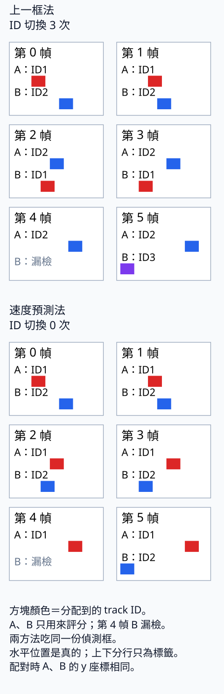

# 19 簡易 tracking：框很準，ID 仍可能換人

[在 Colab 執行本節](https://colab.research.google.com/github/birdhackor/learn_to_yolo/blob/lessons-v0.6.1/notebooks/19-tracking.ipynb){ .md-button }

上一節的偵測器逐幀交出框，但框的序號每次都可能不同。如果要知道一個物件從哪裡走到哪裡，還得把這一幀的框接到先前的物件紀錄上。這項工作叫追蹤（tracking）：持續為同一個物件保留同一個識別編號，稱為 track ID（ID 是 identifier）。

先看一個可以完全控制的交叉案例。讓偵測框一樣準，只更換追蹤的配對方法，就能看清楚：身份錯誤如何出現，以及速度資訊在哪一步幫忙。

## 同類物件交叉，框序號不能當身份

六幀裡有 A、B 兩個同類物件，都是寬 12、高 12，y=20～32，單位為畫素。第 f 幀 A 的左緣 x1=16+8f、B 的 x1=40−8f：A 每幀右移 8，B 每幀左移 8。第 2 幀左右順序反過來；第 4 幀 B 還存在，但我們刻意省掉它的偵測框，模擬一次漏檢。

手機上可左右滑動表格，查看完整欄位。

| 幀 f | 0 | 1 | 2 | 3 | 4 | 5 |
| --- | --- | --- | --- | --- | --- | --- |
| A 的 x1 | 16 | 24 | 32 | 40 | 48 | 56 |
| B 的 x1 | 40 | 32 | 24 | 16 | （漏檢） | 0 |

框用 xyxy `[x1,y1,x2,y2]`。`truth_boxes(f)` 保存六幀的 A、B 真值，`frames()` 按 A、B 順序提供偵測框，只在第 4 幀省略 B。這是人工框，沒有跑模型；兩種 tracker（追蹤器）都吃完全相同的框，故意把偵測器的變動排除，留到後段再接真正的預測。

A、B 只是評估時辨認真實身份的名字，不交給 tracker。tracker 不能靠名字配對，同類也不能靠類別區分。每幀的框即使剛好按 A、B 排，程式也不能把第 0、1 個框當固定身份：真實模型的候選通常按 score 排序，換一幀就可能換順序。

## 先試最直接的規則：和上次的框配對

tracker 為每個物件保存一條 track（軌跡紀錄）。第 0 幀還沒有紀錄，依偵測順序給 A ID1、B ID2；之後希望找到「哪個新框應該延續這條 track」。把新框接到既有 track 的動作叫 association（關聯、配對）。它用的是 track 框與偵測框，沒有 GT 參與；和[偵測評估](06-evaluation.md)拿預測配 GT 的目的不同。

第一種做法直接拿各 track 最後一次配到的框，和新框算 IoU，稱上一框法。程式用 `motion=False`，輸出標為 `last-box IoU`。IoU 低於 0.1 的組合不准配，並遵守一對一：一條 track 最多接一個框，一個框最多接一條 track，也可以不配。第 4 幀只有一個偵測框，兩條 track 不可能都接到它。

第 1 幀，同一物件移動 8、框寬 12，重疊寬為 4。交集 4×12=48，兩框面積各 144，所以 IoU=48/(144+144−48)=0.2，過得了 0.1 門檻，兩個 ID 都接得上。如果誤用偵測評估的 0.5 門檻，這一幀兩個框都會配不到，只能新發 ID；追蹤門檻比的是跨幀重疊，不是與 GT 的定位品質。

到了第 2 幀卻出問題。ID1 上次在 24～36，恰好和 B 的新框完全重合；ID2 上次在 32～44，恰好和 A 的新框完全重合。正確身份的重疊只有 IoU 0.2，接到別人的框卻是 1：

| 第 2 幀 IoU | 偵測 A：32～44 | 偵測 B：24～36 |
| --- | --- | --- |
| ID1 上一框：24～36 | 0.2 | 1 |
| ID2 上一框：32～44 | 1 | 0.2 |

直接按重疊選，會讓 ID1 接到 B、ID2 接到 A。框本身完全沒錯，身份卻互換了。要維持身份，現在的需要是利用「它往哪個方向走」，不只問「它曾在哪裡」。

## 一對一配對如何做出選擇

先固定兩種方法共用的配對規則，再更換送進它的框。每條 track 是矩陣的一列，每個偵測框是一欄，IoU 矩陣 shape 為 `[T,D]`，T 是保留的 track 數、D 是這幀偵測數。每條 track 可以不配，也可以選一個還沒被用掉、IoU≥0.1 的框。

完整程式列舉所有合格配法，先選配成功對數最多的；對數相同，再選 IoU 總和最大的。以兩條 track、兩個框、四項都合格為例，共 7 種：都不配 1 種，只配一對 4 種，配兩對有直配與交叉 2 種。第 2 幀兩種完整配法都配成兩對，上一框法便比較總和：交叉 1+1=2，正確身份配法 0.2+0.2=0.4，因此選交叉。

這個「先比對數，再比總 IoU」是本節的簡化規則，完整列舉會找到該規則下的最佳解，並不是每一步搶最大 IoU 的貪心法。沒有偵測框時，配對清單是空的。完整程式也保存一組真的框，檢查貪心法會選錯，算例如下。

??? note "為什麼不用貪心法"

    貪心法在 [13.1](13-dual-assignment.md) 介紹過。完整程式準備了一組會讓貪心法選錯的框：兩條 track 的框是 `[2,0,12,10]` 與 `[6,0,16,10]`，兩個偵測框是 `[3,0,13,10]` 與 `[0,0,10,10]`。這四個 IoU 是由真的框算出來的，不是隨手填的數字，約為 `[[.8182,.6667],[.5385,.25]]`（列是 track，欄是偵測框）。

    貪心法先配最大的 0.8182（track 0 配框 0），剩下只能配 0.25（track 1 配框 1），總和 1.0682。交叉配對（track 0 配框 1、track 1 配框 0）的總和是 `.6667+.5385=1.2052`，比較大。所以每一步拿最大值，不保證總和最大；本節才用完整列舉。完整程式用斷言（assert）確認：列舉選到的是交叉配對，而且交叉的總和比直配大。


列舉只適合這種小案例：全部合格時，2 對 2 有 7 種，10 對 10 約 2.3 億種。大型系統用專門解一對一問題的演算法，後面的選讀會說明。這個案例用列舉，是為了讓每一種選擇與判準都能直接核對。

## 先預測這一幀的位置，再用同一套配對

第二種做法在紀錄中多存速度：新舊框的四個座標差，除以兩次配到的幀號差，單位是畫素／幀。第 1 幀配完後，A 的速度是 `[8,0,8,0]`、B 是 `[-8,0,-8,0]`。每個 track 此時存四樣東西：`id`、最後配到的 `box`、`velocity`、最後配到的幀號 `last_frame`。

速度預測法（程式 `motion=True`，輸出 `velocity IoU`）不直接比舊框，而是先算

\[
\text{待配對框}=\text{box}+\text{velocity}\times(\text{frame}-\text{last\_frame}).
\]

第 0 幀新建 track 時速度為 0，所以第 1 幀兩種方法仍一樣。第 1 幀取得第一次位移後，第 2 幀 ID1 預測到 32～44、ID2 到 24～36，正好是各自身份的新位置；矩陣因此變成 `[[1,0.2],[0.2,1]]`，正確身份配法總和 2，這次不交換。

以下三行示意「預測→IoU→配對」，名稱和完整程式不完全相同：

```python
# 每條 track 各算一個 predicted_box，疊成 [T,4] 的 predicted_boxes；上一框法直接用 last_box
predicted_box = last_box + velocity * (frame - last_frame)
quality = iou_matrix(predicted_boxes, detections)  # [T,D]
# gated：IoU 低於 threshold 的組合不准配
# pairs 是 (track 列, 偵測欄) 的清單，例如 [(0,1),(1,0)]
pairs = exact_gated_matching(quality, threshold=.1)
```

配對清單 `[(0,1),(1,0)]` 的數字是矩陣列、欄，表示 track 列 0 配偵測欄 1，列 1 配欄 0；它們不是 ID1、ID2。輸入偵測框是 `[D,4]`，待配對框是 `[T,4]`；`update` 回傳長度 D 的 ID list，依當下偵測框順序排列。

### 漏一幀後，速度要乘上間隔

B 第 3 幀最後在 x1=16，第 4 幀沒偵測，第 5 幀回到 x1=0。這次間隔是 5−3=2，預測必須算 16−8×2=0。若只加一次速度，會猜 x1=8，偏了 8 畫素；本例仍有 IoU=0.2、碰巧過門檻，不能由配對成功斷定時間處理正確。偏差是速度×(間隔−1)，漏得越久越大。

另外，tracker 不會永久保留失聯物件。`max_age=2` 指幀號間隔最多為 2；每次配對前，`frame-last_frame>2` 的 track 先刪掉。B 第 5 幀的間隔剛好 2，仍可接回；若連漏第 4、5 幀，第 6 幀間隔 3，就先被刪。也就是本設定最多容許連漏 1 幀，而不是 2 幀。

上一框法的 B 在第 2 幀已換成 ID1；第 3 幀最後框為 `[16,20,28,32]`。第 5 幀雖仍保留這條 track，B 的新框 `[0,20,12,32]` 與舊框 IoU=0，仍配不到，於是發新 ID3。這次換號不是過期造成：max_age 管「紀錄還在不在」，速度預測管「去哪裡找」，保留紀錄本身不能保證接回。

??? note "假設多漏一幀，乘間隔會有什麼差別"

    這個情境沒有放進本節程式：B 連漏第 4、5 幀，到第 6 幀再出現。要先把 max_age 設為 3 才能保留舊 track。乘間隔 3，預測 x1=16−8×3=−8，與真實 40−8×6=−8 相同。只加一次仍猜 8，偏 16，比框寬 12 還大，IoU=0，只能另開 ID。

### 每次 update 的狀態怎麼改

完整程式每幀呼叫 `tracker.update(boxes, frame)`，依序做以下動作：

1. 用幀號間隔刪除過期 track。
2. 算待配對框；上一框法用 `box`，速度法用上面的預測式。
3. 建立 IoU 矩陣，列舉合格的一對一配法。
4. 配到的 track 先用 `(新框−舊框)/間隔` 更新速度，再換成新 `box`、新 `last_frame`。
5. 沒配到的偵測框各開新 track，速度為 0；ID 從 1 只增不減，刪掉的 ID 不重用。

沒配到的 track 留著原紀錄，等待下一幀或過期；不把自己的預測框當新偵測，否則它會靠自我配對永遠不過期。即使空幀也傳 `boxes` 的空 `[0,4]` 進 update，讓過期檢查照常發生，不清空全部狀態。

## 看 ID 結果，也另算偵測成績



每組六格，左至右、上至下是第 0～5 幀；上組是上一框法、下組是速度預測法。A 畫在每格上半、B 在下半只為分開文字，配對用的兩者 y 都仍是 20～32；x 按真實位置等比例畫。「A：ID1」寫在 A 方塊那排上方、靠左。

顏色表示 track ID，不表示類別：紅 ID1、藍 ID2、紫 ID3。上組第 2 幀 A、B 交換顏色，第 5 幀 B 又變紫；第 4 幀標「B：漏檢」。下組顏色一直維持。這張圖只重排頁尾那次執行的位置與 ID，沒有改算結果。

`update` 的實際回傳為：

- 上一框法：`[[1,2],[1,2],[2,1],[2,1],[2],[2,3]]`
- 速度預測法：`[[1,2],[1,2],[1,2],[1,2],[1],[1,2]]`

外層第 f 筆是第 f 幀，內層按偵測 A、B 順序；第 4 幀只有 A。`[2,1]` 因此表示 A 拿 ID2、B 拿 ID1。

現在才拿真實身份來評分。同一個物件這次被偵測到的 ID，與上次被偵測到時不同，算一次 ID switch（身份換號）；漏檢幀跳過，與更早那次比較。上一框法的 A 是 1、1、2、2、2、2，換一次；B 是 2、2、1、1、漏檢、3，換兩次，合計 3。速度預測法 A 一直 1、B 一直 2，合計 0。兩個物件互換 ID 要各算一次，共兩次。

這個 3→0 的改善只來自配對方法，沒有改善偵測。`evaluate_detections()` 另拿每幀偵測框與 `truth_boxes(f)` 的 GT 一對一配對，IoU≥0.5 才算 TP；它完全不經 tracker。人工框沒有 score，所以用完整列舉、門檻 0.5。11 個偵測框和自己的 GT IoU 都為 1，與別人的最多 0.2，即使改成逐筆配，任何順序都會得到 TP=11、FP=0。六幀共 12 個 GT，recall=11/12，漏的只有第 4 幀 B。

這裡只數 ID switch，沒有計算完整多物件追蹤（MOT，Multi-Object Tracking）指標。等速、精準框、短漏檢讓速度預測的作用直接可見；急轉、加速、相機移動或定位抖動會讓速度估計失準，不能把本例的 0 次換號當成所有影片的保證。

## 接回第 18 章的真實逐幀預測

人工案例固定了框，現在把輸入換回模型結果。這個最小 tracker 只看 IoU，沒有檢查類別，先只保留 class 0 的紅矩形框；否則紅物件的 track 可能接到別類預測。`runpy.run_path` 載入兩節程式，不執行各自的 main；偵測器只訓練一次。

```python
import runpy
import torch
torch.set_num_threads(2)
video = runpy.run_path('lesson_cases/18-video.py')
tracking = runpy.run_path('lesson_cases/19-tracking.py')
model = video['fit_detector']()
tracker = tracking['Tracker'](motion=True, max_age=2)  # motion=True：速度預測法
for result in video['run_stream'](video['synthetic_frames'](), model):
    pred = result['prediction']
    # labels==0 得到一串 True/False，只留下類別 0 的框
    boxes = pred['boxes'][pred['labels'] == 0]
    ids = tracker.update(boxes, result['index'])
    print(result['index'], ids)
```

傳進來的框已還原為原圖 xyxy 畫素座標。回傳的 `ids[i]` 對應篩選後的 `boxes[i]`，畫圖或 zip 時也要用篩選後的 boxes。如果拿原始 `pred['boxes']` 配，別類候選排在前面就會錯位；別類剛好都在後面時可能碰巧對上，不能依賴那個順序。

空幀也呼叫 update。本實作按幀號差過期，所以跳過空幀不改變後來有框時的 ID，但會延後清理：下面紀錄的 ID1 最後配到第 1 幀，逐幀呼叫在第 4 幀就刪除（4−1=3>2），跳過空幀則到第 6 幀才刪。如果改用「每次 update 才把 age 加一」的 tracker，跳過空幀還會直接低估失聯時間，甚至之後一直空幀就永不過期。

[影片檔案實測](https://github.com/birdhackor/learn_to_yolo/blob/main/artifacts/checks/curriculum/video-file.json)已接過同一組真實預測：第 0、1 幀 `[1]`，第 2–5 幀 `[]`，第 6、7 幀 `[2]`，其餘 `[]`。連漏超出 max_age 容許範圍，物件再被找到時只能開新 ID。速度沒有補好偵測漏檢；這條接線沒用 GT 評分，不能報成新的 ID switch、IDF1 或 HOTA 成績。框數可能隨重新執行略變，ID 也會跟著變。

要重跑檔案接線，依第 18 章安裝 `requirements-video.txt`，再 `PYTHONPATH=. python scripts/verify_video_file.py`，結果在 `artifacts/runs/video-file/result.json`。連結的既有紀錄是同一程式加 `--record artifacts/checks/curriculum/video-file.json` 產生；自己重跑不用加。

## 執行與自主練習

本機先依 [README 環境步驟](https://github.com/birdhackor/learn_to_yolo#readme)安裝固定依賴，在 repo 根目錄 `PYTHONPATH=. python lesson_cases/19-tracking.py`；Colab 先跑環境格，再跑完整實驗。這裡的追蹤規則不是神經網路，不做 backward，配對、速度、ID switch、偵測 recall 與 FP 都由程式實際計算。

核對兩串 IDs、switch 3→0、`detector recall=11/12, false positives=0`。程式先檢查 `(TP,GT,FP)=(11,12,0)`、貪心反例、空偵測框，才印結果；倒數第二行就是反例與空框檢查完成，最後一行印 `artifacts/lesson-19/ids.svg` 路徑。網頁圖由該次輸出重排而來。

自主練習：在 Colab 裡改「本節可修改的完整實驗」那一格程式；本機則改 `lesson_cases/19-tracking.py`，兩者是同一份程式。把 `def main(max_age=2):` 改成 `def main(max_age=1):`，先預測再執行：

1. 速度預測法第 5 幀的 IDs 會是什麼？兩種方法的 switch 數各是多少？
2. 用一兩句話說明：max_age 和速度預測各管什麼？

完整程式的斷言已經寫好 max_age=1 和 2 兩種情況的答案，不用改；程式只接受這兩個值，改成其他值會在第一個斷言停下。執行後圖也會重畫，一樣存在 `artifacts/lesson-19/ids.svg`（輸出最後一行印出這個路徑），圖上兩列標題的 ID 切換次數，會照這次實際算出的次數重寫。在 Colab 可另開一個程式格，執行 `from IPython.display import SVG, display; display(SVG(filename='artifacts/lesson-19/ids.svg'))` 看圖。核對印出的結果和圖是否一致。

??? note "參考答案"

    **第 1 題**：max_age=1 時，速度預測法的 B 最後在第 3 幀配到 ID2。第 5 幀的 update 一開始先檢查間隔：5−3=2，大於 1，所以 ID2 在配對前就被刪了。速度再準也沒有 track 可接，B 只能開新 ID。ID 只增不減，刪掉的編號不會重用，所以 B 拿到的是 3，不是 2。速度預測法第 5 幀的 IDs 是 `[1,3]`，switch 從 0 變成 1；上一框法仍是 3 次。recall 那一行不變：max_age 只是 tracker 的設定，偵測框沒有變。

    **第 2 題**：max_age 管沒配到的 track 能留多久（壽命）；速度管這一幀要去哪裡找它（運動估計）。兩者是不同的設定：track 一旦被刪，速度再準也接不回來。


## 從這個小規則走向完整追蹤器

多存速度讓平穩運動、短暫漏檢時更有機會維持身份；代價是每條 track 都要存速度、update 必須收到正確幀號。真實系統還需要處理位置與速度的不確定性、外觀、類別與更大的配對問題。

??? note "大型一對一配對與不配的處理"

    匈牙利演算法（Hungarian algorithm）專門求一對一的整體配對，不必完整列出所有組合。本節列舉不是匈牙利演算法；它先比成功對數，和只求總分最好的規則不完全一樣。

    SORT（Simple Online and Realtime Tracking）先配完，再剔除 IoU 低於門檻的配對；ByteTrack 的官方程式把不配的代價放進問題裡，IoU 太低時可以選擇不配。兩者結果可能不同。這種 assignment problem（指派問題）是跨幀配對，不是第 5 章與 12.3 訓練時決定哪個候選負責 GT 的 assignment。

??? note "外觀特徵、Kalman filter 與常見追蹤器"

    - 外觀特徵：另用一個神經網路，把框內的影像變成一串數字，比較兩個框裡的物件長得像不像；兩個物件交叉時，可以靠它分辨誰是誰。代價是要多跑模型、存特徵，還需要有身份標註的資料來訓練。
    - Kalman filter（卡爾曼濾波）：除了估計位置和速度，也估計「這個估計有多不確定」，再依此決定要多相信新的偵測框。代價是要先設定運動和量測各有多少雜訊。

    常見的完整追蹤器例如：

    - SORT：用 Kalman filter 預測位置，再用匈牙利演算法依 IoU 配對。
    - DeepSORT：沿用 Kalman filter 與匈牙利演算法，但配對主要改看外觀特徵的距離（再用 Kalman 預測的位置排除不可能的配對），並讓上次配到的時間越近的 track 越先配。IoU 配對只留在最後一輪，處理兩種 track：剛建立、還在試用期的，以及上一幀還配到、這一幀外觀沒配上的。
    - ByteTrack：先拿高分框配已確認、以及暫時失聯的 track。其中第一輪沒配到、仍在追蹤狀態的 track，再只用 IoU 去配低分框；暫時失聯的 track 不進這輪。新建、待確認的 track 另外用剩下的高分框配對。沒配上的低分框丟掉，不拿來開新 track。

    本節的 tracker 只取它們共同的核心（先預測位置，再一對一配對），不是這些方法的完整實作。

    多物件追蹤的正式評估常用 IDF1（ID F1 score，身份 F1 分數）與 HOTA（Higher Order Tracking Accuracy，高階追蹤準確率）：IDF1 先把整段影片的軌跡和真實身份一對一對應再計分，著重身份有沒有維持住；HOTA 把偵測準不準和關聯對不對分開量，再合成一個分數。本節只數 ID switch，沒有計算這些分數。

<!-- curriculum-evidence:start -->

## 實際執行紀錄

本節的完整程式於 2026-10-08 在 AMD EPYC 9V74 80-Core Processor（2 個執行緒）上用 PyTorch 2.9.1+cpu 執行，程式裡的 assert 全部通過。下面是那次印出的原始輸出；輸出裡若有計時或訓練得到的數字，換一台電腦會略有不同。每個數字的意思，以本頁正文的說明為準。[完整紀錄（JSON）](https://github.com/birdhackor/learn_to_yolo/blob/main/artifacts/checks/curriculum/19-tracking.json)

??? example "展開本次實際輸出"

    ```text
    max_age: 2
    per-frame IDs in detection order A,B (frame4 has only A):
    last-box IoU: [[1, 2], [1, 2], [2, 1], [2, 1], [2], [2, 3]] ; switches: 3
    velocity IoU: [[1, 2], [1, 2], [1, 2], [1, 2], [1], [1, 2]] ; switches: 0
    detector recall=11/12, false positives=0 (same detections feed both trackers)
    exact small matching passes non-greedy counterexample and empty detections
    actual ID panel: artifacts/lesson-19/ids.svg
    ```

<!-- curriculum-evidence:end -->
