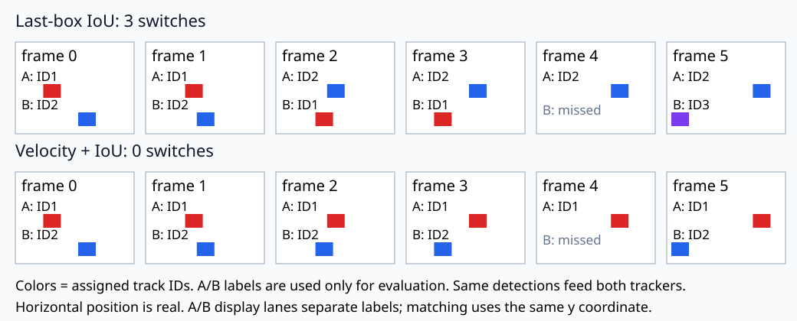

# 19 簡易tracking：框很準，ID仍可能換人

[開啟 Colab](https://colab.research.google.com/github/birdhackor/learn_to_yolo/blob/lessons-v0.1.0/notebooks/19-tracking.ipynb) · 原始碼：`lesson_cases/19-tracking.py`

前置是IoU、影片frame與matching。偵測回答「當前哪些框是物件」，tracking還要回答「這個框是否上一幀的同一個物件」。兩個同類物件交叉時，偵測可以完全正確，track ID卻互換。本節固定同一組偵測框，僅比較用上一框配對、或先用速度預測再配對，並真正計算ID switch。

本節是MiniYOLO應用實驗，沒有宣稱完整SORT、DeepSORT或ByteTrack。detector輸入是人工已知的框序列，以隔離association；tracker不讀真值身份A、B。A、B只在最後評估用來判斷哪個物理物件換了track ID。兩物件視為同一語意類別，不能用分類label偷看身份。

## 六幀，兩個物件與一次漏檢

兩框寬12、高12、y範圍20到32。第f幀A的x1為`16+8f`，B為`40−8f`，單位是畫素；每幀A向右8、B向左8。第0幀A在16、B在40，第1幀A24、B32，第2幀A32、B24，這時左右順序反轉。第4幀B仍存在，但偵測器漏掉它；第5幀再出現。

| 資料 | shape | 用途 |
| --- | --- | --- |
| 當前detections | `[D,4]` pixel xyxy | D通常2，第4幀為1，可為0 |
| tracks的待配對框 | `[T,4]` | 上次框或速度預測框 |
| IoU矩陣 | `[T,D]` | 每track與每detection的配對品質 |
| association IDs | 長度D的整數list | 對應當前detection順序 |

IoU低於.1不允許配對。沒有匹配的detection建立新ID；沒有匹配的track暫留，當`frame−last_frame>max_age=2`才刪除。這個門檻以frame間隔定義，第3幀見到、第4幀漏掉、第5幀還可重接；不是物件消失一幀就把身份丟掉。

## 配對要一對一，也要允許不配

程式逐track列舉「不配」和所有合格、未使用detection，先最大化有效配對數，再最大化IoU總和。這是此小案例的精確全域搜尋，有unmatched選項，並非greedy或Hungarian實作。物件數變大時組合數會迅速增加，正式系統需要有效率的assignment solver與合理的unmatched成本。

```python
predicted_box = last_box + velocity * (frame - last_frame)
quality = iou_matrix(predicted_boxes, detections)
pairs = exact_gated_matching(quality, threshold=.1)
```

案例另用真實幾何框算出反貪心表：tracks`[2,0,12,10]`與`[6,0,16,10]`，detections`[3,0,13,10]`與`[0,0,10,10]`。IoU約`[[.8182,.6667],[.5385,.25]]`。先拿最大.8182會剩.25，總1.0682；交叉配對得`.6667+.5385=1.2052`。程式assert最佳為交叉，沒有把區域性最大演演算法改名來冒充最優。空detections也回傳空配對。

## 為什麼上一框會追錯

第1幀A框在24到36，B在32到44；第2幀A移到32到44、B移到24到36。對上一框做IoU，兩個「相反身份」位置恰好完全重合，IoU=1；正確身份只重疊4畫素寬，IoU=`48/(144+144−48)=.2`。僅依last-box最佳配對會交換兩個ID，框本身卻沒有錯。

速度分支在第1幀已估到A的`[dx1,dy1,dx2,dy2]=[8,0,8,0]`、B為`[-8,0,-8,0]`。先預測第2幀位置，正確身份IoU變1，因此不交換。B漏一幀後，第5幀以間隔2乘速度，從第3幀位置16預測到0，仍能重接。不能只加一次velocity忽略缺失時間。

last-box分支在第5幀仍保留舊ID1，它最後於第3幀匹配到B，框為`[16,20,28,32]`；B此時的偵測是`[0,20,12,32]`。兩框IoU=0，低於.1，故舊ID1與B的偵測都unmatched（未配對），B才建立新ID3。第三次switch不是因為舊ID1過期：`max_age=2`只保留候選，重接仍須通過IoU門檻。



圖中水平位置依真實框x而畫，A／B分開顯示列只是讓標籤易讀，matching的y座標相同。框色代表track ID。last-box結果為`[[1,2],[1,2],[2,1],[2,1],[2],[2,3]]`；速度結果為`[[1,2],[1,2],[1,2],[1,2],[1],[1,2]]`。

本章ID switch定義是每個GT物理身份本次被觀測時，assigned ID與上次被觀測時不同就加1，跨漏檢間隔仍保留上次ID。因此last-box在交叉時換兩次、B重現又換一次，共3；速度分支為0。這不是完整MOT指標實作，沒有宣稱IDF1或HOTA。兩條路偵測recall都為11/12、FP為0，偵測品質未因tracker改善而改變。

執行`PYTHONPATH=. python lesson_cases/19-tracking.py`，核對兩份IDs、3→0、非貪心反例及空detections。tracking規則不是神經網路，本節不需要backward；所有配對、預測與評估都真實執行。

## 收益、代價與失敗範圍

速度預測提高平穩運動與短漏檢的連續性，代價是多一個狀態和時間契約；急轉、加速、相機移動或定位雜訊會讓估速失準。外觀特徵可幫助交叉時辨識身份，但增加模型計算、儲存與資料需求；Kalman filter可描述運動不確定性，也有噪聲設定成本。本節的完美等速案例不能證明速度模型解決所有追蹤問題。

常見錯誤是依detections list索引當ID、允許兩條track配同一detection、在空幀清空所有狀態、把tracker預測框當成新偵測，以及用GT身份參與配對。自主練習：把`main(max_age=2)`的max_age改1。答案是速度分支的B在第5幀來之前，舊ID2的last_frame為3、間隔2，因此被刪除；即使速度完全正確仍要建立新ID3。motion的最後IDs為`[1,3]`，switches從0變1；last-box仍為3次。程式依本次max_age檢查對應switch數與最後IDs，圖的title、desc與列標題也取自實際計數。核對console與圖一致，再說明壽命與運動估計是不同選項。
