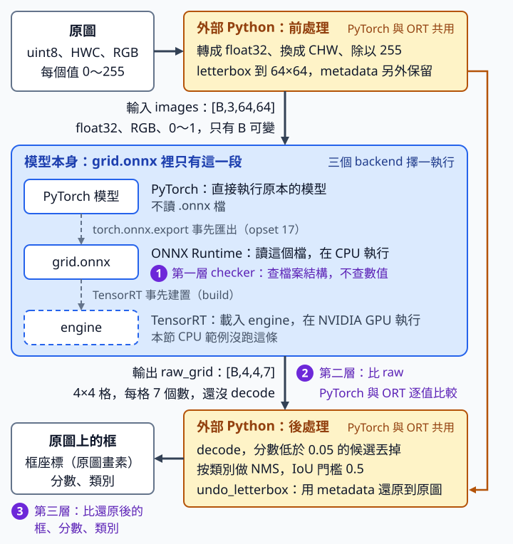

# 20 ONNX／TensorRT：匯出後先證明同一個輸入得到同一個結果

[在 Colab 執行本節](https://colab.research.google.com/github/birdhackor/learn_to_yolo/blob/lessons-v0.6.0/notebooks/20-deployment.ipynb){ .md-button }

訓練好的模型，最後要放到實際使用的地方做預測，例如伺服器、手機或機器人，這叫部署。那些地方常常沒有裝 PyTorch，或需要跑得更快。常見的做法是先把模型匯出成通用的 ONNX 檔，再交給專門的執行程式：本節用 ONNX Runtime 在 CPU 上執行；有 NVIDIA GPU 時，可以改用 TensorRT。換了執行程式，就得證明同一張圖仍然得到同樣的框，這就是本節要做的事。

讀完本節，你能把模型匯出成 ONNX，用三層檢查確認 ONNX Runtime 和 PyTorch 的結果一致，也能分清「模型本身變快」和「整條流程變快」是兩回事。步驟依序是：做出一份固定的權重 → 匯出 ONNX → 檢查檔案 → 比較兩邊的 raw 輸出（模型直接輸出、還沒 decode 的數字）→ 比較還原到原圖的框 → 確認只有 batch 可變 → 計時。後半頁說明有 NVIDIA GPU 時怎麼接 TensorRT，以及作者在雲端 GPU 上的實測。

前置：

- [暖身節](00-warmup.md)的 `model.eval()`：推論前先切到推論模式。
- [人工框解碼與 NMS](06-decode-nms.md)：模型輸出要經過 decode 與 NMS 才變成框。
- [自己的圖片推論](08-own-images.md)：圖片要先轉成 RGB、等比縮放並補邊（letterbox）才能送進模型，框最後要還原回原圖座標。

本節會用到這幾個名詞：

- **ONNX**（Open Neural Network Exchange）：一種通用的模型檔格式。`.onnx` 檔裡存的是模型的運算圖，連同權重。
- **運算圖**：模型 forward 時依序做哪些運算、彼此怎麼接。本例有 Conv（卷積）、Relu、AveragePool（平均池化）等運算。它和[第 2 章](02-diagnostics.md)的「計算圖」不是同一個東西：計算圖是 PyTorch 為了 backward 算梯度而記下的紀錄；本節匯出的 ONNX 只含 forward。
- **ONNX Runtime（ORT）**：讀取 `.onnx` 檔並執行的程式，本身不需要 PyTorch。本節用它在 CPU 上執行。
- **TensorRT**：NVIDIA 的推論加速工具，用在 NVIDIA GPU 上。它讀入 ONNX 後，替模型的每一層挑出在這張 GPU 上最快的算法，這個過程叫建置（build）。
- **engine**：TensorRT 建置後得到的模型檔，是為某一種 GPU 最佳化的結果。它要由 TensorRT 載入才能執行，不是可以直接點開執行的 .exe。
- **backend（執行後端）**：實際把模型算出結果的程式。本節提到三個：PyTorch、ORT、TensorRT；CPU 範例比較的是前兩個。
- **opset**：ONNX 運算規格的版本號，規定有哪些運算、每個運算怎麼算。匯出端和執行端都要支援同一個 opset，本例用 17。

模型檔成功產生，不代表部署成功。運算圖、輸入各軸的排列順序（layout，例如 `[B,3,H,W]`）、分數公式、NMS 和框還原，只要任一處兩邊不同，都可能讓框偏移。所以本節真的匯出 ONNX，先用 checker（ONNX 附的檔案檢查工具）檢查，再用 ORT 在 CPU 上執行，比較 raw 輸出和還原後的框。

TensorRT 需要 NVIDIA GPU。作者另外透過 GitHub Actions（GitHub 的自動執行服務）啟動雲端服務 Modal，租用一張 NVIDIA L4 資料中心 GPU，實際建置並執行 TensorRT，結果在[本頁後段](#l4-results)。你在 Colab 跑的是 CPU 範例。

本節匯出的是第 7 章的 GridDetector（width 8）：輸出 `[B,4,4,7]`，分數用 sigmoid(obj)×softmax，不是 [16.2 節](16-inference-head.md)的部署 head。程式從零建立模型，用合成圖實際做一次 forward、grid loss、backward 與 SGD 更新，然後匯出。本模型沒有會隨模式改變行為的層，但匯出前仍照習慣切到 eval。做這一次更新，是為了讓權重來自本機實際學過的一步；案例不下載 pretrained（預訓練）權重，也不需要 torchvision。只更新一次，不足以證明偵測品質：匯出一致性用這份固定權重就能驗證，偵測品質要用第 17 章那類獨立評估。

## 先講好部署規格，兩邊才能比

部署規格是匯出端和執行端事先講好、兩邊必須一致的規格：輸入圖片怎麼處理、模型的輸入輸出長什麼樣、輸出怎麼變成框。本節的規格如下。

來源圖是 uint8 HWC RGB：每個值是 0～255 的整數，軸依序是高、寬、通道（HWC），顏色順序是 RGB。三張來源是亂數產生的雜訊圖，不是照片；一致性測試只需要兩邊吃同一份輸入，圖裡不必有物件。尺寸以寬×高表示，是 96×64、80×48（兩張橫圖）與 48×80（直圖）；程式裡的 array shape 依序是高、寬、通道，例如 96×64 那張是 `(64, 96, 3)`。

每張圖各自轉成 float32、換成 CHW、除以 255，再 letterbox 到 64×64。例如 96×64 那張縮放 2/3 後，內容是 64×43（高 64×2/3≈42.67，四捨五入成 43），上方補 10 列、下方補 11 列，成為 64×64。每張圖的 letterbox 資訊（縮放比例與補邊多少，程式裡叫 metadata）分開保留，還原框時各用各的。

模型輸入是 `[B,3,64,64]`，raw 輸出是 `[B,4,4,7]`：4×4 格，每格 7 個數。前四個是框的 logits，第五個是 objectness（這格有沒有物件），最後兩個是類別 logits。分數仍是 `sigmoid(obj)×softmax(class)`，不能改成第 16 章那種只用 sigmoid 的類別分數。

ONNX 檔只包含模型本身，也就是產生 raw 的那一段。前處理與後處理在外部的 Python 執行，所以兩個 backend 可以共用同一套前後處理程式。後處理先 decode，並用候選截斷門檻 0.05 篩選：拿每個候選自己的分數去比，低於 0.05 的丟掉。接著按類別分開做 NMS；NMS 的 IoU 門檻是 0.5，比的是兩個預測框的重疊。最後用 undo_letterbox 還原到每張原圖。整條流程沒有包進 ONNX，所以拿到 `grid.onnx` 的人必須知道它的檔案介面：

- 輸入 `images`：float32、RGB、值在 0～1、shape `[B,3,64,64]`，只有 B 可以變。
- 輸出 `raw_grid`：shape `[B,4,4,7]`，還沒 decode。
- 檔案裡沒有、要使用者自己做的步驟：轉成 RGB 與 CHW、除以 255、letterbox、decode、NMS、還原到原圖座標。



`grid.onnx` 只包藍色這一段，也就是模型本身；橘色的前處理與後處理在外部 Python，由 PyTorch 與 ORT 共用。右側那條橘線是 metadata（letterbox 的縮放比例與補邊量），它不經過模型，直接送到後處理用來還原框。藍色區塊左側三個白框，是三個 backend 各自執行的東西：PyTorch 直接執行原本的模型，ORT 讀 `grid.onnx`，TensorRT 則先從 `grid.onnx` 建置出 engine；紫色圓圈 1、2、3 是下方三層驗證各自檢查的位置。

下面是匯出與建立 ORT session 的簡化寫法，加了中文註解；和完整程式不同的地方（檔名、樣本的名字、執行緒設定），註解裡都有寫。另外省略了建立 session 後確認輸入規格的斷言（見下方「動態 batch 不是動態空間」）。session 是 ORT 載入 `.onnx` 檔後建立的物件，之後可以反覆呼叫 `session.run` 來執行模型：

```python
# example 就是完整程式的 images[:1]：一張 [1,3,64,64] 的樣本圖
torch.onnx.export(model, example, 'grid.onnx',  # 完整程式存到 artifacts/lesson-20/grid.onnx
    input_names=['images'], output_names=['raw_grid'],  # 替輸入、輸出取名，之後用名字指定
    dynamic_axes={'images': {0: 'batch'}, 'raw_grid': {0: 'batch'}},  # 只有第 0 軸可變
    opset_version=17, dynamo=False)  # dynamo=False：用舊版匯出器（見下方說明）
onnx.checker.check_model(onnx.load('grid.onnx'))  # 第一層檢查：檔案結構（預設不查各運算的型別與 shape）
# providers 指定 ORT 用哪種硬體執行，這裡是 CPU
# （完整程式另外傳入 sess_options，固定 ORT 的執行緒數）
session = ort.InferenceSession('grid.onnx', providers=['CPUExecutionProvider'])

# 取自完整程式的 B 迴圈：輸入要是 NumPy 陣列；run 回傳 list，[0] 取出 raw_grid
ort_raw = session.run(['raw_grid'], {'images': batch[:b].numpy()})[0]
```

匯出為什麼要給一份樣本 `example`？舊版匯出器會拿它實際跑一次 forward，把經過的運算記成運算圖。`dynamic_axes` 的寫法是「名字 → {第幾軸: 軸的名字}」：這裡只宣告輸入 `images` 與輸出 `raw_grid` 的第 0 軸可變，取名 `'batch'`。沒有宣告的軸（3、64、64）就照樣本的大小固定下來。

??? note "為什麼用 dynamo=False"

    PyTorch 有新、舊兩套把模型轉成 ONNX 的匯出器（exporter）。從 2.9 版起，預設是以 torch.export 為基礎的新匯出器（`dynamo=True`）。本例指定 `dynamo=False`，改用舊的 TorchScript 追蹤式匯出器（拿樣本實際跑一次、記下運算），因為本節的 opset 17 與 `dynamic_axes` 是用它測過的。

    執行時會印出一段 DeprecationWarning（棄用警告：提醒這個功能將來可能移除），開頭是 `You are using the legacy TorchScript-based ONNX export`。這是預期中的警告，不是錯誤，程式照常執行。舊匯出器將來可能被移除，所以升級 PyTorch 或改用新匯出器時，要重跑本節的比對，並改用該版本支援的 `dynamic_shapes`（新匯出器宣告可變軸的參數）與相依套件。

## 三層驗證，各抓不同的錯

比對數值之前，先回答一個問題：同一個模型、同一組權重、同一張圖，PyTorch 和 ORT 為什麼會算出不完全相同的數？float32 只有約 7 位有效數字，每做一次加法或乘法都要捨入。不同的執行程式做卷積時，加總的順序與實作方法不同。這和[第 7 章](07-training.md)說過的道理相同：執行緒數不同時，加總的順序就可能不同。所以最後幾位可能不一樣；這種末位差異，不代表哪一邊算錯。比對時只能要求「夠接近」，不能用 `==` 要求逐位元相同（每一個位元都一樣，也就是完全相等）。

??? note "加總順序為什麼會影響結果"

    數學上，三個數相加時先加哪兩個，結果都一樣，例如 \((a+b)+c=(a+c)+b\)；電腦的浮點數卻不一定。float32 在 \(10^8\) 附近，相鄰兩個能表示的數相差 8，所以 \(10^8+1\) 會被捨入回 \(10^8\)。取 \(a=10^8\)、\(b=1\)、\(c=-10^8\)：\((a+b)+c=(10^8+1)-10^8=0\)，但 \((a+c)+b=(10^8-10^8)+1=1\)。同樣三個數，先算哪兩個，答案就不同。卷積要把很多乘積加起來，加總順序一換，末幾位就可能改變。

「夠接近」用 allclose 判斷，它有兩個容許差。atol（absolute tolerance，絕對容許差）是固定的允許差值；rtol（relative tolerance，相對容許差）再按參考值的絕對值等比例放寬。對每一個數值，要求

\[
|a-r|\le \text{atol}+\text{rtol}\times|r|
\]

其中 a 是受檢查的值，r 是參考值。例如 r＝2.0、`atol=1e-5`、`rtol=1e-5` 時，允許差是 \(10^{-5}+10^{-5}\times2.0=3\times10^{-5}\)，也就是 0.00003。

第二、三層比的是 PyTorch 和 ORT 兩邊；第一層只檢查 ONNX 檔本身。三層各抓不同的錯：

1. **第一層：checker。** `onnx.checker` 檢查 ONNX 檔的結構是否符合規格，例如用到的運算在 opset 17 裡是否存在、每個運算的輸入輸出個數對不對、運算必填的屬性（寫在運算裡的固定設定，例如本例 AveragePool 的池化視窗大小 `kernel_shape`）是否齊全、格式是否正確。本節照預設呼叫，不會核對每個運算收到的資料型別（dtype，例如 float32）與 shape 合不合規，要加 `full_check=True` 才會；它也不檢查數值，所以不能證明算出來的數和 PyTorch 一樣。
2. **第二層：比 raw。** 用 ORT 執行 B=1、2、3，和 PyTorch 的 raw 逐值比較，斷言（assert）要求 `atol=1e-5, rtol=1e-5`。頁尾紀錄中，B=1 的最大絕對差約 `4.77e-7`，B=2、3 都約 `4.77e-7`，也就是最大約 \(4.77\times10^{-7}\)＝0.000000477，低於容許差；report 的 `max_abs_raw_errors` 記下了這三個數。
3. **第三層：比還原後的框。** 兩份 raw 各自經過同一套 decode、NMS 與還原，再比較每張原圖上的結果：框座標（原圖畫素）`atol=1e-4, rtol=1e-5`；分數 `atol=1e-6, rtol=1e-5`；類別必須完全相同。框座標以畫素計、數值比較大，所以容許差比 raw 寬。

raw 已經很接近，為什麼還要第三層？因為 decode 和 NMS 裡有門檻：數值只要跨過門檻，候選的去留就會改變。舉一個假設的情境（不是實測結果）：某個候選在 PyTorch 的分數是 0.0500001，在 ORT 是 0.0499999。候選截斷門檻是 0.05，於是 PyTorch 留下它、ORT 丟掉它，兩邊留下的候選就不一樣，最後的框數也可能不同；可是兩邊的 raw 只差一點點，第二層照樣通過。NMS 也一樣：兩個框的 IoU 若剛好在 0.5 附近，可能一邊刪掉、一邊保留。所以第三層不能省略。

完整程式在 B 迴圈裡、第二層的比較之後，這樣做第三層：

``` { .python data-excerpt="lesson_cases/20-deployment.py" }
# 兩份 raw 各自 decode、NMS、還原到原圖；每張原圖得到一組框、分數與類別
pytorch_predictions, ort_predictions = restore(torch_raw, metadata[:b]), restore(ort_raw, metadata[:b])
for a, o in zip(pytorch_predictions, ort_predictions):  # 一次比一張原圖
    torch.testing.assert_close(a['boxes'], o['boxes'], rtol=1e-5, atol=1e-4)
    torch.testing.assert_close(a['scores'], o['scores'], rtol=1e-5, atol=1e-6)
    assert torch.equal(a['labels'], o['labels'])  # 類別必須完全相同
# 兩個空結果也會通過上面的比較，所以每張原圖都至少要解出一個框
box_counts = [len(a['boxes']) for a in pytorch_predictions]
assert all(c > 0 for c in box_counts), f'B={b}: a source has no restored box {box_counts}'
```

最後兩行防的是另一個漏洞。少了這兩行，門檻一旦高到兩邊都沒有框，每張圖比的就是兩個空結果：沒有框可比，上面三個比較都找不到差異，照樣通過，第三層等於什麼都沒驗證。所以 B=1、2、3 每一圈，都要求每張原圖至少解出一個框（`all(...)` 要裡面每一項都成立，才是 True）；練習 5 會實際觸發這個斷言。

report 的 `restored_boxes_per_source` 記下 B=3 那一圈三張原圖各自的框數，是 `[16, 16, 16]`：4×4＝16 格的候選全部留下，都通過了截斷門檻，NMS 也沒有刪掉任何一個。這些框不是偵測結果：來源是雜訊圖，模型也只更新過一步，分數都只略高於 0.05 的截斷門檻；它們只是讓第三層有實際的框可比。其中 80×48 與 48×80 兩張圖，各有 8 個框完全落在 letterbox 的補邊上，還原時被裁到原圖範圍內，寬或高變成 0。所以這個斷言保證的是兩邊確實有框可比，不保證每個框都落在原圖的內容上。

實際部署時，還要放入空圖、小物件、長寬比極端的圖和擁擠的圖，並記錄差異出在哪個階段。空圖預期兩邊都沒有框，這類圖要確認兩邊一致；「每張原圖至少一個框」的斷言只用在預期會有框的圖，防的是兩邊都變成空結果卻照樣通過。本例比較了三張非正方形的來源，但沒有驗證所有圖片。

## 動態 batch 不是動態空間

ORT 回報的輸入規格（`session.get_inputs()[0].shape`）是 `['batch',3,64,64]`。第 0 軸寫成名字 `'batch'`，表示這一軸的長度可變；其他三軸是固定的數字。所以只有 B 可變，B=1、2、3 都實際通過；完整程式也用斷言確認了這個規格。

B 迴圈的每一圈，完整程式先 assert 輸入確實是 `[B,3,64,64]`，再 assert 兩個 backend 的 raw 都是 `[B,4,4,7]`。為什麼要先檢查輸入？Python 與 PyTorch 的切片超出長度不會報錯：只有 2 張時，`batch[:3]` 仍回傳 2 張，程式會默默把「B=3 的測試」跑成 B=2。先 assert shape 是 `(3,3,64,64)`，就能擋下這種情況。

輸入 80×80 會被 ORT 拒絕。完整程式故意送一張 80×80 的輸入，並 assert 它被拒絕，避免把「PyTorch 模型吃得下別的尺寸」誤當成「ONNX 檔也支援」。兩邊為什麼不同？GridDetector 裡的 `AdaptiveAvgPool2d` 不管輸入多大，都會平均成 4×4，所以 PyTorch 模型吃 80×80 也能跑。但這時每格代表 80÷4＝20 畫素，decode 卻仍以 64×64（每格 16 畫素）換算，框就會放錯位置。ORT 這邊則在算之前就擋下：前面說過，輸入規格的高、寬照樣本固定成 64，80 對不上，ORT 就報錯，模型一層都沒算。就算放寬輸入規格也不行：匯出時，`AdaptiveAvgPool2d` 這一層依 64×64 的樣本被記成固定的 2×2 平均池化，80×80 會算出 5×5 格，不是 4×4。所以這個 ONNX 檔只適用 64×64。

H、W 若要可變，需要重新匯出，確認池化、候選生成與 decode 的 shape 規格，再逐個尺寸測試；不是在 `dynamic_axes` 替第 2、3 軸也取名字就好。

## 同一台裝置上，量 raw 與整條管線

完整程式在 CPU 上固定用 2 個執行緒（threads）。量的項目有：PyTorch 與 ORT 的 raw（只有模型本身），以及兩者各自的整條管線（RGB 前處理 → raw → decode／NMS → 還原到原圖框，以下稱端到端）；另外量 ORT 一次跑 2 張（batch 2）的 raw。這些時間不含讀寫磁碟、顯示畫面或相機佇列（camera queue）的時間。兩類項目的量法不同：

- **raw**（`median_ms` 函式）：每一項先空跑 3 次不計時（warmup，暖機），再連續量 20 次，取中位數（median）。
- **端到端**（`paired_median_ms` 函式）：兩條管線先各空跑 3 次，再量 40 輪。每一輪兩條管線各跑一次，先後輪流：第 1 輪 PyTorch 先，第 2 輪 ORT 先，依此交替。每條管線取自己 40 次的中位數；每一輪再算 PyTorch 減 ORT 的時間差，這 40 個差也取中位數。

端到端為什麼要成對量？假如先把 PyTorch 的 40 次量完、再量 ORT，電腦中途變快或變慢（例如 CPU 調整時脈，或別的程式開始搶 CPU），這個變化就只會算到其中一邊。成對量時，同一輪的兩次執行緊接著發生，條件差不多；先後輪流，則讓兩邊都不會一直排在第二個跑。

頁尾紀錄那次執行的實測如下（單位：毫秒，取中位數）：

| 項目 | PyTorch | ORT |
|---|---|---|
| raw，batch 1 | 0.151 | 0.037 |
| 端到端，batch 1 | 2.325 | 2.156 |
| raw，batch 2 | 未量 | 0.043 |

表中沒有列出同一輪 PyTorch 減 ORT 的差，它記在頁尾紀錄的 `median_ms` 欄。這一欄放的是所有計時的中位數（表中的數字也在這裡），和上面同名的 `median_ms` 函式不是同一個東西。同一輪的差是欄裡的 `paired_torch_minus_ort_preprocess_to_restored_boxes`，由 `paired_median_ms` 算出，正值表示 ORT 比較快。本次是 0.173112 毫秒。它是 40 個差的中位數，一般不等於表中端到端兩格相減，所以要直接讀這一項。

??? note "為什麼不能拿表中兩格相減"

    兩個中位數的差，一般不等於每一輪差值的中位數。舉一個只有 3 輪的假設例子（單位：毫秒）：

    | 輪 | PyTorch | ORT | 同一輪的差 |
    |---|---|---|---|
    | 1 | 2 | 4 | −2 |
    | 2 | 3 | 1 | 2 |
    | 3 | 6 | 5 | 1 |

    PyTorch 的中位數是 3（第 2 輪），ORT 的中位數是 4（第 1 輪），相減得 −1，看起來 ORT 比較慢；可是三輪裡有兩輪是 ORT 比較快，三個差 −2、2、1 的中位數是 1。兩個中位數取自不同的輪，那兩輪電腦的狀況不一定一樣；同一輪相減，比的是緊接著發生、條件差不多的兩次執行。

怎麼讀這張表：

- raw：ORT 約快 4.1 倍，也就是 ORT 的時間約是 PyTorch 的 1/4.1（用頁尾紀錄的完整數字算：0.150975÷0.036600≈4.13）。ORT 為什麼比較快，本節沒有驗證。
- 以獨立量到的 raw 中位數估算，模型約占 PyTorch 端到端時間的 6.5%（0.151÷2.325）；兩者相減約 2.17 毫秒。前處理、decode／NMS 與還原在兩條管線裡用的是同一套程式，但本節沒有逐階段計時，所以這只能粗估模型時間的占比。
- 端到端：兩條管線的程式只有中間的模型那一步不同。本次成對量的差約 0.173 毫秒，raw 中位數的差則約 0.114 毫秒（0.150975−0.036600）。量 raw 時，同一個模型連續呼叫，一次緊接著一次；管線裡，模型前後夾著前處理和後處理，每次輪到模型時，電腦剛做完別的工作。執行條件與計時波動會影響各階段，所以這兩個差不必相等，也無法把整段差異全歸到模型。各階段受到多少影響，本節沒有逐項量測。用成對差除以 PyTorch 端到端的中位數，0.173112÷2.325252≈7.4%，可粗估這次觀察到的整段時間差。
- 這次 raw 時間約快 4.1 倍，端到端成對測量卻只觀察到約 7.4% 的時間差：前後處理不能忽略。這是一台電腦上一次執行的結果。成對量只能抵消兩條管線一起受到的變化；電腦同時忙著跑別的程式時，如果干擾剛好拖慢其中一條，結果仍可能改變，甚至變成 ORT 端到端比較慢，這不代表哪裡做錯。比較穩定的是 ORT 的 raw 明顯比較快，以及模型只占端到端的一小部分。

重新執行時，`artifacts/lesson-20/report.json` 會記下當次兩個 backend 的端到端中位數、同一輪相減的差的中位數（`paired_torch_minus_ort_preprocess_to_restored_boxes`）與輪數（`end_to_end_paired_rounds`，40）。只看 raw 的加速倍數（speedup＝原本時間÷新時間），不能直接宣傳成產品的總加速。

**部署前也要決定 batch 的服務策略。** 服務（serving）是把模型放在伺服器上，接收使用者送來的圖片、回傳結果；策略是指每來一張就馬上算，還是等湊滿幾張再一起算。B=2 的 batch latency（延遲）是一次算完兩張所需的時間；用 batch latency 的中位數粗估 raw throughput（吞吐量），是 2÷batch latency（以秒計），單位是張／秒；持續處理時的實際吞吐量要用總張數除以總耗時。用上表 ORT 的數字：

- 一次一張：0.037 毫秒，約 27,323 張／秒（1000÷0.0365995）。
- 一次兩張：0.043 毫秒，約 46,621 張／秒（2000÷0.042899）。這是模型 raw 的吞吐量，不含前後處理，也不含等湊滿一批的時間。

兩張一起算，吞吐量約是 1.7 倍；但吞吐量不能當成單張請求的服務延遲。假設每 10 毫秒才來一張圖（這只是假設的情境），第一張得等第二張到了才能一起算，就多等約 10 毫秒；一起算省下的計算時間卻只有約 0.030 毫秒（用完整紀錄算，兩張分開是 2×0.036600 毫秒，一起是 0.042899 毫秒）。所以流量低時，等湊滿 batch 可能反而讓單張的回應變慢。產品要的是即時回應，還是大量離線處理的吞吐，會影響要不要湊 batch。

**自己執行**：`PYTHONPATH=. python lesson_cases/20-deployment.py`，需要安裝 `onnx==1.19.1` 與 `onnxruntime==1.23.2`。本機執行前，先依 [README 環境步驟](https://github.com/birdhackor/learn_to_yolo#readme)安裝固定版本的套件，並在 repository 根目錄執行；Colab 則先跑本節的環境格。頁尾紀錄用的是 ONNX 1.19.1、ORT 1.23.2、PyTorch 2.9.1 CPU 版，report 的 `versions` 欄也記下了這些版本。成功條件是：真的產生 `artifacts/lesson-20/grid.onnx`、checker 通過、ORT 實際執行三種 batch、raw 與原圖框的比對都通過，而且每一圈的每張原圖都至少解出一個框。只是能 import 套件或印出 provider 名稱，不算完成。

## 自主練習

練習都在完整程式上做：在 Colab 裡改「本節可修改的完整實驗」下面那一格；本機則改 `lesson_cases/20-deployment.py`，兩者是同一份程式。會用到的是下面這幾行（摘自完整程式，`...` 表示省略的部分）：

``` { .python data-excerpt="lesson_cases/20-deployment.py" }
# 三張來源；array shape 依序是高、寬、通道
sources = [rng.integers(0, 256, shape, dtype=np.uint8)
           for shape in ((64, 96, 3), (48, 80, 3), (80, 48, 3))]
processed = [preprocess(rgb) for rgb in sources]      # 每個元素是 (letterbox 後的圖, metadata)
batch = torch.stack([item[0] for item in processed])  # 取出每張圖，疊成一個 tensor
metadata = [item[1] for item in processed]            # 取出每張圖的 letterbox 資訊，還原框時用
...
with torch.no_grad():  # 不記錄計算圖；少了這行，model(...).numpy() 會報 RuntimeError
    for b in batches_checked:  # batches_checked 是 [1, 2, 3]
        assert batch[:b].shape == (b, 3, 64, 64)
        torch_raw = model(batch[:b]).numpy()
        ort_raw = session.run(['raw_grid'], {'images': batch[:b].numpy()})[0]
        assert torch_raw.shape == ort_raw.shape == (b, 4, 4, 7)
        ...
```

**練習 1**：先預測再執行。`processed` 和 `metadata` 各有幾份？`batch` 疊了幾張圖？可以在 `metadata = ...` 那行下面加一行 `print(len(processed), len(metadata), batch.shape)` 核對（縮排和那行對齊）。B=3 那一圈，`batch[:b]` 和 `ort_raw` 的 shape 各是多少？輸出裡的 `batches_checked` 應該是什麼？

??? note "參考答案"

    `processed` 和 `metadata` 都是三份，每張來源一份；`batch` 疊了三張圖。加的那行印出 `3 3 torch.Size([3, 3, 64, 64])`。B=3 那一圈，`batch[:3]` 是 `[3,3,64,64]`，`ort_raw` 是 `[3,4,4,7]`，兩個斷言都通過。輸出的 `batches_checked` 是 `[1, 2, 3]`，`max_abs_raw_errors` 有三個數（每種 batch 一個），`restored_boxes_per_source` 也有三個數（B=3 那一圈每張原圖一個）。最後一行印出 `real ONNX export + checker + ORT CPU + restored-box parity completed`，表示 raw 與三張原圖的還原框都比對通過，每張原圖也都解出了框。

**練習 2**：把 `sources` 裡的 `(80, 48, 3)` 刪掉，只留兩張來源，其他程式都不改。執行前先預測：哪一行斷言會失敗？在 B 等於多少時失敗？

??? note "參考答案"

    B=1、2 都通過；到 B=3 那一圈，`assert batch[:b].shape == (b, 3, 64, 64)` 失敗。只有 2 張時，`batch[:3]` 不會報錯，仍回傳 2 張，shape 是 `(2,3,64,64)`，不等於 `(3,3,64,64)`。這個斷言就是用來擋下「只有兩張，卻當成 B=3 測試」。做完記得把第三張加回去。

**練習 3**：三張來源都在的情況下，把 `preprocess` 函式裡 `letterbox(image, torch.empty(0, 4), size=64)` 的 `size=64` 改成 `size=80`。哪個檢查會先擋下：ORT 拒絕輸入，還是 Python 的斷言？

??? note "參考答案"

    Python 的斷言先擋下。輸入變成 `(1,3,80,80)`，所以 B=1 那一圈的 `assert batch[:b].shape == (b, 3, 64, 64)` 就失敗了，程式還沒走到 ORT。就算拿掉這個斷言，ORT 也會拒絕 80×80 的輸入；完整程式在迴圈之後那段 try／except，檢查的就是這件事。要支援 80×80，得重新設計匯出與 decode（見上方「動態 batch 不是動態空間」）；不要放寬或刪掉斷言，掩蓋規格不符的錯誤。

**練習 4**：參考值是 3.2、`atol=1e-5`、`rtol=1e-5` 時，受檢查的值最多可以差多少，仍算通過？

??? note "參考答案"

    \(10^{-5}+10^{-5}\times3.2=4.2\times10^{-5}\)，也就是 0.000042。差值不超過 0.000042 就通過；參考值的絕對值越大，允許差也越大。

**練習 5**：三張來源都在的情況下，把 `restore` 函式裡 `decode_grid(...)` 的 `score_threshold=.05` 改成 `score_threshold=.07`。先預測：第三層的三個比較（框、分數、類別）會不會失敗？哪一行斷言會擋下，在 B 等於多少時？

??? note "參考答案"

    第三層的三個比較都不會失敗；擋下的是框數的斷言。B=1 那一圈，`assert all(c > 0 for c in box_counts)` 失敗，訊息是 `B=1: a source has no restored box [0]`。門檻 0.07 比每個候選的分數都高，兩邊的候選全部被丟掉，都是空結果；兩個空結果逐一比較時找不到任何差異，所以兩個 `assert_close` 和 `torch.equal` 都通過。這正是框數斷言要擋下的情況。做完記得改回 `.05`。

## 有 NVIDIA GPU 時，TensorRT 怎麼接

TensorRT 能讓模型在 NVIDIA GPU 上跑得更快，方法之一是改用位數較少的數值格式計算。所以先認識幾種格式：

| 格式 | 是什麼 | 精度與範圍 |
|---|---|---|
| FP32 | 32 位元浮點數，就是前面一直用的 float32 | 約 7 位有效數字 |
| TF32（TensorFloat-32，張量浮點 32 格式） | Ampere 架構（NVIDIA 顯示卡的一個世代）起的 NVIDIA GPU（L4 也包含在內）做卷積、矩陣乘法時可用的格式：相乘前先把 FP32 的輸入捨入成 TF32，乘積仍用 FP32 加總 | 範圍和 FP32 相同；尾數只有 10 位（FP32 有 23 位），精度和 FP16 相當 |
| FP16 | 16 位元浮點數，比較省記憶體，在支援的 GPU 上常比較快 | 約 3 位有效數字；能表示的最大值是 65504 |
| INT8 | 8 位元整數。把數值改用整數表示，叫量化 | 有號 8 位元只有 −128～127 這 256 個整數；要先經校準或量化感知訓練等流程決定縮放。校準會用有代表性的圖片量各層數值的分布；量化感知訓練則在訓練中模擬量化誤差 |

trtexec 是 TensorRT 附的命令列工具（CLI，command-line interface：在終端機打指令執行的程式）。**下面的命令沒有在任何機器上執行過**，只是對照說明；作者在 L4 上實際用的是 TensorRT 10.13.3.9 的 Python 介面，結果見[本頁後段](#l4-results)。以本節「batch 可變、空間固定 64×64」的模型為例：

```bash
trtexec --onnx=artifacts/lesson-20/grid.onnx --saveEngine=grid-fp32.engine --noTF32 \
  --minShapes=images:1x3x64x64 --optShapes=images:2x3x64x64 --maxShapes=images:4x3x64x64
trtexec --onnx=artifacts/lesson-20/grid.onnx --saveEngine=grid-fp16.engine --fp16 --noTF32 \
  --minShapes=images:1x3x64x64 --optShapes=images:2x3x64x64 --maxShapes=images:4x3x64x64
trtexec --loadEngine=grid-fp16.engine --shapes=images:1x3x64x64
```

三條命令依序是：

1. 讀入 ONNX，建置 FP32 engine，存成 `grid-fp32.engine`；`--noTF32` 關掉 TF32。
2. 讀入同一個 ONNX，建置允許 FP16 的 engine（`--fp16`），存成 `grid-fp16.engine`；同樣加 `--noTF32` 關掉 TF32。
3. `--loadEngine` 載入存好的 FP16 engine，`--shapes` 指定這次用 batch 1 執行。

行尾的 `\` 表示命令接到下一行。`images` 是匯出時 `input_names` 取的輸入名稱，`1x3x64x64` 就是 `[B,3,H,W]`＝`[1,3,64,64]`。`--minShapes`、`--optShapes`、`--maxShapes` 合起來是 optimization profile（最佳化設定）：建置時宣告輸入 shape 可以落在哪個範圍。min、max 是允許的最小、最大輸入（本例 batch 1～4，空間固定 64×64）；opt 是 TensorRT 挑選最快實作時主要拿來調校的 shape，本例選 batch 2。

使用時要注意：

1. 先記下 GPU、driver（顯示卡驅動程式）、CUDA（Compute Unified Device Architecture，統一計算裝置架構；NVIDIA 讓程式在 GPU 上計算的平台）與 TensorRT 的版本，以及實際的精度設定，之後才能重現與比較。
2. 用相容的版本，讀取已通過 ORT 比對的 ONNX。
3. 依安裝的 TensorRT 版本，確認命令裡的 flag（旗標：命令或建置設定裡的開關，例如 `--fp16`、`--noTF32`）與 ONNX 運算子（Conv、Relu 這類運算）都受支援；不同版本支援的不一樣。例如 TensorRT 10.12 起，`--fp16`（Python 介面的 `BuilderFlag.FP16`）這種「允許 FP16、由 TensorRT 逐層挑精度」的做法已標為棄用（deprecated：目前還能用，之後的版本可能移除），官方改推 strongly typed network（強型別網路，trtexec 的 `--stronglyTyped`）：每個 tensor 的精度照 ONNX 檔裡宣告的型別決定，例如要 FP16 就先匯出 FP16 的 ONNX。本頁的命令與 L4 實測用的，都是 10.13 仍可使用的舊做法。
4. engine 通常受 GPU 架構（顯示卡的世代設計）與 runtime（載入並執行 engine 的程式庫）版本限制，不要當成跨裝置通用的檔案。
5. FP32 基線要加 `--noTF32`，目的是停用可能預設允許的 TF32 乘法。輸入是 FP32、engine 檔名有 fp32，都不能保證整個計算是完整的 FP32。
6. 先對 FP32 engine 用相同的 RGB 輸入，比對 raw 與 decode 後的結果，再測 FP16。換 FP16 後要重新評估 AP，並檢查門檻敏感的樣本：分數或 IoU 剛好在門檻附近，數值稍微一變就會改變去留的圖。
7. INT8 還需要有代表性的校準或量化流程，不能只加 flag 就期待品質不變。
8. `trtexec` 量的是 engine 相關的執行，不會自動包含本教材的 letterbox 和 NMS；產品的端到端時間要另外量。
9. GPU 計時必須同步，否則只會量到「把工作排進佇列」的時間；改用 CUDA events 時，讀取時間前也要等事件完成。

為什麼 GPU 計時要同步？CPU 把工作交給 GPU 之後，不會等 GPU 做完，而是立刻往下執行，這叫非同步。交出去的工作先排進 GPU 的待辦佇列，這個佇列叫 CUDA stream（和[第 18 章](18-video.md)的影片串流 stream 是兩回事），把工作放進佇列叫 enqueue。如果沒等 GPU 做完就停錶，量到的只是排進佇列的時間；就像把衣服丟進洗衣機就按停錶，量到的是放衣服的時間，不是洗衣服的時間。所以停錶前要先同步，也就是等 GPU 做完（例如呼叫 `torch.cuda.synchronize()`）；或改用 CUDA events：在佇列裡打上時間戳記，由 GPU 自己記錄時間；但讀取兩個戳記之間的時間差之前，仍要等結束的戳記真的記下（例如對結束的 event 呼叫 `synchronize()`，或呼叫 `torch.cuda.synchronize()`）。本節 CPU 版的 PyTorch 與 ORT 都是算完才返回，所以沒有這個問題。

## 收益、代價與常見錯誤

收益：同一個模型能交給 PyTorch 以外的執行程式跑，也可能因此變快。

代價：版本、shape、運算子和精度，都要兩端事先講好並固定下來。

常見錯誤：

- **BGR 沒轉成 RGB**：例如 OpenCV 讀進來的圖是 BGR，紅藍會對調。
- **float32 沒除以 255**：輸入變成 0～255，和模型學過的 0～1 不同。
- **輸出軸讀錯**：raw 是 `[B,4,4,7]`，最後一軸的 7 個數才是框、objectness 與類別。
- **忽略框還原**：decode 出來的框在 64×64 的 letterbox 座標裡，要還原才是原圖座標。
- **把 FP16 的誤差當成一定可以忽略**：FP16 只有約 3 位有效數字，分數靠近門檻時，可能改變框的去留。
- **在沒有 GPU 的環境寫「TensorRT 已驗證」**：TensorRT 要在 NVIDIA GPU 上執行，CPU 範例並沒有跑它。

## L4 GPU 上的 TensorRT 實測 { #l4-results }

作者透過 Modal 雲端租用一張 NVIDIA L4 資料中心 GPU，用 TensorRT 的 Python 介面（不是上面的 trtexec 命令）建置了兩個 engine：一個是 FP32（關閉 TF32），一個允許 FP16。兩個 engine 都分別對 B=1、2、3、4 執行，並和同一張 L4 上的 PyTorch 比對（CPU 上的 ORT 也先和它比對過）。raw、decode 後的框、類別、候選順序與分數全部通過，而且 decode 後確實有框，不是空對空。

下表的差，是 TensorRT 和同一張 L4 上 PyTorch（關閉 TF32）輸出的差，取 B=1～4 中最大的那個。L4 測試的輸入直接取自 8 張 64×64 合成圖，沒有經過 letterbox；框差就以這 64×64 圖上的畫素計。時間只量 B=1，是 20 次的中位數，包含每次執行前的設定，以及等 GPU 做完的同步。

|建置設定|raw 最大絕對差|框最大差（畫素）|raw B=1 中位數|
|---|---|---|---|
|FP32、TF32 停用|7.63e−6|3.81e−6|0.147 ms|
|允許 FP16、TF32 停用|7.63e−6|3.81e−6|0.147 ms|

**允許 FP16 不等於每層都以 FP16 執行。** 建置時，builder（TensorRT 裡負責建 engine 的元件）會替每一層試幾種實作方法（tactic），挑最快的。FP16 flag 只是「允許」用 FP16：如果 FP32 的實作比較快，或某層沒有 FP16 的實作，它仍會選 FP32，所以同一個 engine 可能混用兩種精度。這次兩列的誤差與時間幾乎一樣，可能是多數層仍用 FP32；但這次執行沒有逐層精度稽核（沒有逐層查看實際用了哪種精度），無法確定，誤差與時間接近也不能說 FP16 一定提速。以上是建置 flag 的結果，不是強制全部 FP16 的品質或效能對照。INT8 未測。

這份 L4 模型和上方 CPU 案例是同一個架構（GridDetector（width 8）、15,511 個參數），但權重不同（Adam 40 步對 SGD 1 步），所以輸出與框不能互相對照。硬體（L4 GPU 對 CPU）、執行程式與計時範圍也不同，所以速度也不能比：L4 的時間包含設定與同步的成本，不只是 GPU 計算本身。兩邊都沒有評估 AP。

??? note "實驗紀錄與重跑方式（可略過）"

    - **實測紀錄**：[Actions 實測 37217013901](https://github.com/birdhackor/learn_to_yolo/actions/runs/37217013901)。版本是 PyTorch 2.9.1+cu128（+cu128 表示這版 PyTorch 是針對 CUDA 12.8 編譯的）／CUDA build 12.8、TensorRT 10.13.3.9，GPU 是 NVIDIA L4。模型在固定 8 張合成圖上用 Adam 更新 40 次（loss 0.9848→0.0710）後匯出。
    - **Python 介面的步驟**：建置出 engine 後，把它反序列化（deserialize：把存成位元組的 engine 還原成能執行的物件），再用 `set_input_shape`（設定這次輸入的 shape）、`set_tensor_address`（告訴 engine 輸入、輸出放在 GPU 記憶體的哪裡）、`execute_async_v3`（把計算排進 GPU 的佇列）執行。optimization profile 是 B=1～4、固定 64×64。
    - **計時範圍**：先暖機 3 次，再取 20 次的中位數。包含 shape／address 設定、輸出 buffer（存放輸出的記憶體）配置、enqueue 與 stream／device 同步（等 GPU 做完）；不含前處理、decode、CPU 拷貝、engine 建置與 container（容器：打包好程式與執行環境的獨立執行單位）啟動。Actions client（在 GitHub Actions 上呼叫 Modal 的程式）的總時間 39.20 秒，則包含建置、啟動與傳輸。這個小模型的單次測試，不能當成正式訓練或服務的效能。
    - **檔案保存**：ONNX 與兩份 engine 存在專案專用的 Modal Volume（Modal 的雲端儲存空間）`projects/learn-to-yolo/deployment/github-37217013901-1-463d3f59fb80/`。明確 commit（正式寫入，讓其他容器讀得到）後，由另一個 CPU container 重新讀取，三個檔案的 SHA-256（由檔案內容算出的指紋，內容改一點就會不同）都相符。模型與 engine 沒有放進普通的 Git。
    - **重跑方式**：[完整 JSON](https://github.com/birdhackor/learn_to_yolo/blob/main/artifacts/checks/curriculum/deployment-gpu.json)。重跑入口是手動觸發的 workflow（GitHub Actions 的自動化流程）`deployment-gpu.yml`；一般的 push（上傳提交）或 PR（請求合併修改）不會啟動 GPU。

參考來源：[PyTorch 2.9 ONNX 官方文件](https://docs.pytorch.org/docs/2.9/onnx.html)、[ONNX Runtime Python 入門](https://onnxruntime.ai/docs/get-started/with-python.html)、[TensorRT 10.13 官方 trtexec 範例](https://github.com/NVIDIA/TensorRT/blob/b8db91e15be2cae4465ac17fab19e0f969e45407/samples/trtexec/README.md#example-3-running-an-onnx-model-with-full-dimensions-and-dynamic-shapes)、[flags 定義](https://github.com/NVIDIA/TensorRT/blob/b8db91e15be2cae4465ac17fab19e0f969e45407/samples/common/sampleOptions.cpp)與 [BuilderFlag 的棄用註記](https://github.com/NVIDIA/TensorRT/blob/b8db91e15be2cae4465ac17fab19e0f969e45407/include/NvInfer.h#L8848-L8850)。

<!-- curriculum-evidence:start -->

## 實際執行紀錄

本節的完整程式於 2026-10-06 在 AMD EPYC 9V74 80-Core Processor（2 個執行緒）上用 PyTorch 2.9.1+cpu 執行，程式裡的 assert 全部通過。下面是那次印出的原始輸出；輸出裡若有計時或訓練得到的數字，換一台電腦會略有不同。每個數字的意思，以本頁正文的說明為準。[完整紀錄（JSON）](https://github.com/birdhackor/learn_to_yolo/blob/main/artifacts/checks/curriculum/20-deployment.json)

??? example "展開本次實際輸出"

    ```text
    {
      "onnx": "artifacts/lesson-20/grid.onnx",
      "opset": 17,
      "providers": [
        "CPUExecutionProvider"
      ],
      "input_shape": [
        "batch",
        3,
        64,
        64
      ],
      "batches_checked": [
        1,
        2,
        3
      ],
      "max_abs_raw_errors": [
        4.76837158203125e-07,
        4.76837158203125e-07,
        4.76837158203125e-07
      ],
      "decoded_boxes_scores_labels_match": true,
      "restored_boxes_per_source": [
        16,
        16,
        16
      ],
      "dynamic_spatial": false,
      "spatial80_rejected": true,
      "median_ms": {
        "torch_raw_batch1": 0.1509749990873388,
        "ort_raw_batch1": 0.036599500162992626,
        "torch_preprocess_to_restored_boxes": 2.3252515002241125,
        "ort_preprocess_to_restored_boxes": 2.1557750005740672,
        "paired_torch_minus_ort_preprocess_to_restored_boxes": 0.17311249939666595,
        "ort_raw_batch2": 0.04289900061849039
      },
      "end_to_end_paired_rounds": 40,
      "ort_raw_batch2_images_per_second": 46621.132687598256,
      "versions": {
        "torch": "2.9.1+cpu",
        "onnx": "1.19.1",
        "onnxruntime": "1.23.2"
      },
      "limits": "CPU float32 parity; one training step is not detection-quality evidence; this CPU case does not run TensorRT/GPU; separate L4 evidence is documented"
    }
    real ONNX export + checker + ORT CPU + restored-box parity completed
    ```

<!-- curriculum-evidence:end -->
