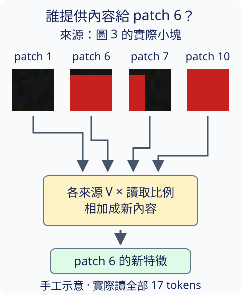
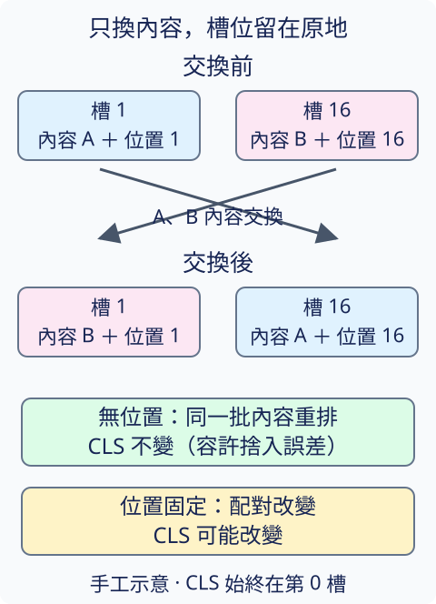

# 21.2 ViT attention：讓每塊取得其他區域的內容

[在 Colab 執行本節](https://colab.research.google.com/github/birdhackor/learn_to_yolo/blob/lessons-v0.6.1/notebooks/21-attention.ipynb){ .md-button }

[上一節](21-patches.md)準備了 16 個 patch token，以及一個等待彙整圖片的 CLS。patch 投影時，各塊只讀自己的像素。**現在怎麼讓一塊的表示也包含其他區域的資訊？** 我們沿用 15.1 的 Q／K／V 讀取法。

## 交換的是特徵，原圖仍留在原位

材料仍是 train 圖 3，答案為紅色 0。patch 1 只有背景，patch 6 已含紅色；紅矩形還跨過其他格子。只看自己時，各塊知道的是自己視窗內的內容。attention 讓它們按當下特徵讀取其他位置，CLS 也能讀到各區域，把分散內容彙整起來。

下面選 patch 6 當接收者，只畫 patch 1、6、7、10 四個來源。實際模型讀的是全部 16 塊和 CLS。



箭頭由提供內容的來源指向接收者。每個來源提供一份 **V（value，值）**；patch 6 用自己的 **Q（query，查詢）**與來源的 **K（key，鍵）**比對，算出各來源的比例，再將 V 加權相加。得到的是 patch 6 的新特徵，不是把紅色像素塗到別塊。圖中沒有實測權重，箭頭只表示內容怎麼流。

這叫 **self-attention（自注意力）**，因為 Q、K、V 都來自同一串 tokens；「self」沒有把讀取限制在自己。CLS 也參與這套運算，因此原本相同的 CLS 初值，讀完不同圖片後可以形成不同表示。

此處要完成的是「讓位置依內容取得其他區域資訊」。前面的 CNN 也能做紅藍分類；這張圖沒有證明 attention 是這道顏色題唯一必要的做法。

## 同一個接收者，可以用四套比例讀內容

15.1 用一套比例混合來源。這裡使用 **4 個 attention heads（注意力頭）**：把 Q、K、V 各自的 32 個特徵分成四組，每組 8 個，各算自己的讀取比例。

這樣同一個接收者不必讓全部特徵共用一張來源比例表：不同組可以形成不同的內容混合，再接回同一個 token。這是多 head 改變的分工；它沒有事先指定哪個 head 看紅色、哪個看背景，也不保證四組會自動學成這種分工。注意力頭和最後輸出紅藍分數的「分類頭」是不同部件。

令 B 為圖片數，T=17 為含 CLS 的 token 數，每個 head 的 Q／K／V 寬度為 d=8。仍用已學的計算：

\[
A=\operatorname{softmax}_{\text{來源}}\!\left(\frac{QK^{\mathsf T}}{\sqrt{8}}\right),\qquad O=AV.
\]

Q 與 K 的內積除以 √8，softmax 沿來源軸分配比例。A 的每列是一個接收者讀各來源的比例，列和為 1；O 是它讀到的加權內容。Q、K、V 都是 `[B,4,17,8]`，A 是 `[B,4,17,17]`，最後兩軸依序為接收者、來源。

A 隨輸入重新計算，並非保存下來的模型參數。會學習的是產生 Q／K／V 的投影。各 head 的 O 仍有 8 維，四組接回 32 維，再用一個可學的 32→32 投影組合，得到 `[B,17,32]`。每個位置都有新內容，token 數與寬度都保留。

## 為什麼還要給位置：重排內容與改變配對

先暫時不加位置向量。若把來源換順序，Q 和 K 算出的來源分數也跟著換，對應的 V 同樣跟著換。對固定的 CLS 而言，它仍是用相同比例加總同一批內容，結果不會因排列順序而變；各 patch 的輸出則跟隨自己的輸入重排。

這能讀到「有這些內容」，但沒有提供「哪些內容在左上或右下」的額外線索。上一節的位置向量，正是在改這件事。



看下半部：位置向量留在槽位，只交換兩塊**尚未加位置的內容**。現在同一內容加上不同位置，形成新的輸入，讀取比例與 CLS 結果就可能改變。若把已加完位置的整個向量一起搬走，仍是同一批向量重排，沒有改變「內容＋位置」配對；那不是要測的位置作用。

這個區別先說明 attention 能使用哪種線索。完整程式還把交換接到整個未訓練 TinyViT；[下一節的完整模型核對](21-transformer.md#position-check)會在教完 blocks 與最終 CLS 後，解讀那組實測差值。顏色答案不依賴位置，改變特徵也不等於提高分類正確率。

## 小塊變多，成對讀取如何增加

每個 head 都要讓每個接收者和每個來源比較，因此一張圖的權重表有 T×T 個值。沿用上一節的練習：原圖不變，把 patch 邊長從 8 改成 4，加 CLS 後會有 65 個 tokens。先算單 head 比原來多幾倍。

??? note "參考答案"

    原來 T=17，有 `17×17=289` 個值；改後 T=65，有 `65×65=4225` 個值，約 14.62 倍。四個 heads 分別有 1156 與 16900 個權重值。CLS 也參與讀取，不能只比 16² 和 64²。

    這比較的是成對項目數，固定 B、head 數及每個 head 的寬度。投影、MLP、資料搬移等沒有算入，因此不能直接把執行秒數乘 14.62。

再想一個變化：某個 head 的接收者 Q 全為 0，與 17 份 K 的分數也全為 0，它會讀到什麼？

??? note "參考答案"

    softmax 給每個來源 1/17，讀到 17 份 V 的平均，包括 CLS 的 V。四個 heads 接回後還有輸出投影，這個平均不直接等於原圖 RGB 平均。

我們已經讓位置之間交換內容，還保留每個位置的向量。下一節要把這份新內容加回原表示，再接上逐 token 的特徵組合，形成可堆疊的 Transformer block。

??? note "多 head 實作與本節程式的兩個檢查"

    ``` { .python data-excerpt="miniyolo/vision_transformer.py" }
        def forward(self, tokens, return_attention=False):
            if tokens.ndim != 3 or tokens.shape[-1] != self.embed_dim or tokens.shape[1] < 1:
                raise ValueError("tokens 必須是非空的 [B,N,embed_dim]")
            batch, count, _ = tokens.shape
            qkv = self.qkv(tokens).reshape(batch, count, 3, self.num_heads, self.head_dim)
            q, k, v = qkv.permute(2, 0, 3, 1, 4).unbind(0)
            weights = (q @ k.transpose(-2, -1) / math.sqrt(self.head_dim)).softmax(dim=-1)
            mixed = (self.attention_dropout(weights) @ v).transpose(1, 2).reshape(batch, count, self.embed_dim)
            output = self.output_dropout(self.projection(mixed))
            return (output, weights) if return_attention else output
    ```

    程式的 N（`count`）就是正文的 T。一次 QKV 投影產生 96 個特徵，先拆成三份、各四組；`permute` 和 `unbind` 取出 Q、K、V。最後把各 token 的四組輸出接成 32 維。

    `return_attention=True` 回傳 softmax 後、dropout 前的權重。dropout 訓練時會隨機刪值並縮放保留值，實際使用的列和不必是 1。本節換位檢查以 `eval()` 關閉 dropout。

    程式前半重做 15.1 的二維手工 tokens `[1,0]、[0,1]、[1,1]、[0,0]`，並做一次 SGD 更新，確認 QKV 收到梯度；這個手工目標不是紅藍答案。後半的 TinyViT 換位檢查則沒有訓練。兩部分不能合成「分類學習成功」的結論。

    attention 權重只說明這層、這個 head 從誰讀得多；後面還有投影、residual、MLP 與其他層。它不是分類答案的完整解釋，也沒有輸出物件框。

機制來源：[ViT Appendix A](https://arxiv.org/html/2010.11929#A1) 的多 head self-attention 與 [§3.1](https://arxiv.org/html/2010.11929#S3.SS1) 的位置向量。Appendix D.4 是原論文的位置對照；本書的換位檢查沒有重做該 ImageNet 實驗。

[上一節：21.1 圖片切塊](21-patches.md) · [下一節：21.3 組成分類模型](21-transformer.md) · [在 Colab 核對讀取](https://colab.research.google.com/github/birdhackor/learn_to_yolo/blob/lessons-v0.6.1/notebooks/21-attention.ipynb)

<!-- curriculum-evidence:start -->

## 實際執行紀錄

本節的完整程式於 2026-10-08 在 AMD EPYC 9V74 80-Core Processor（2 個執行緒）上用 PyTorch 2.9.1+cpu 執行，程式裡的 assert 全部通過。下面是那次印出的原始輸出；輸出裡若有計時或訓練得到的數字，換一台電腦會略有不同。每個數字的意思，以本頁正文的說明為準。[完整紀錄（JSON）](https://github.com/birdhackor/learn_to_yolo/blob/main/artifacts/checks/curriculum/21-attention.json)

??? example "展開本次實際輸出"

    ```text
    {"event": "attention", "manual_tokens": [[1.0, 0.0], [0.0, 1.0], [1.0, 1.0], [0.0, 0.0]], "first_query_scores_before_scale": [1.0, 0.0, 1.0, 0.0], "scale": 1.4142135623730951, "first_attention_row": [0.3348807692527771, 0.1651192307472229, 0.3348807692527771, 0.1651192307472229], "first_weighted_value": [0.6697615385055542, 0.5], "manual_weight_shape": [1, 1, 4, 4], "manual_loss": 0.1594690978527069, "q_k_v_gradient_abs_sums": [0.07701923698186874, 0.07701923698186874, 0.4417698085308075], "qkv_weights_changed": true, "vit_tokens_shape": [1, 17, 32], "vit_heads": 4, "vit_head_dim": 8, "vit_attention_shape": [1, 4, 17, 17], "vit_attention_scores": 1156, "vit_output_shape": [1, 17, 32], "vit_row_sum_max_error": 1.7881393432617188e-07, "swap_patch_sequence_indices": [1, 16], "without_position_cls_max_change": 3.5762786865234375e-07, "without_position_patch_equivariance_max_error": 4.76837158203125e-07, "with_fixed_position_cls_max_change": 0.0016034245491027832, "limitation": "One SGD update validates the mechanism; random ViT attention weights are not explanations of a trained decision."}
    ```

<!-- curriculum-evidence:end -->
