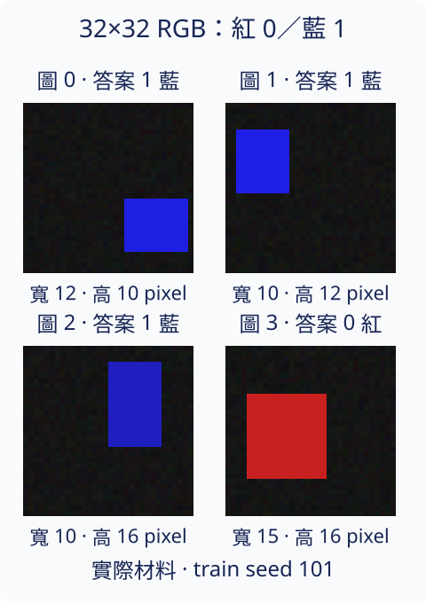
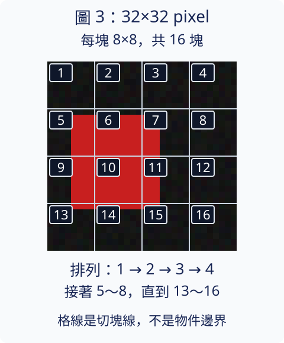
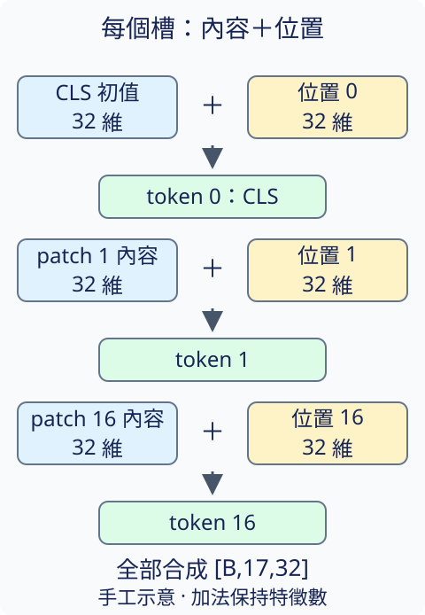

# 21.1 ViT patches：把圖片排成一串小塊

[在 Colab 執行本節](https://colab.research.google.com/github/birdhackor/learn_to_yolo/blob/lessons-v0.6.1/notebooks/21-patches.ipynb){ .md-button }

[第 15.1 節](15-attention-bridge.md)把 CNN 的特徵圖排成 tokens，再讓位置互相讀取。**如果直接從原圖開始，一個 token 要裝什麼？** 這是本節的主要問題。**Vision Transformer（視覺 Transformer），簡稱 ViT**，把圖切成不重疊的小塊，再把每塊轉成向量。

本支線會讓這些向量透過已學的 attention 互相讀取內容，再彙整整圖的表示，交給分類頭回答顏色。本節先準備這串向量；後三節依序接上讀取、完整分類模型與訓練。

這四節是從第 15 章分出的自選支線。你可以先讀 [1：小 CNN](01-small-cnn.md)、[3.1：identity shortcut](03-identity.md)與 [15.1：attention](15-attention-bridge.md)，再從這裡往下走；完成 YOLO 主線不需要先完成這條支線。

## 同一種矩形，先只回答顏色

沿用第 1 章的答案規則：**紅矩形是類別 0，藍矩形是類別 1**。現在每張圖仍是 32×32 RGB，但矩形的寬、高、位置和亮度會變，背景也有少量暗色雜訊。這些變化的抽樣不依賴類別；兩類都是矩形，所以答案不代表形狀種類。



圖號 0～3 只用來找圖片，答案 0／1 才表示紅／藍。上圖是實際訓練材料的四張，沒有把矩形位置當成答案。這條支線最後會用不同 seed 生成的圖片測試；此刻先處理「怎麼讀圖」，還沒有訓練模型。

一張圖的 PyTorch shape 是 `[1,3,32,32]`，軸順序仍是 NCHW：一張圖、三個顏色 channel、高、寬。值介於 0 和 1。32×32 是原圖的 pixel 尺寸，下面的 4×4 則是小塊排列的格數，兩者不要混在一起。

## 8×8 的小塊，變成 192 個數

**Patch** 是切出來的小塊。本例邊長 P=8 pixel，不重疊、沒有 padding，所以每列 4 塊，共 4×4=16 塊。順序由上到下逐列，每列由左到右，和第 15.1 節攤平特徵圖的順序相同。



看圖中的 patch 1～16：這些號碼是閱讀用的編號。每塊含 R、G、B 各一張 8×8 數值表，攤平後有 `3×8×8=192` 個數。實作在塊內先排完 R 的 64 個 pixel，再排 G，最後排 B；每個 channel 內也按列排列。因此整圖的原始 patches 是 `[1,16,192]`：一張圖、16 塊、每塊 192 個像素值。切塊與攤平只是重排資料，沒有可學參數。

注意紅矩形跨過多個格子。patch 邊界是固定的切圖線，沒有在找物件邊界；一塊可以同時含背景和一部分矩形，也可以完全是背景。

## 同一個投影，把每塊變成 32 個特徵

attention 不直接使用那 192 個原始值。本例用同一個可學線性轉換，把每塊的 192 個值變成 D=32 個特徵；這個輸出叫 **patch embedding（小塊的向量表示）**。D 是每個 token 的特徵數，不是圖片的邊長。

這和小 CNN 的共用權重有相似之處：16 塊都用同一套轉換。不過這裡只用 8×8 視窗、每次跳 8 pixel；在這一步，相鄰 patch 還沒有交換內容。32 個特徵也不是固定的 RGB 或座標，而是訓練會調整的組合。

實作用一個 `Conv2d(3,32,kernel_size=8,stride=8)` 完成這個投影。因為視窗剛好覆蓋一個 patch、沒有重疊，每個輸出位置的計算就是「192 個像素值各乘權重、相加、加 bias」，等同每塊共用一個 `Linear(192,32)`。輸出先是 `[1,32,4,4]`，再變成 tokens `[1,16,32]`。下面摘錄的 `self.projection` 就是這個卷積：

``` { .python data-excerpt="miniyolo/vision_transformer.py" }
    def forward(self, images):
        if images.ndim != 4 or tuple(images.shape[1:]) != (3, self.image_size, self.image_size):
            raise ValueError(f"images 必須是 [B,3,{self.image_size},{self.image_size}]")
        return self.projection(images).flatten(2).transpose(1, 2)
```

`flatten(2)` 把 4×4 攤成 16 個位置；`transpose(1,2)` 讓每一列裝一塊的 32 個特徵。這和第 15.1 節的軸轉換相同，只是起點從 CNN 特徵圖換成 patch 投影。

## 添一個 CLS，再加每個槽位的位置向量

最後仍要回答整張圖是紅或藍。我們在 16 個 patch 前面添一個 **CLS（classification，分類）token**：一個可學的 32 維向量，作為整圖的彙整位置。它不是由某個 patch 切出來，也不是正確類別答案。不同圖片一開始取得同一個 CLS 初值；後面讓它讀取各圖內容，才會形成不同的整圖表示。

序列變成 `[CLS, patch 1, …, patch 16]`，共 17 個 tokens，shape `[1,17,32]`。程式索引從 0 開始：索引 0 是 CLS，索引 1～16 才是圖中的 patch 1～16。

光有一串內容向量，attention 沒有額外線索可以知道哪塊在左上、哪塊在右下。因此再準備 **position embedding（位置向量）**：17 個序列槽位各有一個可學的 32 維向量，加到該槽位的內容上。CLS 的槽位也有一份。這些是可學數字，不是直接寫入 `(x,y)` pixel 座標；「第幾槽」和原圖格子位置的對應，來自固定的排列順序。



圖中的加號是逐特徵相加：例如只畫兩維的手工例子，內容 `[2,5]` 加位置 `[0.1,-0.2]` 得 `[2.1,4.8]`。實際向量有 32 維；加完仍是 32 維，不是串接成 64 維。這個兩維例子只說明加法，不是模型的實測特徵。

``` { .python data-excerpt="miniyolo/vision_transformer.py" }
    def embed_tokens(self, images, use_position=True):
        patches = self.patch_embed(images)
        tokens = torch.cat((self.cls_token.expand(images.shape[0], -1, -1), patches), dim=1)
        if use_position:
            tokens = tokens + self.pos_embed
        return self.embedding_dropout(tokens)
```

`expand` 讓整批 B 張圖各有一份相同的 CLS 初值；`cat(...,dim=1)` 沿序列軸把它放到前面。`pos_embed` 的 shape 是 `[1,17,32]`，相加時對每張圖使用同一套位置向量。`embedding_dropout` 在訓練時隨機把一部分特徵設成 0，並縮放保留值；`eval()` 時關閉。下一小節的手工切塊核對實驗採預設 dropout=0，所以不會隨機刪特徵。

## 用手工材料核對順序

為了確認攤平沒有排錯，完整程式另做一張手工測試圖：第 k 塊（k 從 0 到 15）內部是同一個 RGB 值 `[k/16,0.25,0.75]`。也就是圖中 patch 1 對應 k=0，patch 16 對應 k=15。這張圖用來核對切塊順序，不是前面的矩形訓練資料。

|閱讀用 patch 號|程式 k|該塊每個 pixel 的 RGB|
|---|---:|---|
|1|0|`[0,0.25,0.75]`|
|2|1|`[0.0625,0.25,0.75]`|
|16|15|`[0.9375,0.25,0.75]`|

接著手動設定一個 **192→3 的測試投影**，讓輸出剛好是該塊 R、G、B 的平均。程式印出的 `projection_shape=[1,16,3]` 屬於這個手工投影；真正 TinyViT 的 `vit_patch_embedding_shape=[1,16,32]` 才是前面介紹的可學 32 維表示。這兩個寬度不同，是刻意讓排列結果容易核對。

實際輸出中，patch 的 R 平均按順序為 `0、0.0625、…、0.9375`，G、B 平均保持 0.25、0.75。TinyViT 另外核對 `[1,16,192] → [1,16,32] → [1,17,32]` 的 shape，以及 CLS 與位置相加的結果。給每塊相同內容時，不加位置的 patch 表示相同；加上位置後則不同。這些檢查確認輸入整理正確；沒有做 optimizer 更新，也沒有證明隨機模型學會紅藍分類。

## 小變化：把邊長從 8 改成 4

只改 patch 邊長 P=4，原圖仍是 32×32，embedding 的 D 仍是 32。先預測：有幾塊？每塊原始向量有幾個數？加 CLS 後有幾個 tokens？

??? note "參考答案"

    每列 32/4=8 塊，共 64 塊；每塊有 `3×4×4=48` 個數；加 CLS 後有 65 個 tokens。patch 變小，一個 token 覆蓋的原圖範圍更小，但 tokens 增加了。下一節會看到互相讀取的成本增加多少。改 P 後要重新建立模型，位置向量的長度也要變成 65，不能沿用長度 17 的 checkpoint。

本節採用 [ViT 原論文 §3.1 的式 (1)](https://arxiv.org/html/2010.11929#S3.SS1)：patch 投影、可學 CLS 和位置向量。這裡把圖、向量寬度與深度大幅縮小，目的是在 CPU 看清楚流程；它不是原論文預訓練的大模型。

[下一節：21.2 patch 之間怎麼交換內容](21-attention.md) · [在 Colab 重做切塊](https://colab.research.google.com/github/birdhackor/learn_to_yolo/blob/lessons-v0.6.1/notebooks/21-patches.ipynb)

<!-- curriculum-evidence:start -->

## 實際執行紀錄

本節的完整程式於 2026-10-06 在 AMD EPYC 9V74 80-Core Processor（2 個執行緒）上用 PyTorch 2.9.1+cpu 執行，程式裡的 assert 全部通過。下面是那次印出的原始輸出；輸出裡若有計時或訓練得到的數字，換一台電腦會略有不同。每個數字的意思，以本頁正文的說明為準。[完整紀錄（JSON）](https://github.com/birdhackor/learn_to_yolo/blob/main/artifacts/checks/curriculum/21-patches.json)

??? example "展開本次實際輸出"

    ```text
    {"event": "patches", "image_shape": [1, 3, 32, 32], "patch_size": 8, "raw_patch_shape": [1, 16, 192], "raw_vector_order": "channel,row,column", "patch_order": [[0, 0, 0], [1, 0, 1], [2, 0, 2], [3, 0, 3], [4, 1, 0], [5, 1, 1], [6, 1, 2], [7, 1, 3], [8, 2, 0], [9, 2, 1], [10, 2, 2], [11, 2, 3], [12, 3, 0], [13, 3, 1], [14, 3, 2], [15, 3, 3]], "patch_red_means": [0.0, 0.0625, 0.125, 0.1875, 0.25, 0.3125, 0.375, 0.4375, 0.5, 0.5625, 0.625, 0.6875, 0.75, 0.8125, 0.875, 0.9375], "projection_shape": [1, 16, 3], "projection_demo": "RGB means; hand-set weights", "vit_patch_embedding_shape": [1, 16, 32], "tokens_with_cls_shape": [1, 17, 32], "cls_index": 0, "first_patch_sequence_index": 1, "learned_position_shape": [1, 17, 32], "same_content_equal_without_position": true, "same_content_equal_with_position": false, "full_attention_scores_per_head": {"patch8_with_cls": 289, "patch4_with_cls": 4225}, "score_count_ratio_with_cls": 14.619377162629759, "patch_only_score_count_ratio": 16.0, "limitation": "Hand-set projection explains token construction; no optimizer update or learned classification here."}
    ```

<!-- curriculum-evidence:end -->
