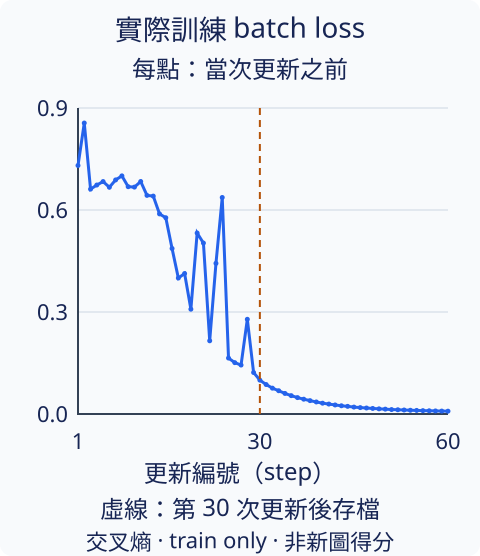
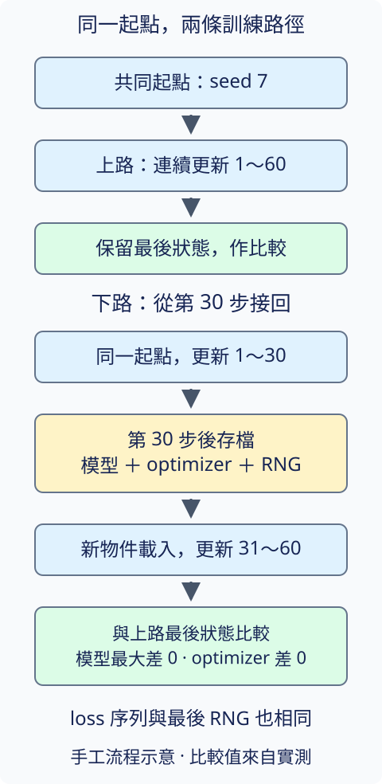

# 21.4 ViT training：從會計算的模型，到能答題的模型

[在 Colab 執行本節](https://colab.research.google.com/github/birdhackor/learn_to_yolo/blob/lessons-v0.6.1/notebooks/21-training.ipynb){ .md-button }

[上一節](21-transformer.md)接出了紅、藍兩個分數，但隨機權重還沒有學過答案。現在讓完整 TinyViT 對照矩形顏色更新。**它能答對新圖片嗎？如果第 30 步停下來，能不能接著原來的訓練走？**

## 先把更新用的圖與新題分開

下面仍是前文的四張訓練圖。紅色答案為 0，藍色為 1；位置、寬高、亮度與背景雜訊都不按類別分配。


我們用同一生成規則、三個不同 seed 建立不同圖片。若只評訓練圖，不能區分模型是否只解好了已看過的題。

|用途|張數|生成 seed|用來更新參數嗎|
|---|---:|---:|---|
|train，訓練|128|101|是|
|val，驗證|64|202|否|
|test，測試|64|303|否|

train 用來計算梯度；val 可觀察表現；test 留到設定固定後評分。本次事先固定 60 次更新，沒有按 val 得分挑 checkpoint。三批都遵循同樣的紅藍矩形規則，因此新題仍是同規則的新矩形，沒有換成自然照片或定位任務。

每步從 train 抽 32 張，可能重複抽到同一張。輸入 `[32,3,32,32]`，答案 `[32]`，模型產生 `[32,2]` logits，順序為紅、藍。交叉熵直接比較 logits 與類別答案；評分才用 `argmax` 檢查顏色是否答對。

## 一個分類 loss，更新整條讀圖路徑

loss 雖然在最後的兩個分數計算，反向傳播仍沿整條模型路徑送回梯度。這次交給 optimizer 的包括 patch 投影、CLS、位置向量、兩個 blocks 的 LN／QKV／輸出投影／MLP，以及分類頭，共 23,970 個可學參數。

沿用前文的 32／8／32／2 blocks／4 heads／MLP 64 設定，本次 dropout=0.1：訓練時每個 dropout 部件隨機將約一成輸入設為 0，並縮放保留值；評分時以 `eval()` 關閉。模型與圖片都在 CPU，以 float32 計算；權重初始化與訓練抽樣 seed 為 7。

刻意讓部分線索暫時缺席，是為了讓網路不能每次都只依賴固定的特徵組合，用來減少只記住訓練材料的傾向。這交代了 dropout 的用途；本例沒有與 dropout=0 作同條件對照，不能由後面的分數判定它提高了正確率。

optimizer 用 **AdamW**，學習率 0.003、weight decay=0.01。Adam 會保留過去梯度的移動平均來調整更新；W 指 weight decay（權重衰減），AdamW 把讓權重稍往 0 縮的動作與梯度更新分開處理。60 步使用固定學習率，沒有 scheduler。這是本例選定的訓練設定；與第 1 章的資料與 optimizer 設定不同，分數不能當成 ViT／CNN 的公平對照。

每步先啟用訓練模式、抽 batch、計算交叉熵，再清梯度、反傳，確認梯度可用，最後 `optimizer.step()`。完整程式的前半如下：

``` { .python data-excerpt="lesson_cases/21-training.py" }
def train_step(model, optimizer, dataset, batch_size):
    model.train()
    # batch抽樣與dropout都消耗torch RNG；只恢復權重不能重現下一步。
    indices = torch.randint(len(dataset), (batch_size,))
    loss = F.cross_entropy(model(dataset.images[indices]), dataset.labels[indices])
    if not torch.isfinite(loss):
        raise RuntimeError("training loss 非有限值")
    optimizer.zero_grad()
    loss.backward()
    parameters = dict(model.named_parameters())
    if not all(parameter.grad is not None and torch.isfinite(parameter.grad).all() for parameter in parameters.values()):
        raise RuntimeError("有缺失或非有限的gradient")
    grad_norm = float(sum(parameter.grad.square().sum() for parameter in parameters.values()).sqrt())
    if not grad_norm > 0:
        raise RuntimeError("gradient全部為0")
```

`grad_norm` 將全部參數梯度的平方相加再開根號，量整體梯度的長度。程式接著記錄部件梯度，才呼叫 `optimizer.step()`；單有 `backward()` 還不是一次參數更新。這裡的 RNG 是 Random Number Generator（亂數產生器），batch 抽樣與 dropout 都會推進它的狀態，後面接續訓練時還會用到。

## Loss 降低與答對新圖，各看一份證據



每個點是該次抽樣、該次 dropout 下，**更新前**的 batch loss。第一點為 0.730835，第 60 點為 0.008318。曲線前半起伏、後半接近 0；不同點的材料與隨機遮除不同，所以還要用固定材料比較。

程式以 `eval()` 關閉 dropout，對完整 train 比較更新前後，再評 val、test。判準是兩個 logits 中較大的類別是否等於答案；分母是各批圖片張數，沒有框或 IoU。

|觀察時間／資料|交叉熵|顏色答對數|
|---|---:|---:|
|更新前，固定 train|0.710059|64/128 = 50%|
|60 次更新後，固定 train|0.007155|128/128 = 100%|
|60 次更新後，val|0.007153|64/64 = 100%|
|60 次更新後，test|0.007154|64/64 = 100%|

另有兩種更新檢查：所有參數梯度皆有限，每步整體梯度長度介於 0.071033～15.675092，沒有全為 0；patch 投影、第一個 block 的 QKV 與 MLP、CLS、位置向量、分類頭這六組權重的前後副本也確實不同。

權重改變回答「有沒有更新」，固定 train 回答「有沒有解好訓練題」，val／test 回答「這兩批新題是否也答對」。合起來支持本次小模型學會了這套色彩任務。它沒有自然照片評測，也沒有架構對照，不能推成 ViT 比 CNN 好，或成功只來自某一個部件。

## 中途停下，下一步還需要哪些狀態

**Checkpoint** 是保存訓練狀態、供還原的檔案。只保存模型權重，足以再做推論；要接著原本那次訓練，下一步還依賴 AdamW 的梯度歷史與步數，以及抽 batch、dropout 的亂數位置。

這個亂數位置叫 **RNG state**。只重設 seed=7 會回到亂數序列開頭，不會接到第 30 步之後。checkpoint 還要保存模型設定與類別順序，才能建出相同模型，知道分數 0／1 代表紅／藍。



圖中上路一路更新 60 次；下路在第 30 次更新**後**保存，重新建立模型和 optimizer、載入狀態，再做第 31～60 步。兩路都只使用同一批固定 train 圖。

為了確認 optimizer 不是空物件，新 optimizer 故意先用學習率 0.9、weight decay=0.5。載入成功後，它應回到保存的 0.003／0.01，也取回前 30 步的歷史。

``` { .python data-excerpt="lesson_cases/21-training.py" }
    resumed_model = TinyViT(**MODEL_CONFIG)
    resumed_optimizer = torch.optim.AdamW(resumed_model.parameters(), lr=.9, weight_decay=.5)
    restored = load_checkpoint(checkpoint_path, resumed_model, resumed_optimizer)
    restored_steps = optimizer_steps(resumed_optimizer)
    restored_learning_rate = resumed_optimizer.param_groups[0]["lr"]
    resumed_history = []
    for step in range(restored["steps_completed"] + 1, steps + 1):
        loss, _, _ = train_step(resumed_model, resumed_optimizer, splits["train"], batch_size)
        resumed_history.append({"step": step, "loss": loss})
```

`MODEL_CONFIG` 是前面的 TinyViT 設定。`load_checkpoint` 載入模型、optimizer 與 RNG；建立新模型本身會消耗亂數，所以函式完成其他還原後，才恢復 RNG。

## 怎樣判斷真的接回同一次訓練

保存的實測中，載入後 optimizer 步數皆為 30，學習率恢復到 0.003。接著更新到第 60 步，與連續訓練比較：

|兩路比較|結果|
|---|---|
|模型參數最大絕對差|0|
|optimizer 狀態最大絕對差|0|
|第 31～60 步每一點 loss|完全相同|
|最後 RNG 狀態|完全相同|
|optimizer 已完成步數|兩路皆 60|

這驗證本次 CPU 程式與設定能接回同一次更新流程，包括抽樣與 dropout；沒有測試跨硬體或不同 PyTorch 版本的逐位元重現。

假如只載入第 30 步模型，保留新建的 AdamW，其他設定與 RNG 都恢復，可以推論嗎？下一步一定與原本第 31 步相同嗎？

??? note "參考答案"

    可以推論，但更新不保證相同。新 AdamW 缺少前 30 步的移動平均與步數；若還保留 0.9 的學習率，設定也不同。反過來，恢復 optimizer 卻沒恢復 RNG，下一個 batch 和 dropout 仍可能改變。檔案能讀取，不能代替完整續訓一致的比較。

現在我們有了能產生 CLS 與 patch 特徵、並學會這套顏色題的小型 ViT。[下一節](22-views.md)保留讀圖架構，重新從隨機權重出發，收起更新時的紅藍答案，看看圖片本身能提供什麼學習訊號。

??? note "重跑與原論文範圍"

    本機在 repo 根目錄執行 `PYTHONPATH=. .venv-model/bin/python lesson_cases/21-training.py`，或用頁首 Colab。程式自行建立模型，將本次的 `result.json` 與 `checkpoint.pt` 寫到 `artifacts/runs/vit-training/`；checkpoint 是本機執行產物，沒有下載預訓練權重。三個資料 seed 可重做同樣的材料。

    架構依據是 [ViT §3.1](https://arxiv.org/html/2010.11929#S3.SS1)；原論文 [§4.1](https://arxiv.org/html/2010.11929#S4.SS1) 與 Appendix B.1 的資料、訓練與微調規模不同。本例沒有重現 ImageNet／JFT 預訓練或自然照片成績。

[上一節：21.3 完整模型](21-transformer.md) · [下一節：22.1 沒有標籤的兩種視圖](22-views.md) · [在 Colab 重做訓練](https://colab.research.google.com/github/birdhackor/learn_to_yolo/blob/lessons-v0.6.1/notebooks/21-training.ipynb)

<!-- curriculum-evidence:start -->

## 實際執行紀錄

本節的完整程式於 2026-10-08 在 AMD EPYC 9V74 80-Core Processor（2 個執行緒）上用 PyTorch 2.9.1+cpu 執行，程式裡的 assert 全部通過。下面是那次印出的原始輸出；輸出裡若有計時或訓練得到的數字，換一台電腦會略有不同。每個數字的意思，以本頁正文的說明為準。[完整紀錄（JSON）](https://github.com/birdhackor/learn_to_yolo/blob/main/artifacts/checks/curriculum/21-training.json)

??? example "展開本次實際輸出"

    ```text
    {"event": "vit_training", "device": "cpu", "seed": 7, "model_config": {"image_size": 32, "patch_size": 8, "embed_dim": 32, "depth": 2, "num_heads": 4, "mlp_ratio": 2, "num_classes": 2, "dropout": 0.1}, "parameters": 23970, "optimizer": "AdamW", "learning_rate": 0.003, "weight_decay": 0.01, "steps": 60, "batch_size": 32, "split": {"train": {"samples": 128, "seed": 101}, "val": {"samples": 64, "seed": 202}, "test": {"samples": 64, "seed": 303}}, "class_names": ["red", "blue"], "answer_rule": "0=red rectangle; 1=blue rectangle; both classes share shape/position rules", "fixed_train_loss_before": 0.7100589871406555, "fixed_train_loss_after": 0.007154775783419609, "train_before": {"correct": 64, "count": 128, "accuracy": 0.5, "loss": 0.7100589871406555}, "train_after": {"correct": 128, "count": 128, "accuracy": 1.0, "loss": 0.007154775783419609}, "validation_before": {"correct": 32, "count": 64, "accuracy": 0.5, "loss": 0.7110880613327026}, "heldout": {"val": {"correct": 64, "count": 64, "accuracy": 1.0, "loss": 0.007152687758207321}, "test": {"correct": 64, "count": 64, "accuracy": 1.0, "loss": 0.007154297083616257}}, "loss_history": [{"step": 1, "loss": 0.7308351397514343}, {"step": 2, "loss": 0.855794370174408}, {"step": 3, "loss": 0.6613631844520569}, {"step": 4, "loss": 0.6734545826911926}, {"step": 5, "loss": 0.6836580634117126}, {"step": 6, "loss": 0.6668286919593811}, {"step": 7, "loss": 0.6884805560112}, {"step": 8, "loss": 0.7003495097160339}, {"step": 9, "loss": 0.6685369610786438}, {"step": 10, "loss": 0.6673541069030762}, {"step": 11, "loss": 0.6837713718414307}, {"step": 12, "loss": 0.642971932888031}, {"step": 13, "loss": 0.6408815383911133}, {"step": 14, "loss": 0.5884948372840881}, {"step": 15, "loss": 0.5772535800933838}, {"step": 16, "loss": 0.48671919107437134}, {"step": 17, "loss": 0.3998703360557556}, {"step": 18, "loss": 0.41314026713371277}, {"step": 19, "loss": 0.30822816491127014}, {"step": 20, "loss": 0.5322189331054688}, {"step": 21, "loss": 0.5027516484260559}, {"step": 22, "loss": 0.21528875827789307}, {"step": 23, "loss": 0.4430631995201111}, {"step": 24, "loss": 0.6368469595909119}, {"step": 25, "loss": 0.16455000638961792}, {"step": 26, "loss": 0.15104880928993225}, {"step": 27, "loss": 0.14399372041225433}, {"step": 28, "loss": 0.2785598635673523}, {"step": 29, "loss": 0.12201113998889923}, {"step": 30, "loss": 0.09960782527923584}, {"step": 31, "loss": 0.08667132258415222}, {"step": 32, "loss": 0.07601938396692276}, {"step": 3
    …（完整輸出見 notebook 與 JSON 紀錄）…
    4 80-Core Processor", "logical_cpus": 5, "threads": 2, "python": "3.12.14", "torch": "2.9.1+cpu", "torch_cpu_capability": "AVX512"}, "source_hashes": {"lesson_cases/21-training.py": "6c9593ba8ef5fb0e4a1f445f0ccd22ce237a5766d87682dea78af8f12ef44322", "miniyolo/__init__.py": "785b058b2b011124243b06ee59df8e59dfa75b77f050b897479e5be636763fc9", "miniyolo/checkpoint.py": "2144e2afa4d89382a7b3cd253755bb851e35fdc0847ee7179dee02dbbf4ca49b", "miniyolo/data.py": "cccad00e2c4f96eb6567eafc9e12248379c6b715fc1790d75518a253baa6181d", "miniyolo/geometry.py": "6a6b57d3493888e99dae4a012dab78127b8b543a0e01d8107963a3d6e63d8483", "miniyolo/inference.py": "995ac8f942d0c1e43d94f2efb3b7adcb91a9feb6b9bab923615209f0c190c313", "miniyolo/losses.py": "81fa9331c9a2aebe2e9c6c453a5313e64566bb20c3fe77ca45ec9df53424d4e4", "miniyolo/metrics.py": "53ce982e37cbd96c784f75c7d30faf99d52f79ab83ca7b8114eb21b4327330e0", "miniyolo/models.py": "49d029ea4ba2650ce8933cf97e3d25dc7aff2ca4e972eec19cdda17b0f4900e6", "miniyolo/provenance.py": "21769813c36b45f513c9f0d6125194f3baa5ae265278ffd44a796d298d124ed3", "miniyolo/targets.py": "2c8e32f2845b3bf970c77304c5cca0f999083d36a4d5af2f75f14aa89b823f16", "miniyolo/vision_data.py": "92b1cc3885a0b897eba2a24ac1cd604c55b5ea903a1886904e64b9364c67dde1", "miniyolo/vision_transformer.py": "212c8fcd59df0abd2ff9d0e545dbee051bbbe306089f5e0973d47783090fa394"}, "limitation": "Only this controlled color classification distribution; no natural-image, localization, or ViT-vs-CNN performance claim."}
    ```

<!-- curriculum-evidence:end -->
