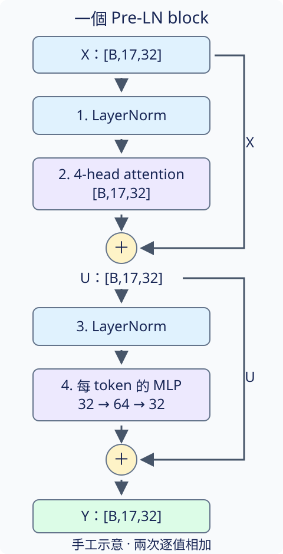
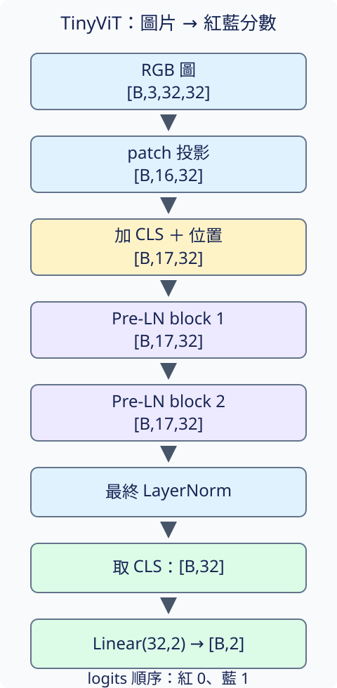

# 21.3 ViT Transformer：從一串小塊得到整圖答案

[在 Colab 執行本節](https://colab.research.google.com/github/birdhackor/learn_to_yolo/blob/lessons-v0.6.0/notebooks/21-transformer.ipynb){ .md-button }

紅矩形回答 0，藍矩形回答 1。輸入仍是 32×32 RGB；[前兩節](21-patches.md)已經準備好 16 個 patch 加 CLS，共 `[B,17,32]` 的 tokens，也知道 attention 能讓它們互相讀取。**怎麼把這個讀取步驟接成完整的圖片分類模型？** 本節走完 Transformer block 到兩個類別分數的路徑。

## 一個 block 有兩次修正

先看 block 的材料：一串 tokens，每個 token 有 32 個特徵，其中第 0 個是 CLS。這些是中間表示，不是紅藍分數。block 要更新這串表示，仍保留 17 個 tokens、每個仍為 32 維，讓下一個 block 接著使用。

[第 3.1 節](03-identity.md)用 `x + F(x)` 把「保留原輸入」和「計算修正」分開。這裡一個 Transformer block 做兩次這樣的相加：先用 attention 修正每個 token，再用一個小型全連線網路修正。兩次相加都要求修正與原輸入 shape 相同。



沿圖往下讀。右邊的兩條 shortcut 各把當下輸入直接送到加號；它們沒有經過 LayerNorm，也沒有換位置。左邊是兩條修正路徑，先說明其中兩個新部件。

## LayerNorm：每個 token 自己整理數值

**LayerNorm（LN，層正規化）**對每個 token 的 32 個特徵各自算平均與變異數，先減掉平均，再除以「變異數加上一個很小的正數」的平方根。小正數用來避免除以 0。最後，每個特徵還有一個可學的倍率與偏移。

例如只用兩維作手工示意，`[2,6]` 的平均是 4、變異數是 4；忽略小正數並使用倍率 1、偏移 0，結果約為 `[-1,1]`。實際模型用 32 維。LN 的用途是整理修正路徑讀到的數值尺度，shape 不變；它不把 17 個 token 平均成一個，也不把不同圖片混在一起算。

這個 block 先 LN、再 attention 或 MLP，叫 **Pre-LN**。原輸入仍沿 shortcut 保留，並沒有被 LN 取代。這和「先 attention、相加後才 LN」的順序不同，讀架構圖時要看清楚。

## MLP：在每個位置組合特徵

**MLP（多層感知器）**在這裡指兩個線性層，中間加非線性函數。每個 token 的 32 個特徵先變成 64 個，再用 **GELU**，最後變回 32 個。GELU 的作用和第 1 章的 ReLU 相似，讓多次線性運算能表示非線性關係；它使用平滑的數值變化，而不是 ReLU 的硬折點。理解本節路徑不需要手算它的公式。

同一套 MLP 權重分別套用到每個 token。它組合一個 token 內的特徵，不在這一步讀其他 patch；位置間的交換由前一段 attention 負責。MLP 中間雖擴到 64 維，最後回到 32 維，就能逐值加回原輸入。

用 X 表示 block 輸入，U 表示第一個加號後的結果，Y 表示 block 輸出。三者 shape 都是 `[B,17,32]`。MSA 表示上一節的四 head attention；這個 block 的兩步是：

\[
\begin{aligned}
U &= X+\operatorname{MSA}(\operatorname{LN}_1(X)),\\
Y &= U+\operatorname{MLP}(\operatorname{LN}_2(U)).
\end{aligned}
\]

兩份 LN 各有自己的倍率與偏移，沒有共用參數。相加後沒有再接 ReLU；這和第 3.1 節刻意保留正負輸入的示範相同。以下是完整實作中的定義：

``` { .python data-excerpt="miniyolo/vision_transformer.py" }
        self.norm1 = nn.LayerNorm(embed_dim)
        self.attention = SelfAttention(embed_dim, num_heads, dropout)
        self.norm2 = nn.LayerNorm(embed_dim)
        self.mlp = nn.Sequential(nn.Linear(embed_dim, hidden), nn.GELU(), nn.Dropout(dropout),
                                 nn.Linear(hidden, embed_dim), nn.Dropout(dropout))

    def forward(self, tokens):
        tokens = tokens + self.attention(self.norm1(tokens))
        return tokens + self.mlp(self.norm2(tokens))
```

`embed_dim=32`，`hidden=64`。第二行相加用的是第一行已更新的 `tokens`，對應公式中的 U。dropout 是訓練時隨機刪掉一部分特徵的部件，`eval()` 時關閉；它不改變張量形狀。

## 兩個 blocks，再取 CLS 分類

本模型叫 **TinyViT**：圖邊長 32、patch 邊長 8、embedding 寬度 32、4 個 attention heads、深度 2。深度 2 表示串接兩個上述 block，兩個 block 的參數各自獨立。這是完整的小型 ViT 分類路徑，不是只取出 attention 的片段；完整也不表示它具有原論文大模型的能力。



兩個 blocks 後，再做一次逐 token 的 LN，得到最終 tokens `[B,17,32]`。程式把它拆成三種容易使用的結果：

|名稱|shape|內容|
|---|---|---|
|`tokens`|`[B,17,32]`|含 CLS 的完整序列，已通過最後 LN|
|`cls`|`[B,32]`|第 0 個 token，作為整圖表示|
|`patches`|`[B,16,32]`|後 16 個 tokens，仍按原圖格子順序排列|

`forward_features` 回傳這個字典；`forward` 再把 `cls` 交給 `Linear(32,2)` 得到 `[B,2]` logits。分數順序是紅、藍，取 `argmax` 得到預測 0／1，和第 1 章相同。

``` { .python data-excerpt="miniyolo/vision_transformer.py" }
    def forward_features(self, images, use_position=True):
        tokens = self.encode_tokens(self.embed_tokens(images, use_position=use_position))
        return {"cls": tokens[:, 0], "patches": tokens[:, 1:], "tokens": tokens}

    def forward(self, images):
        return self.head(self.forward_features(images)["cls"])
```

`encode_tokens` 依序執行兩個 blocks 和最後 LN。第 0 個 CLS 經過了 attention，所以它的值會依圖片內容而變；分類 head 只讀這個最終 CLS，不直接讀原始像素，也不把 patch 編號當類別。

完整程式把第一個 block 的兩次相加拆開算，實際得到的結果與 `block(embedded)` 完全相同，`manual_residual_matches_block=true`。同時印出 CLS `[1,32]`、patches `[1,16,32]` 和 logits `[1,2]`，模型參數數量為 23,970。這些結果確認公式與實作的路徑一致；此程式沒有做 optimizer 更新，也沒有用分類正確率證明它學會任務。[下一節](21-training.md)才真正更新整個模型、保留 checkpoint 並測試。

## 小變化：MLP 中間寬度改成 128

只把 MLP 的中間特徵數從 64 改成 128，最後的輸出仍是 32。原有 shortcut 還能相加嗎？MLP 會因此直接讀到更多 patch 嗎？

??? note "參考答案"

    可以相加，因為 MLP 最後仍輸出 `[B,17,32]`。中間加寬會增加參數與線性運算，但它仍分別處理每個 token，不會新增 patch 之間的讀取。跨位置讀取還是 attention 的工作。不能只憑加寬就保證分類變準。

再看圖中的兩條 shortcut：若兩條修正路徑的最終輸出都為 0，block 會輸出什麼？如果接著做最後 LN，結果仍保證等於原始 X 嗎？

??? note "參考答案"

    block 的兩次相加都是加 0，所以 Y=X；但 block 外的最後 LN 會整理每個 token 的數值，沒有保證 `LN(X)=X`。驗證 block 的 identity 性質時，不能把外面的最後 LN 算進同一個輸出。

原論文依據：[ViT §3.1 式 (2)～(4)](https://arxiv.org/html/2010.11929#S3.SS1) 定義 Pre-LN、attention／MLP 兩條 residual 與最終 CLS 的 LN；MLP 使用 GELU。[§4.1 Table 1](https://arxiv.org/html/2010.11929#S4.SS1) 的 ViT-Base 是深度 12、寬度 768、MLP 3072、12 heads。本例是 2／32／64／4，並直接從小資料訓練；分類 head 採單一線性層，沒有重現論文預訓練時含隱藏層的 head，也沒有大規模預訓練。

[上一節：21.2 小塊交換內容](21-attention.md) · [下一節：21.4 訓練、測試與還原](21-training.md) · [在 Colab 重做模型檢查](https://colab.research.google.com/github/birdhackor/learn_to_yolo/blob/lessons-v0.6.0/notebooks/21-transformer.ipynb)

<!-- curriculum-evidence:start -->

## 實際執行紀錄

本節的完整程式於 2026-10-05 在 INTEL(R) XEON(R) PLATINUM 8573C（2 個執行緒）上用 PyTorch 2.9.1+cpu 執行，程式裡的 assert 全部通過。下面是那次印出的原始輸出；輸出裡若有計時或訓練得到的數字，換一台電腦會略有不同。每個數字的意思，以本頁正文的說明為準。[完整紀錄（JSON）](https://github.com/birdhackor/learn_to_yolo/blob/main/artifacts/checks/curriculum/21-transformer.json)

??? example "展開本次實際輸出"

    ```text
    {"event": "transformer", "block_count": 2, "input_tokens_shape": [1, 17, 32], "pre_ln": true, "first_attention_update_norm": 0.18654006719589233, "first_mlp_update_norm": 0.21488948166370392, "manual_residual_matches_block": true, "cls_feature_shape": [1, 32], "patch_feature_shape": [1, 16, 32], "logit_shape": [1, 2], "permutation": [0, 16, 15, 14, 13, 12, 11, 10, 9, 8, 7, 6, 5, 4, 3, 2, 1], "without_position_equivariance_max_error": 3.5762786865234375e-07, "with_fixed_position_cls_max_change": 0.030437029898166656, "parameters": 23970, "limitation": "Untrained mechanism check; changed CLS values do not show successful color classification."}
    ```

<!-- curriculum-evidence:end -->
