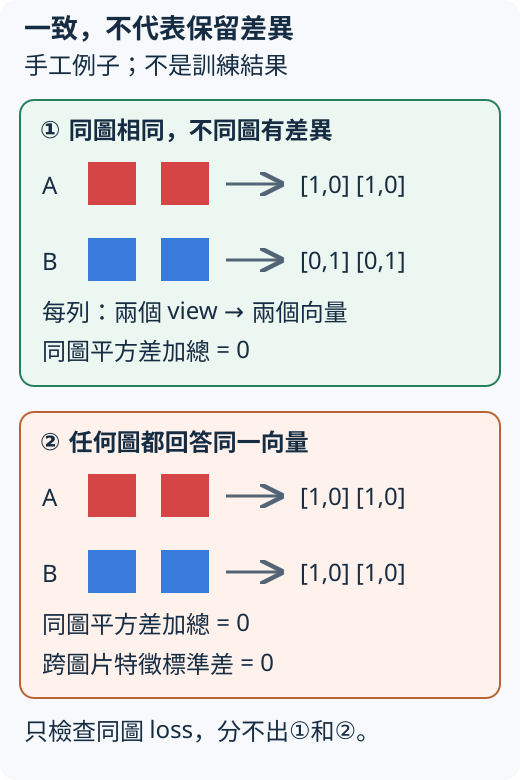

# 22.2 兩個 view 很一致，為什麼仍可能什麼也分不出來？

[在 Colab 執行本節](https://colab.research.google.com/github/birdhackor/learn_to_yolo/blob/lessons-v0.6.1/notebooks/22-collapse.ipynb){ .md-button }

[上一節](22-views.md)想讓同一張圖的不同 view 保留共同內容。現在除了紅矩形，還加入一張藍矩形。**同圖兩份表示接近，是否就足以讓特徵供後續分類使用？** 先比較兩種都能滿足一致性的回答。

## 一個保留差異，一個對所有圖都答一樣

紅色原圖 A、藍色原圖 B，各做 view 1、view 2。暫時不用 ViT，只手工指定兩維向量：A 的兩份 view 都得到 `[1,0]`，B 都得到 `[0,1]`。同圖一致，不同圖還有差別。

第二種回答更簡單：不管 A、B 或哪個 view，一律給 `[1,0]`。



上半部的兩張圖仍可區分；下半部四份輸出完全相同。箭頭只是圖片送入模型、取得向量，圖不是訓練成果。兩維數字也沒有事先定義成紅／藍機率。

這種把不同輸入都壓成相同表示、丟掉所需差異的情況叫 **collapse（塌縮）**。向量可以很長，甚至有很大的值，但如果對每張圖都一樣，下游仍看不見圖片差異。

## 一致性 loss 沒有問到哪件事

先用平方差檢查同圖兩份表示：逐項相減、平方，再相加。A 的兩份向量一樣，loss 為 0；B 也一樣。

|手工回答|A 的 view 1／2|B 的 view 1／2|兩張圖的同圖 loss 加總|
|---|---|---|---:|
|保留差異|`[1,0]`／`[1,0]`|`[0,1]`／`[0,1]`|0|
|常數回答|`[1,0]`／`[1,0]`|`[1,0]`／`[1,0]`|0|

這個最小 loss 不能分出兩者。它只問「同一原圖的兩份 view 是否一樣」，沒有問「不同圖片是否保有可用差異」。常數已能滿足它，所以只把這個目標優化得更好，沒有提供保留圖片差異的要求。這是目標的漏洞，不是增加訓練步數就必定能補上的事。

## 分類器收到同一輸入，能回答什麼

現在才拿出 A、B 的顏色答案，訓練一個讀特徵的分類器。若兩張都給 `[1,0]`，它收到完全相同的輸入，就不能按圖片內容分辨紅藍。對這一紅一藍兩題，固定猜一類只能答對 1／2。

因此，除了同圖一致，還要觀察**跨圖片的特徵變化**。在固定一批圖中，每個特徵維度各算標準差，也就是數值散開的程度。全部圖片都送出同一向量時，每維標準差都為 0。

但標準差大也還沒證明顏色可用：特徵可能只留下背景雜訊。現在有三個不同的問題了：同圖是否一致、跨圖是否完全一樣、後續任務能否讀出所需答案。[22.4 節](22-features.md)會用凍結特徵與獨立圖片，實際檢查最後一題。

## 改用分佈與交叉熵，仍需查塌縮

DINO 實際比較的是投影頭產生的 K 維分佈，沒有使用剛才的二維平方差。把向量換成分佈，本身仍不能保證輸入可區分；模型也可能對所有圖給出同一分佈。

完整程式為 8 張圖手工指定相同的 32 維特徵，投影輸出 K=16 個分數，兩個 view 也一樣。用 softmax 得到分佈，再比較兩份分佈的交叉熵。

|全部圖、全部 view 的手工 logits|分佈的樣子|跨 view 交叉熵|
|---|---|---:|
|16 個分數全為 0|16 槽各佔 1/16|約 2.773|
|第 0 槽為 10，其餘為 −10|幾乎全落在第 0 槽|約 `6.18×10⁻⁷`|

相同分佈的交叉熵不一定是 0；均勻回答與集中回答會得到不同數字。這裡的要點是，第二種 loss 很小，卻仍對所有圖片答同一槽。兩種手工特徵的跨圖標準差都是 0；一律猜紅，在紅藍平衡的 8 個答案中都只答對 4／8。更低 loss 仍沒有讓特徵能區分圖片。

這是刻意構造的反例，沒有 optimizer 更新，也不是「移除某項 DINO 設計後一定塌縮」的訓練對照。執行 `PYTHONPATH=. python lesson_cases/22-collapse.py` 或頁首 notebook，可重做這些數值。下一節會解釋 DINO 的軟目標交叉熵，並追蹤它如何同時避免某槽長期獨佔與所有槽都平均的兩種傾向。

## 換掉常數值，漏洞會消失嗎

把前面的常數回答從 `[1,0]` 改成 `[7,-3]`。同圖平方差會變嗎？跨圖標準差呢？先預測，再用 Python 建立四個相同向量核對。

??? note "參考答案"

    都仍為 0。每對向量相減為零，每張圖在各維的值也都相同。數字變大沒有恢復輸入差異；要看的是不同輸入之間的關係，不是單一向量的大小。

一致性值得保留，但需要更完整的訓練安排。[下一節](22-distillation.md)加入 teacher／student 的分工，說明目標如何固定、如何更新，以及 center 與溫度各改變哪個量。

??? note "原始來源與本例的責任"

    [DINO §3.1](https://arxiv.org/abs/2104.14294) 使用無標籤的 teacher／student 交叉熵；§5.3〈Avoiding collapse〉分析 centering 與 sharpening 的互補作用。本頁二維常數向量及平方差表格是教學用手工例子，不是原論文實驗。

[上一節：22.1 同圖的兩個 view](22-views.md) · [下一節：22.3 DINO 的目標與更新](22-distillation.md)

<!-- curriculum-evidence:start -->

## 實際執行紀錄

本節的完整程式於 2026-10-08 在 AMD EPYC 9V74 80-Core Processor（2 個執行緒）上用 PyTorch 2.9.1+cpu 執行，程式裡的 assert 全部通過。下面是那次印出的原始輸出；輸出裡若有計時或訓練得到的數字，換一台電腦會略有不同。每個數字的意思，以本頁正文的說明為準。[完整紀錄（JSON）](https://github.com/birdhackor/learn_to_yolo/blob/main/artifacts/checks/curriculum/22-collapse.json)

??? example "展開本次實際輸出"

    ```text
    {
      "constant_uniform": {
        "cross_view_ce": 2.7725887298583984,
        "feature_std": 0.0,
        "normalized_feature_std": 0.0,
        "mean_pair_cosine": 0.9999999403953552,
        "mean_output_entropy": 2.7725887298583984,
        "marginal_output_entropy": 2.7725887298583984
      },
      "constant_peaked": {
        "cross_view_ce": 6.183461209730012e-07,
        "feature_std": 0.0,
        "normalized_feature_std": 0.0,
        "mean_pair_cosine": 0.9999999403953552,
        "mean_output_entropy": 6.183461209730012e-07,
        "marginal_output_entropy": 6.183461209730012e-07
      },
      "constant_feature_balanced_color_accuracy": 0.5,
      "constant_feature_balanced_color_correct": 4,
      "constant_feature_balanced_color_count": 8,
      "construction": "hand-written outputs, no learned model and no optimizer",
      "interpretation": "low cross-view CE alone does not establish useful features; entropy/std/cosine describe different failures",
      "centering_limit": "not an ablation: this does not show that disabling centering immediately collapses every training run"
    }
    ```

<!-- curriculum-evidence:end -->
