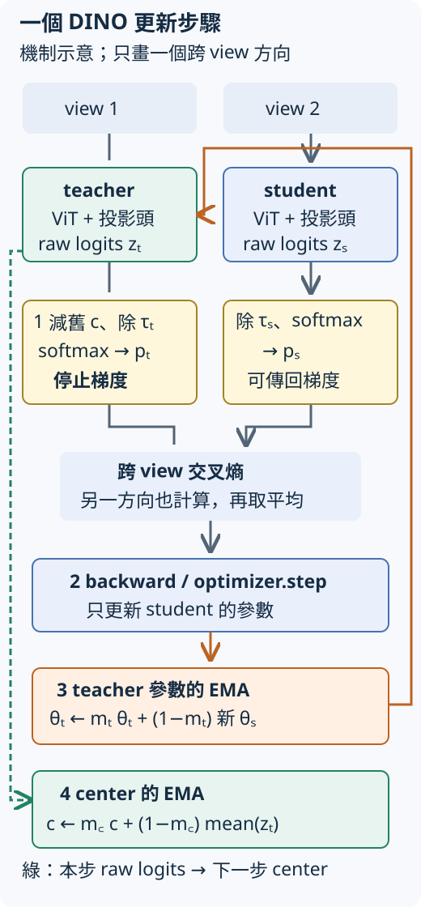

# E.22.3 DINO 的一步：誰提供目標，誰接受更新？

[在 Colab 執行本節](https://colab.research.google.com/github/birdhackor/learn_to_yolo/blob/lessons-v0.6.1/notebooks/22-distillation.ipynb){ .md-button }

[上一節](22-collapse.md)看到，常數回答也能滿足同圖一致。我們仍想利用同圖兩個 view，但要安排好「目標怎麼形成」與「哪一邊向目標移動」。**DINO 怎麼把這兩種工作分開，又處理輸出太平均或長期只偏向一槽的傾向？**

## 先把圖片表示變成訓練用分佈

準備兩份結構、初始權重相同的 ViT，重新從隨機權重開始：**student（學生）**由 optimizer 更新；**teacher（教師）**給本步目標，步末才緩慢追蹤 student。teacher 不是預先學會紅藍分類的模型。

兩份模型各先得到 32 維 CLS，再接 **projection head（投影頭）**產生 K 個 logits。投影頭是用來將特徵轉成自監督訓練輸出的可學層。本例先 `Linear(32,64)` → GELU → `Linear(64,16)`，再將 16 維向量除以自己的長度，最後用無 bias 的 `Linear(16,16)` 得到 K=16 個分數。backbone 原有的紅藍分類頭仍保存在模型中，但凍結且不使用。

softmax 會把分數轉成比例總和為 1 的分佈。**這 16 槽沒有預先命名為紅或藍**；第 0 槽不是類別 0，不能拿其 `argmax` 當顏色答案。它們先服務跨 view 的學習，完成訓練後再取 backbone 特徵給下游任務。



沿圖中前向實線看兩份 view 的目標與回答，再看更新箭頭：student 走梯度；teacher 參數與 center 是兩個不同狀態，各有自己的更新。下面逐一拆開。

## 這一步的 teacher 目標，先減中心再調溫度

teacher 的 logits 記作 `z_t`。為每個輸出槽保留一個 **center（中心）**值 `c`，代表過去 teacher 原始分數的移動平均；不是 RGB 平均，也不是 32 維 CLS 平均。產生本步目標時，使用**步開始前的舊 center**：

\[
p_t=\operatorname{softmax}\left((z_t-c)/\tau_t\right).
\]

`p_t` 是 teacher 目標分佈，`τ_t` 是正數的 teacher 溫度。某個槽若對許多圖片長期都有偏高 raw 分數，它累積的 center 也會偏高，減掉後，就比較難只靠這份共同偏高一直佔優勢。這個 **centering（中心化）**針對的是跨圖片的輸出偏好。

先用 K=3 手算：`z_t=[0.20,0,0]`、舊 `c=[0.10,0.05,-0.05]`，相減為 `[0.10,-0.05,0.05]`。取 `τ_t=0.10`，softmax 輸入為 `[1,-0.5,0.5]`，目標約 `[0.5465,0.1220,0.3315]`。這是機制示意，不是本節訓練結果。center 減在原始 logits 上，不能先 softmax 再拿機率減它。

溫度則改變槽與槽分數差距的尺度。同樣的 `[0.2,0]`，除以 0.2 得 `[1,0]`，softmax 約 `[0.7311,0.2689]`；除以 0.1 得 `[2,0]`，約 `[0.8808,0.1192]`。較小溫度使分佈偏向高分槽，叫 **sharpening（銳化）**。

student 的 logits `z_s` 不減 teacher center，使用自己的溫度：

\[
p_s=\operatorname{softmax}(z_s/\tau_s).
\]

本例 teacher 溫度比 student 小，用來銳化目標。center 壓制長期共同偏高的槽，但若只把各槽推得接近，也可能走向平均回答；銳化再保留每張圖較偏好的槽。兩者回應不同傾向，需要配合。這是在解釋設計的作用方向，還沒有證明任意設定都能避免塌縮或學出可用特徵。

## 用另一個 view 的答案教 student，並固定本步目標

同一張圖的 view 1、view 2 都交給 teacher 和 student。用 teacher 的 view 1 教 student 的 view 2，再用 teacher 的 view 2 教 student 的 view 1；跳過同 view 配對，才是在要求不同看法保留共同內容。

一個方向的交叉熵為：

\[
H(p_t,p_s)=-\sum_{k=1}^{K}p_{t,k}\log p_{s,k}.
\]

k 是輸出槽索引。teacher 給某槽較高比例，student 若把該槽比例降得很低，這項懲罰就大；讓回答接近 teacher 會減少這種不吻合。兩個跨 view 方向與 batch 中的圖片都取平均。這是**軟目標**，保留各槽比例，不先選單一 `argmax` 當標籤。

這一步要讓 student 向目標移動，所以目標須固定，不能也讓 loss 把 teacher 改成更容易配合 student 的答案。**Stop-gradient（停止梯度）**切斷目標回傳梯度的路：計算 teacher 用 `torch.no_grad()`，teacher 分佈也由 `logits.detach()` 取得；teacher 參數不交給 optimizer。

因此 `loss.backward()` 只為 student 的 backbone 與投影頭算梯度，`optimizer.step()` 只更新它們。停止梯度沒有讓 teacher 永遠停在初值；那是下一個更新動作的工作。

## Student 更新後，teacher 怎麼跟上

teacher 不由本次交叉熵直接更新，而是在 student 更新完後，對每個參數做 **EMA（Exponential Moving Average，指數移動平均）**：保留大部分舊值，再加入少量新值。

\[
\theta_{t,\mathrm{new}}=m_t\theta_{t,\mathrm{old}}+(1-m_t)\theta_{s,\mathrm{new}}.
\]

`θ_t`、`θ_s` 分別是 teacher、student 的參數，`m_t` 是 teacher 動量。手工例子：teacher 權重為 2，新 student 為 4，取 `m_t=0.9`，teacher 變為 2.2。它吸收 student 的改變，卻不立即變成 4；目標來源因此追蹤一段權重歷史，而非每步直接複製新 student。這不是另外一次 backward，也不是單靠 EMA 就保證不塌縮。

center 更新的是另一種量：把**本步前向已算好的 raw teacher logits**，在 batch 與兩個 views 間平均，再做 EMA：

\[
c_{\mathrm{new}}=m_c c_{\mathrm{old}}+(1-m_c)\operatorname{mean}(z_t).
\]

`m_c` 是中心動量，與 `m_t` 分開設定。某槽舊 center=0.1，本步 raw logits 平均=0.3，`m_c=0.9` 時，新值為 0.12。它供下一步使用；本步目標仍使用舊值 0.1。

完整實作的步末順序如下：

``` { .python data-excerpt="miniyolo/self_distillation.py" }
        self.optimizer.step()
        update_teacher(self.student, self.teacher, self.config.teacher_momentum)
        self.loss.update_center(teacher_outputs)  # loss 已算完，才更新給下一步
        self.step += 1
```

先更新 student，再更新 teacher 參數與 center。雖然程式先做 teacher EMA，`teacher_outputs` 仍是本步較早算好的輸出，沒有用 EMA 後的 teacher 重算。這也就是圖中兩條更新箭頭分開的理由：teacher 讀新 student 參數，center 讀本步 raw logits，兩者都只改下一步的目標來源。

## 跑這個更新，觀察哪些事情真的成立

本節 CPU 程式自行建立隨機小模型，使用 seed 101 的 128 張 train 圖，不下載權重、不依賴 21.4 checkpoint。每步抽 24 張，只傳 images，自監督 loss 不讀 labels 或 boxes。

AdamW 的學習率固定 0.0005、weight decay=0.01；`τ_s=0.15`、`τ_t=0.08`、`m_t=0.95`、`m_c=0.9`。投影頭 K=16。前面的 K=3、溫度 0.1、EMA 0.9 都是另外標明的手工例子，沒有替換這組設定。

本例加入**梯度裁剪**，是為了降低偶發的大梯度讓訓練更新不穩的風險。更新前將梯度範數最大截為 3：全部梯度平方和開根號後，若長度超過 3，就用約「3／原長度」的共同比例縮放，保留方向。紀錄 `student_grad_norm` 是裁剪前長度，第一步 24.1192 可以大於 3；optimizer 用的是裁剪後梯度。

執行 `PYTHONPATH=. python lesson_cases/22-distillation.py` 或頁首 notebook。保存的 160 步第一／最後 loss 為 1.943／1.874，student backbone 權重確實變化，teacher 沒有梯度，逐步梯度範數也有記錄。這些是更新機制的證據；loss 變化不能替特徵用途評分，[下一節](22-features.md)再凍結 backbone 檢查。

## 接續時，連目標來源也要還原

前章已保存模型、optimizer、步數與 RNG。DINO 還有 teacher 與 center，會直接影響下一步答案，所以 checkpoint 要一起保存 student、teacher、optimizer、center、step、設定，以及 batch／view 的 RNG 狀態。

一般的 **schedule** 是第幾步使用哪個溫度、動量或學習率的安排。本例這些值固定，但完整設定與步數仍保留；改成有排程時，更不能把 step 重設為 0。

程式比較連續 160 步，與第 80 步存檔、重建讀回、再做 80 步。這次第 81～160 步 loss、最後 student／teacher／center／optimizer 狀態及下一組隨機 views 都完全相同。這只驗證本 CPU 設定的接續；沒有跨硬體或 PyTorch 版本的逐位相等測試。只取特徵時可以載入 teacher backbone，精確接續時才需要上述完整狀態。

## Teacher 完全不吸收更新，會怎樣

把手算中的 `m_t=0.9` 改為 1，teacher 權重會到多少？若始終取 1，還會追蹤 student 嗎？

??? note "參考答案"

    仍是 2，因為 `1×2+0×4=2`。始終取 1 就一直保留初始 teacher。動量越大，跟得越慢，沒有「越大一定越好」的保證；這是公式的邊界推論，本書可執行設定要求動量小於 1。

??? note "原始來源與本例省略的部分"

    2021 年 [DINO](https://arxiv.org/abs/2104.14294) §3.1、公式 1–4 與 Algorithm 1 支持 teacher／student、停止梯度、跨 view 交叉熵、center 與 EMA；§5.3 分析中心化與銳化。它與 2022 年 [DINO detector](https://arxiv.org/abs/2203.03605) 不同。

    原版使用兩個 global views 與較小 local views，teacher 只讀 global、student 讀全部。本例只有兩個 global views，也縮小 ViT、資料量並簡化投影頭，沒有原版最後層的 weight normalization；溫度／動量／學習率固定，取代原版 warmup 與 cosine schedules，沒有重現 ImageNet 實驗。

    固定官方 [main_dino.py](https://github.com/facebookresearch/dino/blob/7c446df5b9f45747937fb0d72314eb9f7b66930a/main_dino.py) 的 `DINOLoss.forward` 使用舊 center、`detach`、跳過同 view 配對，最後更新 raw logits 的 center；`train_one_epoch` 在 student optimizer step 後做 teacher EMA。本書的設定與步末呼叫順序以自己的程式為準，不混用不同版本預設值。

[上一節：22.2 一致性的漏洞](22-collapse.md) · [下一節：22.4 特徵能不能使用](22-features.md)

<!-- curriculum-evidence:start -->

## 實際執行紀錄

本節的完整程式於 2026-10-08 在 AMD EPYC 9V74 80-Core Processor（2 個執行緒）上用 PyTorch 2.9.1+cpu 執行，程式裡的 assert 全部通過。下面是那次印出的原始輸出；輸出裡若有計時或訓練得到的數字，換一台電腦會略有不同。每個數字的意思，以本頁正文的說明為準。[完整紀錄（JSON）](https://github.com/birdhackor/learn_to_yolo/blob/main/artifacts/checks/curriculum/22-distillation.json)

??? example "展開本次實際輸出"

    ```text
    {
      "seed": 7,
      "device": "cpu",
      "steps": 160,
      "checkpoint_step": 80,
      "train_samples": 128,
      "batch_size": 24,
      "backbone": {
        "image_size": 32,
        "patch_size": 8,
        "embed_dim": 32,
        "depth": 2,
        "num_heads": 4,
        "mlp_ratio": 2,
        "num_classes": 2,
        "dropout": 0.0
      },
      "training_config": {
        "output_dim": 16,
        "hidden_dim": 64,
        "bottleneck_dim": 16,
        "batch_size": 24,
        "learning_rate": 0.0005,
        "student_temperature": 0.15,
        "teacher_temperature": 0.08,
        "teacher_momentum": 0.95,
        "center_momentum": 0.9,
        "global_scale": [
          0.65,
          1.0
        ]
      },
      "first_step": {
        "step": 1,
        "loss": 1.9427120685577393,
        "teacher_entropy": 1.7583107948303223,
        "student_grad_norm": 24.119152069091797
      },
      "last_step": {
        "step": 160,
        "loss": 1.8742694854736328,
        "teacher_entropy": 1.8415940999984741,
        "student_grad_norm": 0.9462160468101501
      },
      "backbone_weights_changed": true,
      "teacher_has_no_grad": true,
      "resume": {
        "next_random_views_identical": true,
        "student_teacher_optimizer_center_identical": true,
        "loss_history_identical": true,
        "final_step": 160
      },
      "diagnostics_train": {
        "feature_std": 0.32309943437576294,
        "normalized_feature_std": 0.05657871067523956,
        "mean_pair_cosine": 0.8623802661895752,
        "mean_output_entropy": 1.7878104448318481,
        "marginal_output_entropy": 2.2156848907470703
      },
      "elapsed_training_and_resume_seconds": 4.185710720994393,
      "checkpoint_path": "artifacts/runs/dino/22-distillation-midpoint.pt",
      "simplifications": "2 global views; ordinary MLP and no weight normalization; fixed temperatures/LR/EMA; no multi-crop or official schedules",
      "limitation": "DINO2021 mechanism demonstration from scratch; loss/diagnostics are not downstream or natural-image capability proof"
    }
    actual history: artifacts/runs/dino/22-distillation.json
    ```

<!-- curriculum-evidence:end -->
