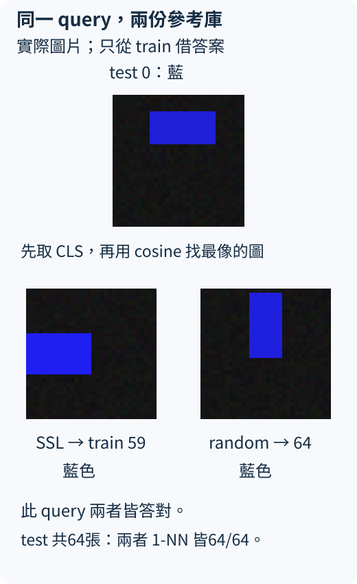
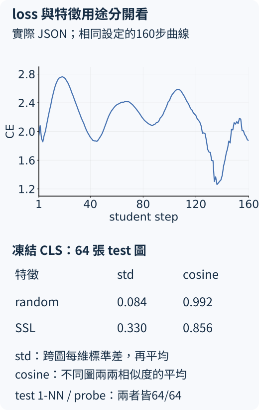

# 22.4 凍結特徵後，能分辨沒看過的紅藍矩形嗎？

[在 Colab 執行本節](https://colab.research.google.com/github/birdhackor/learn_to_yolo/blob/lessons-v0.6.0/notebooks/22-features.ipynb){ .md-button }

前面已經完成小型 DINO 的更新路徑，並確認 checkpoint 可以接續。接下來的問題是：**不再改 backbone，只讀它產生的特徵，能不能回答獨立圖片的紅藍顏色？** 這一步才開始使用紅藍標籤；它測的是特徵對這個用途是否可用。

## 保留相同材料，把訓練與評分分開

每張圖片仍是 32×32 RGB，只有一個紅色或藍色矩形。用同一套生成規則、不同 seed 產生三批圖片：train 128 張（101）、validation 64 張（202）、test 64 張（303）。位置、寬高和亮度不按顏色類別分配；每批紅藍各半。validation 和 test 都不進 optimizer。本例事先固定所有設定，validation 只報分數，沒有用它挑溫度、步數或 checkpoint；test 也只在設定固定後評分。

先以 train 圖片從隨機參數做 160 步自監督訓練，仍只傳 `images`，不傳紅藍答案。這一頁的程式會自己做這段短訓練，不依賴你是否執行過 22.3，或本機是否留有舊 checkpoint。再取 **teacher 的 backbone**，移除訓練時的投影頭用途，只讀 `forward_features(images)["cls"]`。

teacher 在這裡提供的是每張原圖的 32 維特徵，不是 K=16 個投影槽的分佈。評分時送完整原圖，不抽新的訓練 crop。把 backbone **凍結**，意思是參數不接受 optimizer 更新，也不計算它的梯度；程式另外比較前後的權重副本，確認評分與下游訓練沒有改到它。

## 第一種讀法：找最像的訓練圖

下文並列兩份固定的 backbone：**SSL** 是 160 步後的 teacher；**random** 保留它訓練起點、尚未更新的權重。兩份都用同一批圖片評分，讓我們檢查自監督訓練有沒有帶來差別。

先把 128 張 train 圖各轉成一個特徵向量，存成 reference bank（參考庫），並在此時才附上它們的紅藍標籤。對一張新的 test 圖取出特徵，把它和參考庫逐一比較，找到最相近的一張，借用那張 train 圖的顏色答案。這叫 **1-nearest-neighbor（1-NN，一個最近鄰）**；它沒有需要訓練的分類頭。

相近使用 cosine similarity（餘弦相似度）：先把每個向量除以自己的長度，變成長度 1，再取內積；方向越相近，數值越接近 1。這和前文 attention 的未正規化內積不同：這次先消除了向量長度的影響。test 圖不加入參考庫，否則可能找到自己，失去獨立評分的意義。



這張 query 是 test 0；SSL 找到 train 59，random 找到 train 64，兩張參考圖也都是藍色。位置與大小不必一模一樣，借用的是參考圖的顏色 label；這一張的成功仍要連同全部 64 張和 baseline 一起看。

```python
train_features = extract_features(backbone, train.images)  # [128,32]
test_features = extract_features(backbone, test.images)    # [64,32]
accuracy, neighbors = nearest_neighbor_accuracy(
    train_features, train.labels, test_features, test.labels
)
```

`neighbors` 是每張 query 所找到的 train 索引，`accuracy` 是 64 張 query 中紅藍答對的比例。這些 labels 沒有回傳到自監督 loss；train labels 只用來借答案，test labels 只用來計分。

## 第二種讀法：只訓練一個線性分類頭

另一種檢查在凍結特徵後接 `Linear(32,2)`，用 train 的紅藍標籤做 120 步交叉熵更新。這叫 **linear probe（線性探測）**：「probe」是拿一個簡單的讀取器探查特徵，不重訓 ViT，沒有添加新的 attention 或隱藏層。

為了整理不同特徵維度的尺度，先只用 train 特徵估計每維平均與標準差，再把 train／validation／test 都照這份統計標準化。標準差最小取 0.01，避免幾乎不變的維度除以過小數字。不能用 test 特徵重新估平均與標準差，否則評分資料也參與了讀取器的設定。

標準化後，以 Adam、學習率 0.02、全 train batch，固定訓練 120 步。此時只有新線性頭更新；backbone 保持凍結。這是有標籤的下游訓練，不能把整段都說成「完全沒用 label」。自監督的是取得 backbone 那一段。

## 必須和同起點的隨機特徵一起看

如果上述方法答對很多，還要問：這個任務是否本來就很容易？因此保留一份**同一次初始化、尚未自監督更新的 backbone**作 random baseline。它和 SSL teacher 使用相同 TinyViT 結構、相同資料切分、相同 1-NN 規則；兩個線性頭也從相同 seed 900 初始化，用相同 optimizer、學習率與 120 步。兩套特徵各自只用自己的 train 統計標準化。

這樣比較的主要差別是 backbone 是否經過這 160 步自監督更新。若給 SSL 頭更多步數，或讓 baseline 用另一個較弱的讀取器，就無法把差異解釋成自監督的收益。

本次 CPU 實測如下。表格的分母各為 64；列中的「SSL」指凍結 teacher backbone，「random」指同起點而未訓練的 backbone。

| 特徵與讀法 | validation 紅藍答對 | test 紅藍答對 |
| --- | --- | --- |
| random + 1-NN | 64／64 | 64／64 |
| SSL + 1-NN | 64／64 | 64／64 |
| random + linear probe | 64／64 | 64／64 |
| SSL + linear probe | 64／64 | 64／64 |

結果顯示兩套特徵都能讓這兩種讀取器解答這組色彩任務，**沒有顯示 SSL 比 random 更好**。紅藍差異在像素中已經很直接，小型隨機網路也可能保留足夠線索。不要把「DINO 特徵得 100%」單獨摘出來，寫成自監督訓練成功提升能力。

## 曲線和特徵統計，各補充一件事



圖上半部是同一設定下的 160 步跨 view loss。它並非一路下降：center 和 teacher 也持續改變，目標不是固定答案，因此不能照監督分類的直覺，只用頭尾或單調性解讀。曲線記錄的是優化過程；下半部的獨立 test 評分才回答色彩用途。

圖中的 feature std 是「跨 64 張 test 圖，分別算每個 CLS 維度的標準差，再平均 32 個維度」；mean pair cosine 是不同 test 圖兩兩向量正規化後的平均相似度，不包含同圖與自己比較。本次 random 的 std／cosine 約 0.084／0.992，SSL 約 0.330／0.856。這些統計能幫忙檢查是否所有圖都成為同一向量，但一個不為零的 std 仍不能替代下游評分：random 的向量雖比較相近，也足以解出這個色彩任務。

更換資料、seed 或投影頭設定後，數值可能不同；這個結果只涵蓋這套合成矩形規則。原版 DINO 在自然圖片上報告的特徵表現，不由這 256 張小圖重現。

執行 `PYTHONPATH=. python lesson_cases/22-features.py`，或頁首 notebook，查看兩套 backbone 的 frozen 檢查、1-NN 的正確張數、線性頭的 train／validation／test 分數與設定。[實際執行紀錄](https://github.com/birdhackor/learn_to_yolo/blob/main/artifacts/checks/curriculum/22-features.json)可查完整輸出；讀表時仍要使用本頁的任務、分母與比較條件。

## 改一件事，先預測

把 test 特徵和 test 標籤一起加入 1-NN 參考庫，其他不變。高正確率還能說明模型辨認了沒看過的圖片嗎？

??? note "參考答案"

    不能。query 很可能找到完全相同的自己，借用自己的真值標籤；即使 backbone 沒學到有用內容，也可能得到很高分。參考庫應只包含 train，test 只提供 query 和最後評分答案。

??? note "原論文怎麼用 backbone 特徵"

    [DINO 論文](https://arxiv.org/abs/2104.14294) §3.1〈Network architecture〉說明取 backbone 的輸出作下游特徵，投影頭只服務自監督目標；§3.2〈Implementation and evaluation protocols〉介紹凍結特徵的線性分類與 k-NN 評測。本文使用簡化的 1-NN 和 32 維 CLS，沒有重現原論文的 k 值、資料量及評分協議，數字不能直接比較。

到這裡，原始 DINO 的核心路徑已走完：view → 塌縮問題 → teacher／student 訓練 → 凍結特徵評測。[23.1 節](23-dino-versions.md)介紹 DINOv2、DINOv3 與現成預訓練權重的範圍，再到 [23.2 節](23-detection-bridge.md)把 patch 特徵接回框的任務。

<!-- curriculum-evidence:start -->

## 實際執行紀錄

本節的完整程式於 2026-10-05 在 INTEL(R) XEON(R) PLATINUM 8573C（2 個執行緒）上用 PyTorch 2.9.1+cpu 執行，程式裡的 assert 全部通過。下面是那次印出的原始輸出；輸出裡若有計時或訓練得到的數字，換一台電腦會略有不同。每個數字的意思，以本頁正文的說明為準。[完整紀錄（JSON）](https://github.com/birdhackor/learn_to_yolo/blob/main/artifacts/checks/curriculum/22-features.json)

??? example "展開本次實際輸出"

    ```text
    {
      "ssl_steps": 160,
      "probe_steps": 120,
      "ssl_seed": 7,
      "split": {
        "train": {
          "samples": 128,
          "seed": 101
        },
        "val": {
          "samples": 64,
          "seed": 202
        },
        "test": {
          "samples": 64,
          "seed": 303
        }
      },
      "task": "red vs blue rectangle color, both classes share position/size generation",
      "feature_source": "frozen teacher CLS [N,32]; no projection head in downstream",
      "ssl_first_loss": 1.9427120685577393,
      "ssl_last_loss": 1.8742752075195312,
      "controls": "same data, TinyViT initial backbone, probe head seed900, optimizer/lr/120steps; train-only feature standardization",
      "validation_use": "report only; no hyperparameter selection",
      "test_use": "evaluation only",
      "models": {
        "ssl_teacher": {
          "nearest_neighbor": {
            "val": {
              "accuracy": 1.0,
              "correct": 64,
              "count": 64,
              "first_query_neighbor_train_index": 64,
              "first_query_class": "blue",
              "first_neighbor_class": "blue"
            },
            "test": {
              "accuracy": 1.0,
              "correct": 64,
              "count": 64,
              "first_query_neighbor_train_index": 59,
              "first_query_class": "blue",
              "first_neighbor_class": "blue"
            }
          },
          "linear_probe": {
            "train_accuracy": 1.0,
            "val_accuracy": 1.0,
            "test_accuracy": 1.0,
            "steps": 120,
            "head_seed": 900,
            "final_loss": 0.00017759109323378652
          },
          "diagnostics_test": {
            "feature_std": 0.32950541377067566,
            "normalized_feature_std": 0.057700853794813156,
            "mean_pair_cosine": 0.855993390083313,
            "mean_output_entropy": 1.7631711959838867,
            "marginal_output_entropy": 2.2008676528930664
          },
          "backbone_unchanged": true,
          "backbone_has_no_grad": true
        },
        "random_baseline": {
          "nearest_neighbor": {
            "val": {
              "accuracy": 1.0,
              "correct": 64,
              "count": 64,
              "first_query_neighbor_train_index": 100,
              "first_query_class": "blue",
              "first_neighbor_class": "blue"
            },
            "test": {
              "accuracy": 1.0,
              "correct": 64,
              "count": 64,
              "first_query_neighbor_train_index": 64,
              "first_query_class": "blue",
              "first_neighbor_class": "blue"
            }
          },
          "linear_probe": {
            "train_accuracy": 1.0,
            "val_accuracy": 1.0,
            "test_accuracy": 1.0,
            "steps": 120,
            "head_seed": 900,
            "final_loss": 0.0025564320385456085
          },
          "diagnostics_test": {
            "feature_std": 0.0842096358537674,
            "normalized_feature_std": 0.014960691332817078,
            "mean_pair_cosine": 0.9917243123054504
          },
          "backbone_unchanged": true,
          "backbone_has_no_grad": true
        }
      },
      "elapsed_seconds": 5.610021456988761,
      "limitation": "a simple color task may already be solved by random features; equal accuracy is not evidence of SSL improvement or natural-image transfer"
    }
    ```

<!-- curriculum-evidence:end -->
