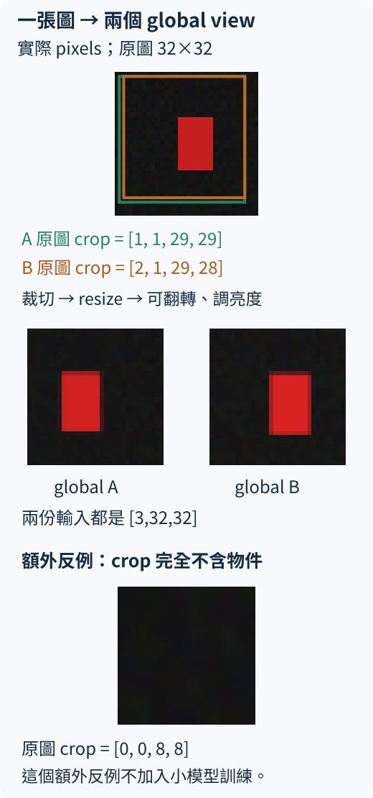

# 22.1 沒有紅藍標籤，同一張圖的兩個 view 能教什麼？

[在 Colab 執行本節](https://colab.research.google.com/github/birdhackor/learn_to_yolo/blob/lessons-v0.6.1/notebooks/22-views.ipynb){ .md-button }

前文用 32×32 RGB 矩形，讓 ViT 讀圖片，再對照「紅或藍」答案更新。現在把訓練時的顏色答案收起來，只留下圖片。這一節的問題是：**沒有人工類別答案，我們能從同一張圖自己製造什麼學習訊號？**

本章使用 **DINO（self-distillation with no labels，無標籤的自蒸餾）**來學影像特徵。已學的小型 ViT 負責把圖片轉成表示，DINO 則指定如何訓練它：從同一張圖做出不同看法，讓模型學著保留它們共同的內容。這樣，只有圖片、沒有人工類別答案時，也能用圖片本身製造學習目標，不必沿用上一章對照紅藍答案的做法。

「自蒸餾」指模型用自己逐步形成的輸出來教另一份模型。這裡有 teacher（教師）與 student（學生）兩份副本：教師給出目標，學生學著回答；教師的權重緩慢追蹤學生，並不是一份已經知道正確類別的答案模型。具體更新方式在 [22.3 節](22-distillation.md)再拆開算。訓練後保留產生特徵的 backbone，把新圖片轉成整圖或逐 patch 的向量，交給分類、定位等後續任務；後續任務仍可能需要自己的標籤。我們希望特徵能供這些任務使用，是否真的有用，要到 [22.4 節](22-features.md)評估，不能只憑訓練 loss 判定。

## 一張矩形，做出兩份看法

先看材料。圖片規則沿用前文：每張只有一個紅色或藍色矩形，背景偏暗；矩形的位置、寬高和亮度會改變。本節另外生成一張紅色矩形作 view 示範，不是取前章 128 張資料裡的索引 0。兩類都用矩形，因此後面若能分紅藍，只支持學到顏色任務所需的線索，不能稱為學會形狀分類。

從一張圖片各抽一次較大的正方形區域，縮放回 32×32，再各自決定是否左右翻轉與調整亮度。這兩張衍生圖片叫兩個 **view（視圖）**：同一張原圖的兩種看法。它們保留一些共同內容，又讓位置、裁切範圍和亮度稍有不同。

圖上的 crop 座標是**原圖的像素**，順序為 `[x1,y1,x2,y2]`：左上邊界為 `(x1,y1)`，右下邊界為 `(x2,y2)`。原點在原圖左上，x 向右、y 向下；右邊 `x2` 和下邊 `y2` 不包含在裁切範圍內。



圖中兩個 view 來自同一張原圖，不是隨便拿兩張紅色圖配對。裁切座標畫在原圖上；縮放與翻轉後，view 裡的物件位置已改變，不能把原圖的框座標直接拿來用。後面的自監督訓練只讀 image，不讀矩形的 label 或 box；這一節先製造 view，還不更新模型。

這是本節程式另生成的實際紅矩形：以 seed 101 生成 1 張圖，取這份單張資料的索引 0，view 的亂數種子為 22。A、B 的原圖 crop 分別為 `[1,1,29,29]`、`[2,1,29,28]` 像素。圖下方另取左上 `[0,0,8,8]`，展示裁走物件的反例；這個額外小 crop 不加入後面的兩個 global view 訓練。

## 要保留的共同內容，決定了 view 怎麼做

這裡每次選原圖面積比例約 0.65 到 1 的正方形 crop（裁切），稱為 global view，因為它讀的是比較大的一片，不是小小局部。程式先抽面積比例、求正方形邊長並四捨五入，再抽左上位置；32 像素的小圖經取整後，實際面積比例會稍有差距。

裁切不是永遠安全的。矩形若很靠角落，crop 可能只留下部分矩形，甚至全部裁掉。兩張 view 是否還包含我們想保留的內容，必須看素材和增強方式，不能先假定「任何 crop 都不改語意」。這個小實驗使用大 crop 降低風險，但沒有讀 box 來保證物件一定在其中；這些失敗 view 也是實驗的限制。

亮度變化使用同一個倍數調整 RGB 三個通道，沒有交換紅藍通道、改色相或轉灰階。原因是後續要檢查的任務是矩形顏色；若先把紅藍線索抹掉，要求兩個 view 仍相同，就會和這個用途衝突。設計 view 時仍需對資料與用途做選擇；「loss 沒用 label」不表示增強策略完全不需要人判斷。

## 讓同圖兩份表示互相接近

前文的 ViT 把 RGB 圖切成 16 個 8×8 patch；每個 patch 變成 32 維 token，加入 CLS 與位置向量，經兩層 Transformer 得到一張圖的 CLS 特徵 `[32]`。現在讓 view 1、view 2 各走一次相同的 backbone，得到兩份圖片表示。

我們希望同一張圖的兩份表示相近，讓特徵保留兩份 view 共享的內容，減少對這次左右翻轉或亮度變化的依賴。這叫 **view consistency（跨視圖一致性）**。但原圖 A 和另一張原圖 B 是否也應該相近，不能從這個條件推出；本節只知道哪兩個 view 來自同一張圖。

把資料本身製造的關係當成訓練目標，叫 **self-supervised learning（自監督學習）**。在這個例子中，「來自同一原圖」就是免費取得的關係，代替人工寫出的紅藍類別答案。這和前文 supervised learning（監督學習）的差別在於更新時用的目標來源；到了 22.3 的訓練，ViT 的 patch 投影、attention 和 MLP 仍會真的更新。

DINO 用兩份模型產生目標和回答，並把 CLS 經一個投影頭轉成分佈再比較。投影頭是讓特徵變成訓練用輸出的可學層；其詳細機制留到 [22.3 節](22-distillation.md)。在開始訓練前，先用[下一節](22-collapse.md)檢查這個想法的一個漏洞：如果模型對每張圖都回答同一向量，兩個 view 不是也會相同嗎？

## 程式先只生成 view

這一節先做資料操作，不更新 ViT。下面使用本節的真實 helper，產生兩批 view；`generator` 記錄一串亂數的位置，同一種子加上同樣的呼叫順序可以重做同一組 view。

```python
import torch
from miniyolo.self_distillation import random_view

generator = torch.Generator().manual_seed(1007)
view1, crop1 = random_view(images, generator)
view2, crop2 = random_view(images, generator)
```

`images` 是 `[B,3,32,32]`，B 張原圖、RGB 三通道、高寬各 32；值是 0 到 1 的浮點數。`view1`、`view2` 也是 `[B,3,32,32]`。`crop1`、`crop2` 是 `[B,4]`，每張原圖上的 `[x1,y1,x2,y2]` 像素座標：x 向右、y 向下，右下邊界不包含在切片中。這些 crop 數字只用來理解及記錄資料操作，不會當成 DINO 的偵測答案。

這段程式兩次只把 `images` 交給 `random_view`；沒有 `labels` 或 `boxes` 引數。執行 `PYTHONPATH=. python lesson_cases/22-views.py`，或使用頁首 notebook，查看示例 crop、view shape 及同一 RNG 狀態能重做 view 的檢查。輸出證明的是兩份輸入怎麼製造，以及資料操作能重做；不是模型已學到特徵。

## 改一件事，先預測

假如把資料操作改成「有一半機率把紅、藍通道交換」，再要求同圖兩個 view 的表示一致，對後來要分紅藍的任務可能有什麼影響？

??? note "參考答案"

    同一張紅矩形可能變成一紅一藍的兩個 view。要求它們表示一致，會鼓勵模型對紅藍差異不敏感，與後續顏色分類的用途衝突。這不代表色彩增強在所有任務都不合適；它表示 view 的設計要對應想保留的內容。

??? note "原始 DINO 為什麼讀不同大小的 view"

    [DINO 論文](https://arxiv.org/abs/2104.14294) §3.1 的 multi-crop 包含兩個 global view 及多個較小的 local view；teacher 只讀 global，student 也讀 local，讓局部看法朝較完整的看法學習。固定官方 [main_dino.py 的 DataAugmentationDINO](https://github.com/facebookresearch/dino/blob/7c446df5b9f45747937fb0d72314eb9f7b66930a/main_dino.py) 顯示 global/local crop 的實際增強流程。

    本書 CPU 小實驗只做兩個 global view，沒有 multi-crop、自然影像資料或原版大量訓練。下面幾節會把跨 view、teacher、center 和溫度的主線走完，但不能把合成矩形的結果說成重現原版 DINO 的自然影像能力。

[上一節：21.4 ViT 訓練與還原](21-training.md) · [下一節：22.2 一致也會塌縮](22-collapse.md)

<!-- curriculum-evidence:start -->

## 實際執行紀錄

本節的完整程式於 2026-10-06 在 AMD EPYC 9V74 80-Core Processor（2 個執行緒）上用 PyTorch 2.9.1+cpu 執行，程式裡的 assert 全部通過。下面是那次印出的原始輸出；輸出裡若有計時或訓練得到的數字，換一台電腦會略有不同。每個數字的意思，以本頁正文的說明為準。[完整紀錄（JSON）](https://github.com/birdhackor/learn_to_yolo/blob/main/artifacts/checks/curriculum/22-views.json)

??? example "展開本次實際輸出"

    ```text
    {
      "source_seed": 101,
      "source_sample_index": 0,
      "source_samples": 1,
      "view_generator_seed": 22,
      "same_rng_reproduces_views": true,
      "input_shape": [
        1,
        3,
        32,
        32
      ],
      "source_bbox_xyxy_pixel": [
        14,
        10,
        22,
        22
      ],
      "global_a_crop_xyxy_pixel": [
        1,
        1,
        29,
        29
      ],
      "global_b_crop_xyxy_pixel": [
        2,
        1,
        29,
        28
      ],
      "local_crop_xyxy_pixel": [
        4,
        11,
        19,
        26
      ],
      "empty_crop_xyxy_pixel": [
        0,
        0,
        8,
        8
      ],
      "empty_crop_object_intersection_pixel2": 0,
      "view_shape": [
        1,
        3,
        32,
        32
      ],
      "ssl_inputs": "images only; labels/bboxes excluded",
      "role": "official DINO: teacher gets global; student gets global+local; later tiny trainer uses only 2 globals",
      "limitation": "same source does not guarantee a crop contains the object; views are not labeled detection examples"
    }
    actual views: artifacts/runs/dino/22-views.svg
    ```

<!-- curriculum-evidence:end -->
