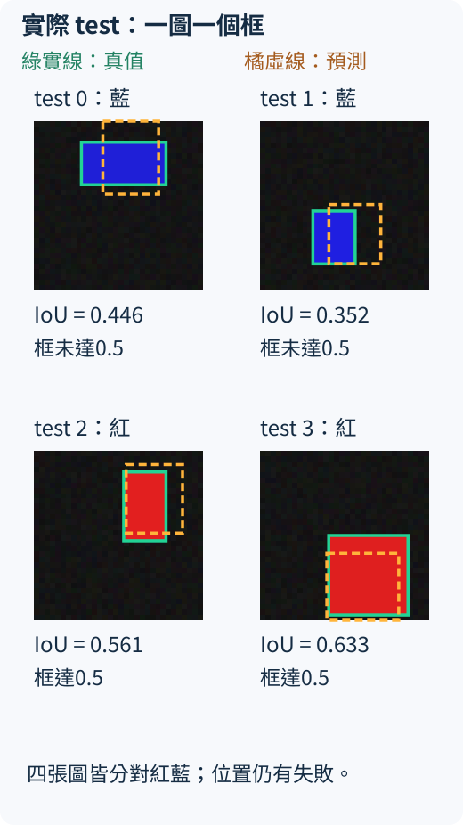
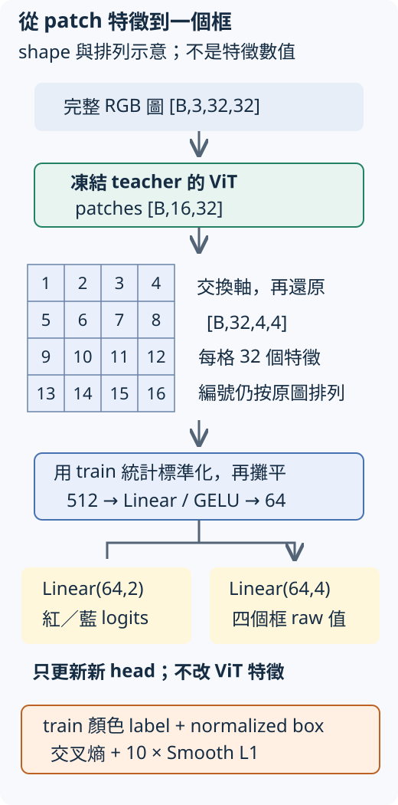

# 23.2 圖片特徵怎麼接回「紅藍與框在哪裡」？

[在 Colab 執行本節](https://colab.research.google.com/github/birdhackor/learn_to_yolo/blob/lessons-v0.6.0/notebooks/23-detection-bridge.ipynb){ .md-button }

[22.4 節](22-features.md)用 CLS 特徵讀整張圖的顏色；[上一節](23-dino-versions.md)又區分了原始 DINO、後續版本與預訓練模型的範圍。現在回到本書一直關心的問題：**保留小型自監督 ViT，能不能接一個新 head，同時回答矩形是紅或藍、框在哪裡？**

## 仍是一個矩形，多了一份位置答案

材料不換：每張 32×32 RGB 圖只有一個紅色或藍色矩形。下圖左上是 test 圖 0，正確顏色為藍色，真值框是 `xyxy=[9,4,25,12]` 像素。x 向右、y 向下，原點在圖片左上；四個數依序是左、上、右、下邊界，寬 16、高 8。train／validation／test 仍為 128／64／64 張，seed 為 101／202／303。



先看左上：綠實線包住真值矩形；橘虛線是模型的實際預測，位置還不準。圖中的顏色紅藍是圖片內容；綠橘只區分真值與預測，不是新的物件類別。此時讀圖只要知道「我們要同時猜顏色與四條邊」，下面才說這份預測怎麼來。

本節仍自己從隨機參數做 160 步小型 DINO，再凍結 teacher backbone，不下載 DINOv2／DINOv3，也不依賴上一頁的 checkpoint。自監督階段只讀 train images；新 head 的監督訓練才會用 train labels 和 boxes。validation 只報結果、不挑設定；test 不參與任何參數更新或標準化統計。

## 用 patch 特徵，把空間排列拿回來

前文的 `forward_features` 同時保留 CLS `[B,32]` 和 patches `[B,16,32]`。CLS 是整圖彙整位置；現在要讀空間排列，所以使用後面的 16 個 patch 特徵，照原順序還原成 4×4 格。

16 個 patch 由上而下、每列由左到右排列。先交換「patch 數」與「特徵數」兩軸，得到 `[B,32,16]`，再把 16 拆成 4×4，得到 `[B,32,4,4]`。這個 **patch grid** 就像前面 CNN 的 feature map：B 張圖、32 個特徵 channel、高寬各 4 格。只改排列，不再訓練新的特徵。

```python
patches = extract_features(backbone, images, kind="patches")  # [B,16,32]
feature_map = patch_feature_map(patches)                     # [B,32,4,4]
```

第 (row, column) 格仍對應原圖中該 8×8 patch 的槽位；但經過 attention 後，這個向量也混合了其他 patch 的內容，不能把它當成「只看這 8×8 像素」的原始局部資訊。位置對應仍有用，卻不是現成的框答案。



圖的上半部是凍結 backbone 的前向，下半部是新 head；只有下半部的參數更新。每張圖只輸出一個框，因此這個例子沒有「很多候選點誰負責」的 assignment，也沒有重複框需要 NMS。它教的是把特徵接到位置任務，還不是前面 YOLO 的多物件密集 head。

## 一個新 head，讀出顏色與四個框參數

先只用 train 的每個 grid 位置、每個 channel，估平均和標準差；val／test 也用同一份 train 統計標準化，最小標準差取 0.05。再把每張圖的 `32×4×4=512` 個特徵攤平，以 `Linear(512,64)` 和 GELU 組成共用層。

共用的 64 維表示分兩路：顏色路是 `Linear(64,2)`，輸出紅、藍兩個 logits；框路是 `Linear(64,4)`。框路的四個 raw 值先 sigmoid，變成 0 到 1 之間的數。前兩個當中心 `cx,cy`，後兩個經 `size=0.05+0.7×sigmoid(raw)` 成為寬 `w`、高 `h`。

這四個框參數是原圖邊長的比例，不是 grid 的格數。例如寬 w=0.5 就是 32×0.5=16 像素。用中心與寬高換成 `xyxy`：`x1=cx−w/2`、`y1=cy−h/2`、`x2=cx+w/2`、`y2=cy+h/2`，最後將邊界截在 0 到 1 之間；乘 32 才回到圖上的像素框。

寬高被限制在 0.05 到 0.75，截邊還可能改變最後的中心與尺寸。這是適合本例 8～16 像素矩形的簡化輸出，不能原樣拿去表示所有大框。框路只有一個槽，不用「第幾個 patch 輸出哪個框」來解碼；它看整個 grid 後，一次回歸全圖唯一物件。

真值也先除以 32。本例 test 0 的 `[9,4,25,12]` 變成 `[0.28125,0.125,0.78125,0.375]`。訓練使用顏色交叉熵，加上預測／真值 normalized xyxy 的 Smooth L1（小誤差用平方、較大誤差用線性）再乘 10：

\[
L=L_{\mathrm{color}}+10L_{\mathrm{box}}.
\]

兩項數值尺度不同，10 是這個小實驗固定的權重，不是原始 DINO 或 YOLO 的預設值。以 Adam、學習率 0.003、batch 32 訓練 head 200 步，seed 901 初始化 head。backbone 事先算出的特徵不帶梯度；程式檢查 head 的梯度有限且非零、權重有變，也檢查 backbone 權重前後完全相同。

## 一張圖一個框，直接按圖片配對評分

每張圖固定只有一個真值、一個預測，所以按同一圖片直接配對。顏色取 `argmax`；框以 IoU（交集面積除以聯集面積）評分。再數有多少張同時滿足「顏色答對且 IoU≥0.5」。這個張數比例沒有對置信分數排序，也沒有 PR 曲線，所以**不是 AP50 或 mAP**。

本次 CPU 實測的 train head loss 從 0.8861 到 0.000967，但更值得看的是獨立圖片和框的位置：

| 切分 | 顏色答對 | 平均配對 IoU | 顏色對且 IoU≥0.5 |
| --- | --- | --- | --- |
| train | 128／128 | 0.8594 | 128／128 |
| validation | 64／64 | 0.6160 | 49／64 |
| test | 64／64 | 0.6057 | 54／64 |

顏色全對，框卻沒有全對。回到第一張圖，模型預測藍色，預測框約 `[13.05,0,23.61,13.82]` 像素，和真值 `[9,4,25,12]` 的 IoU 為 0.4459，未達 0.5；它右移，也包含了物件上方的背景。test 1 的 IoU 0.3522 也是失敗；test 2、3 分別為 0.5611、0.6326，達到本節門檻。圖板保留了這些失敗，避免只顯示好看的預測。

這些結果支持「凍結的小型自監督 patch 特徵可以接上有標籤的單物件 head，並在同規則獨立圖片上取得表中定位結果」。本節沒有與隨機 backbone 的框 head 做對照，也沒重訓 YOLO，所以不能據此宣稱 DINO 比 random 或 CNN 更適合偵測。自然照片、多物件與背景誤報都未在本例測試。

執行 `PYTHONPATH=. python lesson_cases/23-detection-bridge.py` 或頁首 notebook，會從零完成短 SSL、head訓練及三批評分，並保存 backbone、head、train 特徵平均與標準差和類別名稱。這些統計也是推論所需的設定，不能只保存 head。完整框與設定可查[實際執行紀錄](https://github.com/birdhackor/learn_to_yolo/blob/main/artifacts/checks/curriculum/23-detection-bridge.json)。

## 改一件事，先預測

同一張 test 圖裡再放第二個矩形，這個 head 能同時輸出兩個框嗎？增加一個 NMS 步驟會解決嗎？

??? note "參考答案"

    不能：它的框路固定只輸出四個數，只有一個框槽。NMS 只會從已有的多個候選刪掉重複，不會產生第二個框。要處理多物件，需要改輸出結構、責任分配與訓練／評分資料；可以回到本書第 7 章的 grid head，再思考如何把 patch grid 接上去。

??? note "這個 bridge 與兩個 DINO 名稱"

    [原始自監督 DINO](https://arxiv.org/abs/2104.14294) §3.1〈Network architecture〉說明取 backbone 作下游特徵，§3.2 再交代評測協議；本文的單物件監督 head是本書的教學設計。它沒有重現原論文的偵測或分割實驗，也不是現成 DINOv2／DINOv3 權重的效能測試。

    [2022 DINO detector](https://arxiv.org/abs/2203.03605) 的完整名稱是 *DETR with Improved DeNoising Anchor Boxes for End-to-End Object Detection*，官方專案為 [IDEA-Research/DINO](https://github.com/IDEA-Research/DINO/tree/d84a491d41898b3befd8294d1cf2614661fc0953)。它是另一個物件偵測方法；不能因為名字相同，把這裡的 teacher、center 或投影槽當成它的偵測機制。

[回到凍結特徵評測](22-features.md) · [回到版本與預訓練權重](23-dino-versions.md) · [回到多物件 grid 責任分配](07-targets.md)

<!-- curriculum-evidence:start -->

## 實際執行紀錄

本節的完整程式於 2026-10-05 在 INTEL(R) XEON(R) PLATINUM 8573C（2 個執行緒）上用 PyTorch 2.9.1+cpu 執行，程式裡的 assert 全部通過。下面是那次印出的原始輸出；輸出裡若有計時或訓練得到的數字，換一台電腦會略有不同。每個數字的意思，以本頁正文的說明為準。[完整紀錄（JSON）](https://github.com/birdhackor/learn_to_yolo/blob/main/artifacts/checks/curriculum/23-detection-bridge.json)

??? example "展開本次實際輸出"

    ```text
    {
      "ssl_steps": 160,
      "head_steps": 200,
      "device": "cpu",
      "split": {
        "train": {
          "samples": 128,
          "seed": 101
        },
        "val": {
          "samples": 64,
          "seed": 202
        },
        "test": {
          "samples": 64,
          "seed": 303
        }
      },
      "ssl_first_loss": 1.9427120685577393,
      "ssl_last_loss": 1.8742752075195312,
      "feature_shapes": {
        "patches": [
          128,
          16,
          32
        ],
        "map": [
          128,
          32,
          4,
          4
        ]
      },
      "head": "Flatten512 -> Linear64/GELU -> class Linear2 + box Linear4; sigmoid center, size=.05+.7*sigmoid; clamp decoded xyxy to [0,1]",
      "head_learning_rate": 0.003,
      "head_batch_size": 32,
      "head_seed": 901,
      "loss": "cross_entropy(class) + 10*smooth_l1(normalized_xyxy)",
      "first_head_step": {
        "step": 1,
        "loss": 0.8860687017440796,
        "class_loss": 0.6687705516815186,
        "box_loss": 0.021729812026023865
      },
      "last_head_step": {
        "step": 200,
        "loss": 0.0009670326253399253,
        "class_loss": 1.56007481564302e-05,
        "box_loss": 9.514318662695587e-05
      },
      "backbone_unchanged": true,
      "backbone_has_no_grad": true,
      "head_weights_changed": true,
      "metrics": {
        "train": {
          "count": 128,
          "class_correct": 128,
          "class_accuracy": 1.0,
          "mean_iou": 0.8593764305114746,
          "iou_ge_0_5_count": 128,
          "class_correct_and_iou_ge_0_5_count": 128
        },
        "val": {
          "count": 64,
          "class_correct": 64,
          "class_accuracy": 1.0,
          "mean_iou": 0.6160324811935425,
          "iou_ge_0_5_count": 49,
          "class_correct_and_iou_ge_0_5_count": 49
        },
        "test": {
          "count": 64,
          "class_correct": 64,
          "class_accuracy": 1.0,
          "mean_iou": 0.6056987643241882,
          "iou_ge_0_5_count": 54,
          "class_correct_and_iou_ge_0_5_count": 54
        }
      },
      "examples": [
        {
          "test_index": 0,
          "source_seed": 303,
          "truth_xyxy_pixel": [
            9,
            4,
            25,
            12
          ],
          "predicted_xyxy_pixel": [
            13.051470756530762,
            0.0,
            23.608638763427734,
            13.815780639648438
          ],
          "truth_class": "blue",
          "predicted_class": "blue",
          "iou": 0.4459247589111328
        },
        {
          "test_index": 1,
          "source_seed": 303,
          "truth_xyxy_pixel": [
            10,
            17,
            18,
            27
          ],
          "predicted_xyxy_pixel": [
            13.031095504760742,
            15.765176773071289,
            22.852426528930664,
            26.953554153442383
          ],
          "truth_class": "blue",
          "predicted_class": "blue",
          "iou": 0.35220029950141907
        },
        {
          "test_index": 2,
          "source_seed": 303,
          "truth_xyxy_pixel": [
            17,
            4,
            25,
            17
          ],
          "predicted_xyxy_pixel": [
            17.466455459594727,
            2.604665756225586,
            28.128145217895508,
            15.542051315307617
          ],
          "truth_class": "red",
          "predicted_class": "red",
          "iou": 0.5610500574111938
        },
        {
          "test_index": 3,
          "source_seed": 303,
          "truth_xyxy_pixel": [
            13,
            16,
            28,
            31
          ],
          "predicted_xyxy_pixel": [
            12.647476196289062,
            19.411514282226562,
            26.247318267822266,
            32.0
          ],
          "truth_class": "red",
          "predicted_class": "red",
          "iou": 0.6325743794441223
        }
      ],
      "elapsed_seconds": 6.428522803005762,
      "evaluation": "one prediction paired with one truth per image; class argmax, paired IoU, joint class-correct and IoU>=.5; no AP/mAP",
      "limitation": "tiny frozen self-supervised ViT plus supervised single-object head; not DINO detector, not official DINOv2 backbone, no architecture ranking or natural-image transfer claim"
    }
    actual boxes: artifacts/runs/dino/23-detection-bridge.svg
    ```

<!-- curriculum-evidence:end -->
