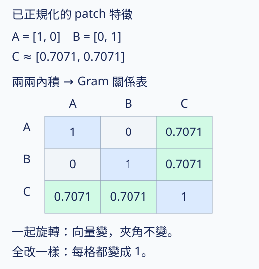
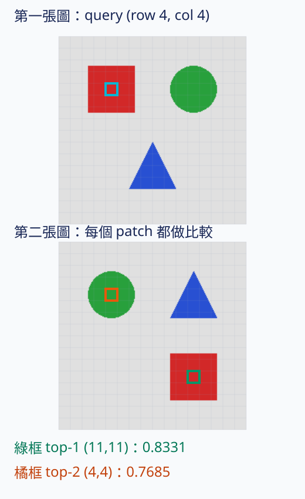

# 23.1 DINO 版本：從整張圖的答案，走到 patch 的關係

[在 Colab 執行本節](https://colab.research.google.com/github/birdhackor/learn_to_yolo/blob/lessons-v0.6.1/notebooks/23-dino-versions.ipynb){ .md-button }

前置：[特徵有沒有用](22-features.md)。上一節已把 tiny DINO 的特徵凍結，再用有標籤的資料評估；現在換成官方預訓練模型，看看它能交出哪兩種特徵。

想判斷兩張圖片整體像不像，可以各取一個向量。想找「第一張圖的這一塊，在第二張圖裡哪一塊最接近」，就需要保留每個 patch 的向量。兩個問題使用同一張圖，卻需要不同粒度的答案。

本節有兩個可以分開執行的例子：notebook 主例用三個手工向量理解 patch 關係，不下載權重；後半的選讀實驗才載入官方 DINOv2。看網頁上的保存結果，也能完成這節的主要比較。

## 同樣叫 DINO，接下來改的是什麼

第 22 章實作的是原始 DINO 的簡化核心：不同視圖、teacher/student、EMA、centering 與 sharpening。它訓練的是圖片表示，也就是交給下游模型使用的特徵。這裡的 DINO、DINOv2、DINOv3 都沿這個問題發展；物件偵測裡同名的 [DINO detector](https://arxiv.org/abs/2203.03605) 使用 DETR 路線，屬於另一個模型。

| 方法 | 本節關心的主要變化 | 為什麼這樣改、代價在哪裡 |
| --- | --- | --- |
| 原始 DINO | 用整張圖的 CLS 輸出對齊不同視圖；teacher 只看兩個 global crops，student 也看 local crops | 不用人工分類標籤即可學特徵；多視圖增加前向計算，仍需處理 collapse |
| DINOv2 | 同時教整圖 CLS 與被遮住的 patch；搭配更大的資料與訓練方法 | 希望整圖與局部特徵都可供下游使用；需要更多資料、計算與額外訓練項目 |
| DINOv3 | 在大規模長訓練後段，另約束 patch 之間的相似關係（Gram anchoring） | 處理長訓練時局部特徵品質退化；多一個參考模型及 patch 關係計算 |

這不是逐次只改一行的控制變因實驗。資料、模型大小、訓練時間與其他方法都改了，不能把論文結果全部歸功於表中的單一項目。本專案沒有重訓官方 DINOv2 或 DINOv3。

??? note "DINOv2 的幾個名詞，讀官方資料時再查"

    **iBOT 的 patch 任務：**iBOT 是 Image BERT Pre-Training with Online Tokenizer（用線上 tokenizer 做影像 BERT 預訓練）的縮寫。這個名稱中的 tokenizer 指 teacher 為圖片位置產生訓練目標，會跟著訓練更新；本節關心它的 patch 任務：把 student 輸入的部分 patch 藏起來，讓它預測 teacher 在那些位置的輸出分佈；teacher 看未遮住的圖。它和整圖 CLS 任務分工，DINOv2 為兩者使用分開的 head。

    **Sinkhorn–Knopp：**對一批 teacher 輸出一起做平衡。本節只指出 DINOv2 的訓練配方用它取代原始 DINO 的 teacher softmax-centering，沒有實作這個算法。

    **KoLeo：**名稱來自 Kozachenko–Leonenko 熵估計；這裡用作鼓勵特徵分散的正則項。對圖級特徵加上鼓勵分散的約束，避免它們全擠在一起。本節沒有重現這項 loss。

    **Register tokens：**額外加入、沒有直接對應圖片 patch 的 token。它們來自後續〈Vision Transformers Need Registers〉，官方同時提供有 register 與沒有 register 的 DINOv2 模型；不能把所有 DINOv2 都寫成有 register。

    來源：DINOv2 論文第 4 節；register 論文的模型修改與實驗。本頁下方列出固定版本。

## 先用三塊圖片的特徵，理解「關係」

假設三個 patch 的兩維特徵已經除以各自長度，使長度都是 1：

| Patch | 特徵向量 | 對它的理解 |
| --- | --- | --- |
| A | `[1, 0]` | 只沿第一個方向 |
| B | `[0, 1]` | 只沿第二個方向 |
| C | `[0.7071, 0.7071]` | 位於兩個方向之間 |

這些是方便手算的特徵，不是官方模型對某種物件的真實答案；兩維也不是「紅色」和「藍色」的類別。

每兩個向量做內積，得到一張關係表。因為向量長度都為 1，這裡的內積就是 cosine similarity（方向的相似程度）。例如 A 與 B 為 `1×0+0×1=0`，A 與 C 約為 `0.7071`。



表的列與欄都依序是 A、B、C，每格表示那一對 patch 的相似程度。整張表稱為 **Gram 矩陣**；把三個向量排成矩陣 F，就可以用 `F @ F.T` 一次算完。

它與第 15 章的 attention 權重不同：這裡沒有 softmax，不要求每列加起來為 1，也沒有把表乘上 V 來混合內容。

## 保住關係，不必逐個特徵值照抄

把三個向量一起旋轉 90 度，它們各自的數字改了，但夾角沒有改。程式會得到：

| 做法 | 和原特徵的平均平方差 | 和原 Gram 表的平均平方差 |
| --- | --- | --- |
| 三個向量一起旋轉 | `1.0000` | `0.0000` |
| 三個向量全改成 `[1,0]` | 本例不以此數字比較 | 約 `0.2603` |

第二種做法讓所有 patch 都一樣，所以新的 Gram 表每格都是 1。它消除了原先 A 與 B 不同、C 介於兩者之間的關係。

``` { .python data-excerpt="lesson_cases/23-dino-versions.py" }
anchor_gram = anchor @ anchor.T
rotated_gram = rotated @ rotated.T
constant_gram = constant @ constant.T
rotated_gram_mse = (rotated_gram - anchor_gram).square().mean()
constant_gram_mse = (constant_gram - anchor_gram).square().mean()
```

DINOv3 的 Gram anchoring 用參考模型的 patch 關係約束 student。上面的三向量例子只教會「要保留什麼」：同一視圖、相對應位置之間的特徵關係。它沒有載入 DINOv3、沒有更新參數，平均平方差也不代表完整的官方 loss 權重與排程。

??? note "DINOv3 的參考模型不是永久凍住最初的一份"

    論文觀察到長訓練後期的局部特徵退化，使用較早期 EMA teacher 的 snapshot 作 Gram teacher。第 4.2 節的 refinement 在主訓練後段開始，並定期用當前 EMA teacher 更新 Gram teacher；附錄 C 再交代 refresh 次數。第 4.3 節還使用較高解析度的 Gram teacher，將特徵降採樣到 student 的網格。

    所以不能把它簡化成「永遠抄最初模型的向量」。本頁的旋轉例子也沒有證明 Gram 約束一定保留所有語意：它只檢查三個已指定向量的關係。

## 官方 DINOv2：同一張圖，取整體與局部兩種特徵

選讀實驗使用官方 **DINOv2 ViT-S/14、沒有 register 的版本**。`S` 表示這系列的小型模型，`14` 是 patch 邊長；224×224 的圖切成 16×16，共 256 個 patch。與前幾節的 tiny ViT 相比，這是另一個架構設定與一份已訓練好的權重。

它有 22,056,576 個參數，權重約 84.2 MiB。載入後固定權重，只做前向推論；沒有在本專案訓練它。

兩張輸入都是程式畫的 224×224 RGB 圖：紅方塊、綠圓形、藍三角形移到不同位置。這組材料方便核對位置；沒有自然照片的分類、偵測或語意評測。



圖中的 query 是第一張圖第 `(row=4, col=4)` 個 patch，列、欄從 0 開始，位於紅方塊內。拿它的 384 維特徵，和第二張圖全部 256 個 patch 算 cosine similarity，再由大到小排序。

這次 top-1 在第二張圖的 `(11,11)`，相似度約 `0.8331`，落在紅方塊；top-2 在 `(4,4)`，約 `0.7685`，卻落在綠圓形。**最接近的一塊有對上，不等於它穩定辨認出紅色物件。** 在這組圖裡形狀與顏色也綁在一起，不能單獨歸因於其中一項。

兩張圖的 CLS 特徵 cosine 約 `0.9850`：它們整體特徵很接近。patch 特徵則讓我們可以詢問局部位置。這是這兩張受控圖的觀察，不能推出所有重排都不影響 CLS，也不能把 cosine 當成類別機率或 IoU。

| 輸出 | 本例 shape | 可以拿來做什麼 |
| --- | --- | --- |
| CLS 特徵 | `[2,384]` | 每張圖一個整體向量，用於圖片近鄰或下游分類 |
| Patch 特徵 | `[2,256,384]` | 每張圖每個 patch 一個向量，可還原成16×16網格 |
| Register 特徵 | `[2,0,384]` | 此模型沒有 register，這個軸為0 |

下一節會回到自己的 tiny DINO，保留 patch 網格再接定位 head。官方特徵實驗沒有訓練定位 head，最近的 patch 也不是物件框。

??? example "在同一個 Colab 另開一格跑官方模型"

    先跑本頁 notebook 的環境格與三向量主例，再另開一個 code cell：

    ```python
    !python scripts/run_dino_pretrained.py --report artifacts/runs/dinov2-pretrained/report.json
    ```

    它從固定官方 commit 取得程式，核對程式壓縮檔與權重的 SHA-256，才載入模型。RGB 圖的值先轉成 `[0,1]`，再以 ImageNet mean `[0.485,0.456,0.406]`、std `[0.229,0.224,0.225]` 逐 channel 正規化。前處理固定 resize 到224×224；本例產生的圖片本來就是這個尺寸，沒有裁切，空間尺寸不變。

    權重、官方程式、輸入圖、NPZ 特徵與報告都放在 git 不追蹤的 `artifacts/runs/`；模型檔不進普通 Git，也不進 Pages。第一次需要網路及約84.2 MiB的權重下載，沒有 token 或 GPU 的要求。

    保存的[官方模型實跑紀錄](https://github.com/birdhackor/learn_to_yolo/blob/main/artifacts/checks/curriculum/dinov2-pretrained.json)另記機器、來源、SHA 與計時範圍。這是 CPU 特徵提取，沒有 DINOv3 實跑或自然圖像品質排名。

## 自主練習

1. 把手工例子的 C 改成 `[1,0]`，先預測 Gram 表哪一列、哪一欄會改，再執行。A 與 C 是否還是只有約0.7071的相似？
2. 同時交換 F 的兩個 feature channel，Gram 表會變嗎？若只交換 patch A、B 的順序，表的列與欄會怎麼移？先區分「改特徵座標」和「改圖片位置」。
3. 官方例子的 top-2 已經不同物件。若要主張特徵能可靠對應物件，你會補哪些圖片、變化與判準？只有一組最高相似度為何不足？

修改手工例子時，原有 assert 是原題的核對；依新題目更新期望值，再比較結果。

## 原始來源

- [DINO，2104.14294v2](https://arxiv.org/abs/2104.14294v2)：第3.1節與Algorithm1，multi-crop、teacher/student及centering/sharpening。
- [DINOv2，2304.07193v2](https://arxiv.org/abs/2304.07193v2)：第4節的訓練方法。選讀載入的[官方程式固定commit](https://github.com/facebookresearch/dinov2/tree/e1277af2ba9496fbadf7aec6eba56e8d882d1e35)，參數與輸出來自本頁的實跑。
- [Vision Transformers Need Registers，2309.16588](https://arxiv.org/abs/2309.16588)：register是後續模型修改，不能替所有baseline加上它。
- [DINOv3，2508.10104v1](https://arxiv.org/abs/2508.10104v1)：第4.2／4.3節與附錄C，Gram teacher、refinement及refresh。

接著讀：[凍結 patch 特徵接回定位](23-detection-bridge.md)。

<!-- curriculum-evidence:start -->

## 實際執行紀錄

本節的完整程式於 2026-10-06 在 AMD EPYC 9V74 80-Core Processor（2 個執行緒）上用 PyTorch 2.9.1+cpu 執行，程式裡的 assert 全部通過。下面是那次印出的原始輸出；輸出裡若有計時或訓練得到的數字，換一台電腦會略有不同。每個數字的意思，以本頁正文的說明為準。[完整紀錄（JSON）](https://github.com/birdhackor/learn_to_yolo/blob/main/artifacts/checks/curriculum/23-dino-versions.json)

??? example "展開本次實際輸出"

    ```text
    {
      "mode": "hand-specified normalized patch relations; no optimizer, no downloads",
      "anchor_features": [
        [
          1.0,
          0.0
        ],
        [
          0.0,
          1.0
        ],
        [
          0.7071067690849304,
          0.7071067690849304
        ]
      ],
      "anchor_gram": [
        [
          1.0,
          0.0,
          0.7071067690849304
        ],
        [
          0.0,
          1.0,
          0.7071067690849304
        ],
        [
          0.7071067690849304,
          0.7071067690849304,
          0.9999999403953552
        ]
      ],
      "rotated_feature_mse": 1.0,
      "rotated_gram_mse": 0.0,
      "constant_gram": [
        [
          1.0,
          1.0,
          1.0
        ],
        [
          1.0,
          1.0,
          1.0
        ],
        [
          1.0,
          1.0,
          1.0
        ]
      ],
      "constant_gram_mse": 0.26034948229789734,
      "scope": "Mean squared Gram difference illustrates relation preservation; not the complete DINOv3 loss or schedule."
    }
    ```

<!-- curriculum-evidence:end -->
